```{r}
#| include: false
library(knitr)
library(kableExtra)
library(tidyverse)
library(MASS)
```

# Modulo 1 -- Introduzione a `R`

## RStudio

```{r, echo = FALSE, out.width="100%", fig.align='center'}
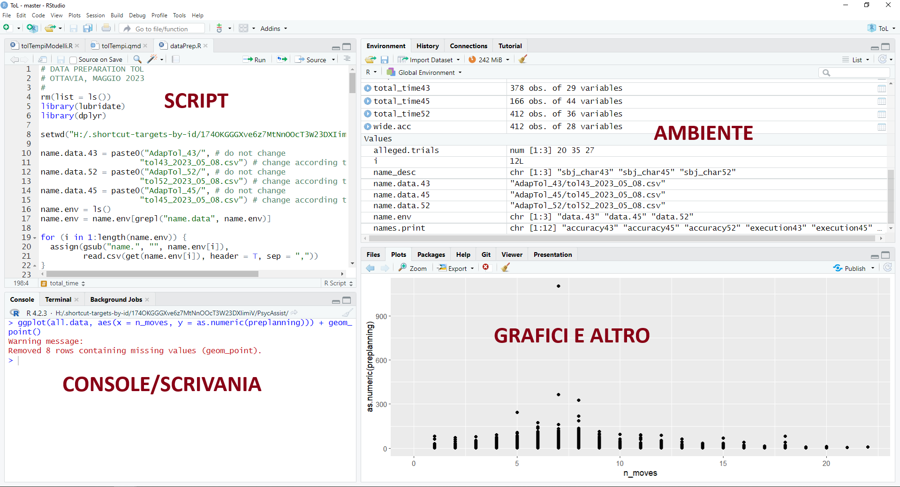
```

**Ambiente/Environment**. Contiene tutti gli oggetti che sono stati creati fino a quel momento nell'ambiente di lavoro

**Script**. File di tipo testuale dove salvare il codice usato per generare gli oggetti presenti nell'ambiente. Si possono combinare codice e commenti (righe che non vengono eseguite e interpretate come codice `#`)

```{r}
# codice per assegnare il numero 25 alla variabile x
x <- 25 
```

**Working directory**. La cartella dentro cui sta lavorando R in quel momento. Diventa di fondamentale importanza perché è dove R si aspetta che ci siano i file (e.g., i dati) con cui volete lavorare

:::{.callout-note}
## Console

I comandi nella console vengono eseguiti con click su Invio 

Il codice non viene salvato e scompare sequenzialmente.

L'output appare immediatamente nella console.

Per fare lo switch alla console $\rightarrow$ `ctrl + 2`

:::

:::{.callout-note}
## Script

Si possono salvare gli script di codice 

Per far "correre" qualsiasi comando nello script
 $\rightarrow$ Ctrl + Invio (o `cmd + Enter`)

L'output appare nella console.

Per fare lo switch allo script $\rightarrow$ `ctr + 1`

:::

## Working directories (`wd`)

### Hard way

```{r}
# per sapere dove sta lavorando R
getwd()
```

La `wd` si può cambiare con il comando `setwd()`: 

```{r}
#| eval: false

setwd("C:/Users/Ottavia/Documents/altro-percorso")
```

### Easy Way: R Project

Crea automaticamente una working directory in cui potete trovare tutto il materiale necessario per delle analisi

Struttura tipica

```text
my-project/
|
+-- index.qmd
+-- data/
|   +-- mydata.csv
+-- img/
|   +-- logo.png
|   +-- plot.jpg
|   +-- illustration.svg
+-- bibliography/
|   +-- references.bib
+-- slides/
    +-- intro.qmd
    +-- advanced-topics.qmd
```

From `File` $\rightarrow$ New Project: 

```{r}
#| label: fig-project
#| echo: false
#| out-width: 100%
#| fig-align: center
#| layout-ncol: 3
#| fig-cap: Creare un progetto R in 3 step
#| fig-subcap: 
#|   - "Step 1"
#|   - "Step 2"
#|   - "Step 3"

library(knitr)
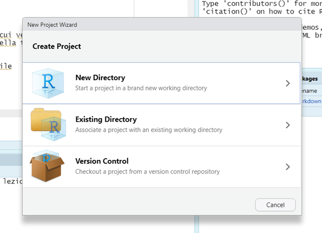
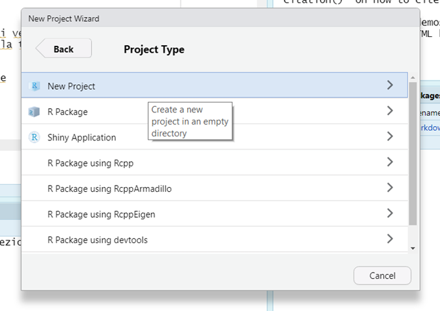

```

```{r}
#| echo: false
#| fig-align: center
#| fig-cap: Indica il nome del progetto

```

```{r}
#| echo: false
#| out-width: 70%
#| fig-align: center
#| fig-cap: "Creare un nuovo script"


```

    
Oppure la seguenza di tasti: `Ctrl + shift + n`

Per salvare uno script: Click sull'icona del salvataggio 

## Reporting con quarto

quarto è un markup language integrato con RStudio. 

Permette la creazione di documenti (sia pdf sia html) che possono contenre chunk di codice, ovvero delle parti dove viene eseguito il codice R, per ottenere risultati, tabelle e grafici.

In questo corso, useremo quarto per tutti gli esercizi.

Una parte dell'esame prevede l'utilizzo di quarto per lo svolgimento degli esercizi. le esercitazioni in intinere sono da svolgere su quarto. 

A [questo link](https://arca-dpss.github.io/shine-with-quarto/) trovate maggiori informazioni su quarto e una guida veloce sul suo funzionamento 

```{r}
#| echo: false
#| fig-align: center
#| fig-cap-location: top
#| out-width: 80%
#| label: fig-quarto
#| fig-cap: Crea un nuovo file quarto
#| layout-ncol: 2
#| fig-subcap: 
#|   - "Crea il file"
#|   - "Selezione tipo di file/dati"

library(knitr)


```

::::{.columns}

:::{.column width="70%"}

```{r}
#| echo: false
#| fig-align: center
#| label: fig-example
#| fig-cap: Deafult documento di quarto. In verde lo YAML, in rosso un chunk di codice eseguibile come qualsiasi script R
library(knitr)
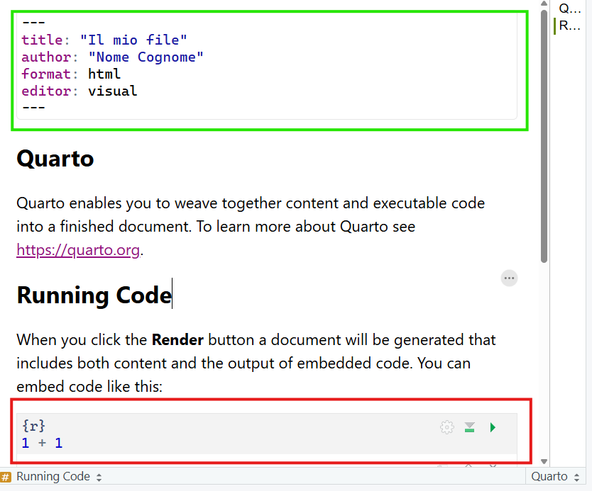
```

:::

:::{.column width="30%"}
In verde in @fig-example, lo YAML che controlla l'aspetto generale del documento. Va modificato per cambiare i metadati del documento. 

In rosso in @fig-example, un chunk di codice eseguibile, ovvero una parte del docuemnto che funziona come un qualsaisi script di R e in quanto tale permette di esguire codice. 

:::

::::

:::{.callout-caution}
## Modifica importante allo YAML

La parte `embed-resources: true` è fondamentale (e va scritta esattamente seguento l'indentazione riportata). Serve a fare in modo che tutti i codici, i risultati e i grafici prodotti nel documento rimangano nel documento quando lo compilate in html. 

```{markdown}
---
title: "Il mio file"
author: "Nome Cognome"
format: 
  html: 
   embed-resources: true
editor: visual
---
```

:::

Il chunk di codice funziona esattamente come R -- è sequenziale, va seguito l'ordine con cui vengono fatte le operazioni

Ogni volta che viene fatto il rendering del documento (`shift + ctrl + k` o freccina azzurra), viene creato un ambiente temporaneo dove viene eseguito il codice. 

L'ambiente temporaneo è indipendente dall'ambiente che vedete su R! 

Per creare un nuovo chunk: `shift + ctrl + i` oppure @fig-chunk: 

```{r}
#| echo: false
#| out-width: 50%
#| label: fig-chunk
#| fig-cap: Creare un nuovo chunk di codice
#| fig-align: center

```


## Elementi base

### Calcolatrice

```{r eval = FALSE} 
3 + 2   # più
3 - 2   # meno
3 * 2   # per
3 / 2   # diviso
```

Parentesi e simili:

> `()` `[]` `{}` `""` `:` `;` `,`


:::{.callout-caution}
## ATTENZIONE

Nei chunk di codice che seguono vedrete spesso l'operatore `;` scritto sulla stessa riga di codice dove viene eseguita un'altra operazione, come ad esempio: 

```{r}
#| echo: true

variabile = 1:5 ; variabile
```

equivale a scrivere 

```{r}
variabile = 1:5 
variabile

```


:::

### Assign (Crea oggetti)

Tutto quello che viene creato in R viene chiamato *oggetto* tramite l'"assegnazione" con specifici simboli, ovvero `<- ` oppure `=`:

```{r}
x <- 4 ; x 

X = 5 ; X
```

Gli elementi a destra del simbolo (contenuto) vengono assegnati all'elemento a sinsitra (contenitore) del simbolo

:::{.callout-warning}
## Attenzione!

R è case sensitive. `x` e `X` sono due oggetti diversi!
:::

### Nominare gli oggetti

```{r echo = FALSE, out.width="25%", fig.align='center'}
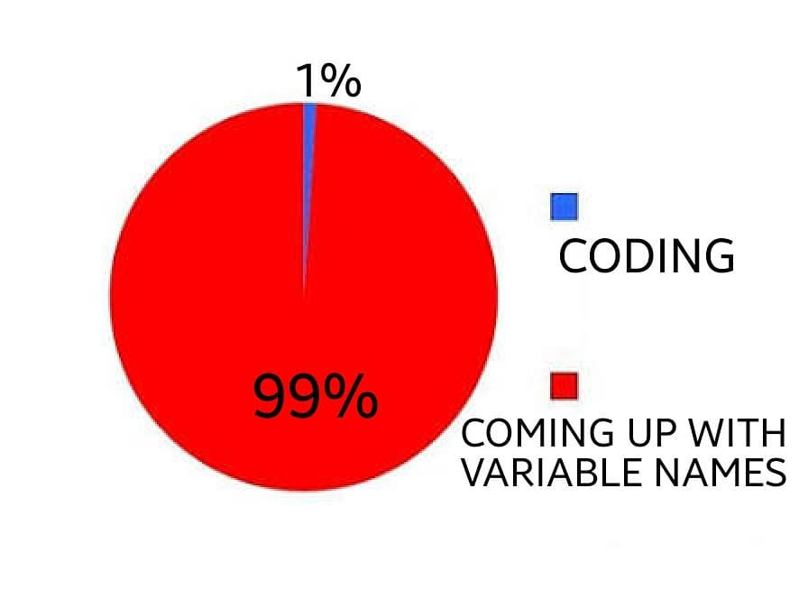
```

Nomi validi sono lettere, numeri, punti, underscore (e.g., `variable_name`)

:::: {.columns}

::: {.column}
Buoni nomi per le variabili: 

- `mean_rt`

- `sum_age`

- `prop_item`

:::

::: {.column}
Pessimi nomi per variabili: 

- `x`

- `y`

- `ciccio`

:::

::::

Non deve contenere caratteri speciali come #, &, $, ?, etc.

Non deve essere una parola riservata ovvero quelle parole che sono
utilizzate da R con un significato speciale (`?reserved`).

```{r}
#| error: true
.01 = 5
1 = "a"
TRUE = 567
```

#### Per convenzione

Queste istruzioni sono valide attraverso diversi linguaggi di programmazione

Fanno riferimento a nomi di oggetti composti da più nomi e/o molto lunghi: 

1. `first_data`, ovvero separare i termini con un underscore (e.g., `my_data`)
2. `firstData`, ovvero la prima parola tutta minuscola, la seconda con la prima lettera maiuscola (e.g., `unitnData` invece di `university_of_trento_data`)

:::{.callout-note}
## Esercizio

1. Creare un nuovo chunk di codice e creare i seguenti oggetti:
  - $10 + 15$ (nome dell'oggetto: `somma`)
  - $\frac{5}{10} \times 3 -2$ (nome dell'oggetto: `operazione_1`)

2. Compilare il documento

:::

### L'ambiente

Gli oggetti finiscono nell'ambiente (`environment`) di R. 

La funzione `ls()` permette di vedere tutti gli oggetti all'interno dell'ambiente

```{r}
#| echo: false
#| fig-align: center
#| fig-cap: "Ambiente di R"
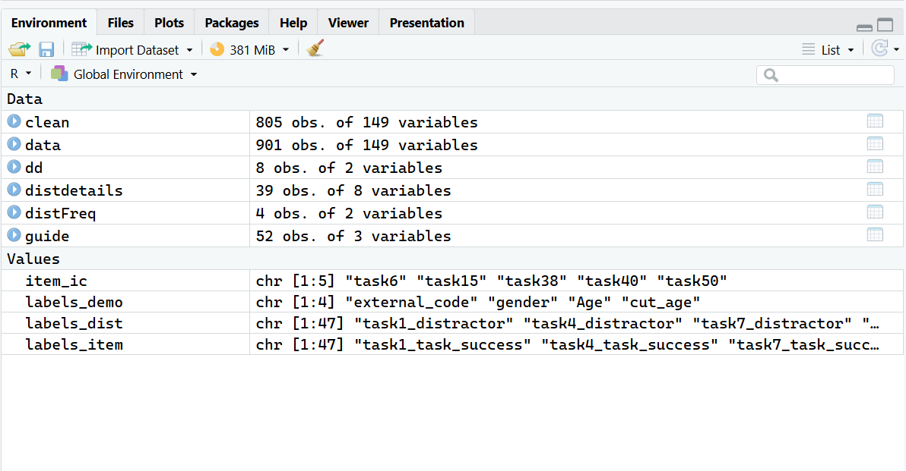
```

`rm()` (remove) è la funzione preposta per rimuovere gli oggetti dall'ambiente di R: `rm("oggetto")`

Il codice `rm(list = ls())` permette di eliminare tutti gli oggetti nell'ambiente in un colpo solo (equivale alla scopetta)

## Pacchetti e Funzioni

### Funzioni

Ogni cosa fatta in R di fatto è riassumbile nelle operazioni fatte su oggetti 

Le operazioni sono le **funzioni**, che permettono di modificare gli oggetti esistenti e di creare di nuovi

```{r}
#| echo: false 

vettore = 1:5
```

```{r}
vettore

sum(vettore)
```

Le funzioni in R sono come le funzioni matematiche $f(\cdot)$, dove viene preso un input, viene elaborato secondo le regole della funzione e si ottiene un output:

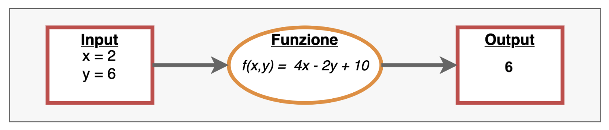{fig-align="center"}

    
    mean(x, trim = 0, na.rm = FALSE, ...)

- Nome della funzione: `mean`
- Parentesi che racchiudono gli argomenti della funzione
- argomenti: 
  - **obbligatori**, senza valori predefiniti senza di cui la funzione non può funzionare
  - **facoltativi** con valori di default (`trim = 0`, `na.rm = FALSE`)
  

```{r}
mean(1:5)
mean(1:5, trim = 0.3)
```

`?funzione` permette di accedere all'help della funzione per scoprire esattamente cosa fa una funzione: 

```{r}
#| eval: false
?mean
```

```{r}
#| echo: false
#| out-width: 70%
#| fig-align: center
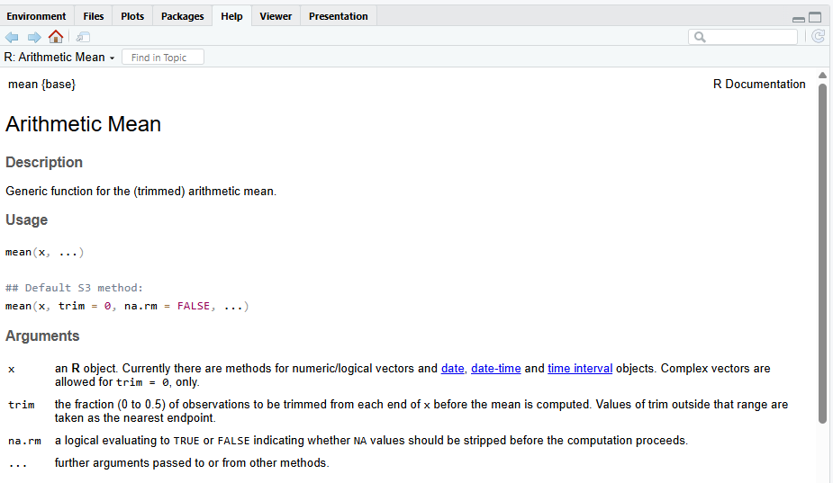
```

Ne esistono di predefinite all'installazione di R, se ne possono definire di nuove autonomamente, si possono installare dei "pacchetti" dal CRAN (comprehensive R archive network) o da un file locale, a seconda delle operazioni che si vogliono svolgere.

```{r}
#| eval: false
#| lst-label: lst-install
#| lst-cap: Codice per installare e caricare un pacchetto

install.packages("nomePacchetto") # installa
library(nomePacchetto) # carica il pacchetto
```

## Operatori

### Operatori Matematici

| Funzione | Cosa fa?        | Esempio     | Risultato |
|----------|-----------------|-------------|-----------|
| `+`      | addizione       | `5.4 + 6.1` | `11.5`    |
| `-`      | sottrazione     | `9 - 4.3`   | `4.7`     |
| `*`      | moltiplicazione | `7 * 1.4`   | `9.8`     |
| `/`      | divisione       | `9/3`       | `3`       |
| `%%`     | resto           | `9%%2`      | `1`       |
| `^`      | potenza         | `15 ^ 2`    | `225`     |

| Funzione | Cosa fa?               | Esempio           | Risultato |
|----------|------------------------|-------------------|-----------|
| `abs()`    | valore assoluto        | `abs(-8)`         | `8`       |
| `sqrt()`   | radice quadrata        | `sqrt(225)`       | `15`      |
| `exp()`    | funzione esponenziale  | `exp(0)`          | `1`       |
| `log()`    | logaritmo naturale     | `log(1)`          | `0`       |
| `round()`  | arrotondamento, intero | `round(1.738)`    | `2`       |
| `round()`  | arrotondamento         | `round(1.738, 2)` | `1.74`    |

### Operatori Relazionali

In R è possibile valutare se una data relazione è vera o falsa. R valuterà le proposizioni e ci restituirà il valore **`TRUE`** se la proposizione è vera oppure **`FALSE`** se la proposizione è falsa.

+---------------+-------------------+-------------------+---------------+
| Funzione      | Nome              | Esempio           | Risulato      |
+===============+===================+===================+===============+
| `==`          | uguale            | `30 == 30`        | `TRUE`        |
+---------------+-------------------+-------------------+---------------+
| `!=`          | diverso           | `30 != 30`        | `FALSE`       |
+---------------+-------------------+-------------------+---------------+
| `>`/`>=`      | maggiore/o uguale | `30 > 10`         | `TRUE`        |
|               |                   |                   |               |
|               |                   | `30 >= 10`        | `TRUE`        |
+---------------+-------------------+-------------------+---------------+
| `<`/`<=`      | minore/o uguale   | `30 < 10`         | `FALSE`       |
|               |                   |                   |               |
|               |                   | `10 <= 10`        | `TRUE`        |
+---------------+-------------------+-------------------+---------------+
| `%in%`        | inclusione        | `10%in%c(1,2,10)` | `TRUE`        |
+---------------+-------------------+-------------------+---------------+

### Insiemistici

Dato:

```{r,echo = TRUE}
x = 30 
```

| Funzione | Nome                   | Esempio       | Risulato |
|----------|------------------------|---------------|----------|
| `&`      | Congiunzione           | `x>25 & x<60` | `TRUE`   |
| `|`      | Disgiunzione Inclusiva | `x>25 | x>60` | `TRUE`   |
| `!`      | Negazione              | `!(x<18)`     | `TRUE`   |

## Tavole di verità

| Operazione | Simbolo | In R | Significato |
|------------|:-------:|:----:|-------------|
| Congiunzione (AND) | $A \cap B$ | `&` | Vera se entrambe le condizioni sono vere. |
| Disgiunzione (OR) | $A \cup B$ | `|` | Vera se almeno una delle due condizioni è vera. |
| Negazione (NOT) | $\overline{A}$ | `!` | Inverte il valore logico di $A$. |
| Differenza simmetrica (XOR) | $A \Delta B$ | `xor(A, B)` | Vera se una e una sola delle due condizioni è vera. |

```{r}
#| echo: false
#| label: tbl-tables
#| tbl-cap: "Tavole di verità"
#| tbl-subcap: 
#|   - "Congiunzione"
#|   - "Disgiunzione"
#|   - "Negazione"
#|   - "Differenza Simmetrica"
#| layout-ncol: 2
#| layout-nrow: 2 
library(knitr)

congiunzione <- data.frame(
  a = c("V", "V", "F", "F"),
  b = c("V", "F", "V", "F"),
  ab = c("V", "F", "F", "F")
)
kable(congiunzione,
      caption = "Congiunzione",
      col.names = c("$a$", "$b$", "$a \\cap b$"))

# Tabella della disgiunzione
disgiunzione <- data.frame(
  a = c("V", "V", "F", "F"),
  b = c("V", "F", "V", "F"),
  ab = c("V", "V", "V", "F")
)
kable(disgiunzione,
      caption = "Disgiunzione",
      col.names = c("$a$", "$b$", "$a \\cup b$"))

# Tabella della negazione
negazione <- data.frame(
  a = c("V", "F"),
  nota = c("F", "V")
)
kable(negazione,
      caption = "Negazione",
      col.names = c("$a$", "$\\lnot a$"))

xor <- data.frame(
  p  = c("V", "V", "F", "F"),
  q  = c("V", "F", "V", "F"),
  pq = c("F", "V", "V", "F")
)

kable(
  xor,
  caption = "Differenza simmetrica (XOR)",
  escape = FALSE,
  col.names = c("$p$", "$q$", "$p \\oplus q$"),
  row.names = FALSE
)
```

Lo stesso risultato della funzione `xor()` può essere ottenuto con la combinazione di diversi operatori logici (ed è la strada da preferire)

## R ed errori

Ci sono diversi livelli di **allerta** quando scriviamo codice:

-   **`messaggi`**: la funzione ci restituisce qualcosa che è utile sapere, ma tutto liscio

-   **`warnings`**: la funzione ci informa di qualcosa di *potenzialmente* problematico, ma (circa) tutto liscio

-   **`error`**: la funzione non solo ci informa di un **errore** ma le operazioni richieste non sono state eseguite

Come risolvere?

-   Capire il messaggio
-   Leggere la documentazione della funzione
-   Cercare il messaggio su internet
-   Chiedere aiuto nei forum dedicati
-  Chidere all'IA

#### R e l'uso dell'IA

I prompt devono più specifici possibile e centrati su quello che volete fare e come lo volete fare.

Dovete comunicare chiaramente che volete sempre la soluzioe in R base, possibilmente senza usare funzioni aggiuntive e dovete sempre chiedere che vi spieghi il codice.

:::{.callout-warning}

All'esame non potete usare l'IA, ma la potete usare per prepararvi e per aiutarvi nello studio

:::

## Vettori

I vettori sono una struttura dati unidimensionale e sono la più semplice presente in R.

{fig-align="center"}

**Caratteristiche**:

* **la lunghezza**: il numero di elementi da cui è formato il vettore

* **la tipologia**: la tipologia di dati da cui è formato il vettore. Un vettore infatti deve esssere formato da **elementi tutti dello stesso tipo**!

#### Caratteristiche degli elementi di un vettore

-   **un valore**: il valore dell'elemento che può essere di qualsiasi tipo ad esempio un numero o una serie di caratteri

-   **un indice di posizione**: un numero intero positivo che identifica la sua posizione all'interno del vettore.

{fig-align="center"}

#### Creare un vettore con `c()`

Concatena diversi oggetti insieme per creare un nuovo oggetto unico

```{r}
x = c(1, 2, 3) ; x
X = 1:3 ; X
x == X 
```

### Tipologie di vettore

Tipi di oggetti diversi $\rightarrow$ Tipi di vettori diversi: 

- `num` (`numeric`): Numeri `(-0.56, 3, 4.5)`
- `logi` (`logic`): Logico (`TRUE` vs `FALSE`)
- `chr` (`character`): characters `("a", "b", "c")`
- `factor` (`factor`): factor con diversi livelli

La distinzione più importanti è tra vettori di tipo categoriale (`chr` e `factor`) e vettori di tipo numerico (`int` e `num`): 

- `integer` e `numeric`: Operazioni matematiche E calcolo delle frequenze
- `character` e `factor`: Calcolo delle frequenze

```{r}
months = c(5, 6, 8, 10, 12, 16); months
```

```{r}
weight = runif(6, 3, 18) ; weight
```

I vettori logici si ottengono testando delle condizioni sulla base dei valori di altri vettori: 

```{r}
months > 12
```

Il vettore logico risultante può essere utilizzato

```{r}
v_chr = c(letters[1:3], LETTERS[4:6]); v_chr
```

```{r}
ses = factor(rep(c("low", "medium", "high"), each = 2)); ses
```

Il secondo vettore è un vettore di tipo `factor` e prevede che si possa specificare l'ordine dei livelli 

```{r}
ses = factor(ses, levels = c("low", "medium", "high"))
```

Attenzione a non mischiare gli oggetti!!

`num` + `logi` $\rightarrow$ `num` 

`num` + `factor` $\rightarrow$ `num` 

`num` + `chr` $\rightarrow$ `chr`

`chr` + `logi` $\rightarrow$ `chr`

### Indicizzare i vettori

```{r eval=TRUE}
nomi = c("Pasquale", "Egidio", "Debora", "Luca", "Andrea")
nomi
```

\begin{table}[h]
\centering
\begin{tabular}{p{2cm}p{2cm}p{2cm}p{2cm}p{2cm}}
\hline
\multicolumn{1}{|c|}{Pasquale} & \multicolumn{1}{|c|}{Egidio}& \multicolumn{1}{|c|}{Debora} & \multicolumn{1}{|c|}{Luca} & \multicolumn{1}{|c|}{Andrea} \\\hline
& & & & \\
\multicolumn{1}{c}{1} & \multicolumn{1}{c}{2}& \multicolumn{1}{c}{3} & \multicolumn{1}{c}{4} & \multicolumn{1}{c}{5}\\
\end{tabular}
\end{table}

`nome_vettore[indice]`

`nomi[1]` $\rightarrow$  `r nomi[1]`

`nomi[3]` $\rightarrow$  `r  nomi[3]`

`nomi[seq(2, 5, by = 2)]` $\rightarrow$  `r nomi[seq(2, 5, by = 2)]`

```{r}
weight
```

```{r eval=TRUE}
weight[2] # secondo elemento di weight
(weight[6] = 15.2) # sostituisce il sesto elemento di weight
weight[seq(1, 6, by = 2)] # elementi 1, 3, 5
weight[2:6] # elementi dal 2 al 6 (incluso)
weight[-2] # rimuove il secondo elemento
```

Si può indicizzare con la logica

```{r}
weight > 7
```

```{r}
weight[weight > 7] # solo i valori > di 7
weight[weight >= 4.5 & weight < 8] # valori compresi tra 4.5 e 8
```

:::{.callout-note}
## Esercizio

In un nuovo documento quarto (`esercizi-modulo1.qmd`):

- Assegna i seguenti valori a un oggetto chiamato `my_var` (i valori devono essere **concatenati** tra loro)

> 23, 24, 25, 27, 28, 29, 30

- Calcola la media di `my_var` usando la funzione `mean()`, il minimo (`min()`) e massimo (`max()`)

- Crea un oggetto (`voto`) di tipo character come segue (usare la funzione `rep()`): 
  - "si" ripetuto 12 volte
  - "no" ripetuto 15 volte 

:::

## Matrici

Le matrici sono una struttura dati **bidimensionale** (caratterizzate da 2 dimensioni **`dim()`** ) dove il numero di righe rappresenta la dimensione 1 e il numero di colonne la dimensione 2.

```{r, echo=TRUE}
my_mat = matrix(data = 1:10, nrow = 2, ncol = 5)
my_mat
```

     `matrix(data, nrow, ncol, byrow = FALSE)`

```{r}
# crea una matrice con 3 righe e 4 colonne 
# (i valori sono sistemati per riga)
A = matrix(1:12, nrow=3, ncol = 4, byrow = TRUE)
# assegna dei nomi alle righe 
rownames(A) = paste("a", 
                    1:nrow(A), sep ="_") 
# assegna dei nomi alle colonne
colnames(A) = paste("b", 
                    1:ncol(A), sep ="_")
A
```

### Caratteristiche

* Possono contenere una sola tipologia di dati
* Essendo bidimensionali, sono necessari due indici di posizione
(righe e colonne) per identificare un elemento
* Possono essere viste come un insieme di singoli vettori

### Indicizzare le matrici

```{r echo = FALSE, results='asis'}
#| tbl-cap: "Struttura di una matrice"
library(knitr)
library(kableExtra)
library(tidyverse)

my.mat = rbind("[1,]" = c("$[1, 1]$", "$[1, 2]$", "$[1, 3]$"), 
       "[2,]" = c("$[2, 1]$", "$[2, 2]$", "$[2, 3]$"), 
       "[3,]" = c("$[3, 1]$", "$[3, 2]$", "$[3, 3]$"))
colnames(my.mat) = c("[,1]", "[,2]", "[,3]")
my.mat %>% kable(align = "c")

```

`my_matrix[righe, colonne]`

```{r}
A
```

`A[1, ]` $\rightarrow$  `r A[1, ]`

`A[, 2]` $\rightarrow$ `r A[, 2]`

`A[2, 3]` $\rightarrow$ `r A[2, 3]` 

:::{.callout-note}
## Esercizio

- Crea una matrice $3 \times 3$ con la tabellina del 3 fino a 24, assegnandola all'oggetto `my_mat`
- Dai un nome alle righe (e.g., `r1, r2, r3`) e alle colonne (e.g., `c1, c2, c3`)
- Indice da `my_mat`:
  - La prima riga
  - La seconda colonna
  - La cella $[1,2]$

:::

## Dataframe

Il dataframe è la struttura più “complessa”, utile e potente di R: 

Come le matrici, è composto da due dimensioni (righe $\times$ colonne)

A differenza delle matrici, può contenere dati di tipo diverso

* Ogni elemento (colonna) è un vettore con un nome associato 

* Ogni colonna deve avere lo stesso numero di elementi
di conseguenza ogni riga ha lo stesso numero di elementi (struttura
rettangolare)

* **Tutte le colonne (quindi tutti i vettori contenuti nel dataframe) devono avere la stessa lunghezza**

    data.frame(. . .)

```{r}

sesso = c(rep(c("M","F"), length=length(weight)))
data = data.frame(id = paste0("id", 1:length(weight)), 
                  weight, sesso)
data
```

### Indicizzare i dataframe

    data[r, c], data$nome_variabile

:::: {.columns}

:::{.column width="50%"}
```{r}
data
```

:::

:::{.column width="50%"}

```{r}

data[2, 1]
data$weight
data$weight[2]
```
:::
::::

La stessa logica con cui dai vettori si estraggono tutte le osservazioni che soddisfano un determinato requisito

```{r}
weight[weight >= 7]
```

Nel caso del dataframe: 

::::{.columns}

:::{.column width=50%}
```{r}
data[data$weight >=7, ]
```
:::

:::{.column width=50%}
```{r}
data[data$weight >=7 & data$weight < 9, 
     "id"]
```
:::

::::
### Attributi e caratteristiche

Le funzioni **`names()`** , **`dim()`**, **`nrow()`**, **`ncol()`** sono alcune delle funzioni per ottenere informazioni sulle caratteristiche del dataframe. 

La funzione più utile è **`str()`** poichè ci restituisce una veloce overview della struttura del dataframe: dimensioni, tipi di variabili,...

```{r,echo=TRUE}
str(data) 
```

:::{.callout-note}
## NB

La funzione **`str()`** funziona su tutti gli oggetti di R
:::

## Liste

      list(name1 = obj1, name2 = obj2, name3 = obj3, . . .)
      

Permette di creare liste di oggetti diversi (matrici, vettori, variabli) di diverso tipo (`numeric`, `character`, `integer`)

Molti dei risultati ottenuti con le funzioni per le analisi statistiche sono organizzati in liste, proprio perché permettono di contenere oggetti di natura diversa e con dimensionalità diversa

```{r}
A <- c(1,8,5,0)
M <- matrix(A, 2, 2)
Nomi3 <- c("giorgio", "ugo", "anna")
LV <- c(TRUE, FALSE, TRUE, TRUE)
OgLista <- list(a = A, Mat = M, nomi = Nomi3, X = LV)
str(OgLista)
```

### Indicizzare le liste

    lista[[i]], lista$nome_oggettpo

`[[i]]`: indice dell'oggetto all'interno della lista a cui si vuole accedere 

```{r}

OgLista[[2]]
```

`$nome_oggetto`

```{r}
OgLista$Mat
```

## Importare dati esterni

### Importa base

    read.csv2("file_path", header = T, sep = ";")

Il default della funzione prevede che la prima riga contenga i nomi delle variabili e che il separatore di colonne sia ";".

Se si possiede un dataset chiamato "dati" nella cartella "data", questo codice lo importerà all'interno dell'ambiente

```{r}
#| eval: false
# Lettura file dati esterni
data <- read.csv2("data/dati.csv")
```

### Importa alternativa 1

```{r}
#| echo: false
#| fig-align: center
#| out-width: 100%

```

```{r}
#| echo: false
#| fig-align: center
#| out-width: 100%
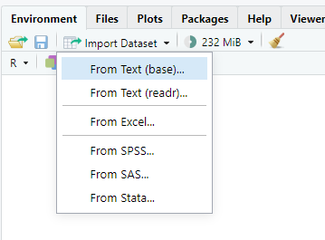
```

```{r}
#| echo: false
#| fig-align: center
#| out-width: 100%
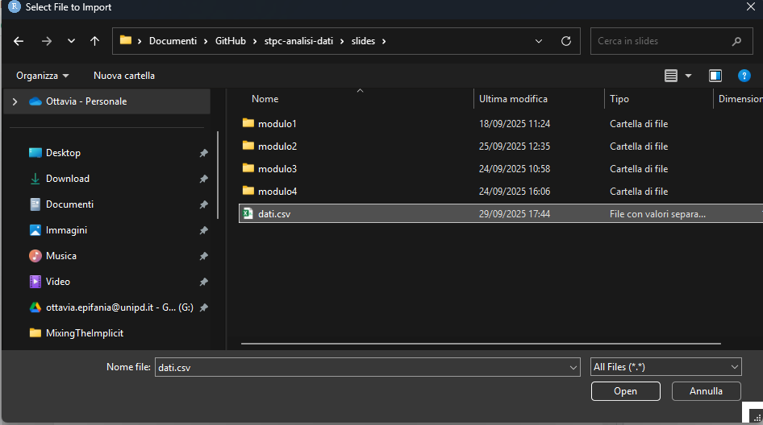
```

```{r}
#| echo: false
#| fig-align: center
#| out-width: 100%
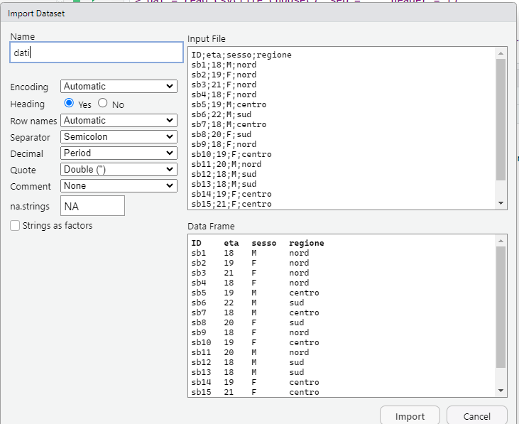
```

### Importa alternativa 2

```{r}
#| echo: true
dati = read.csv("slides/dati.csv", 
                sep =";", dec =",", header = TRUE)
head(dati)
```

## Sintesi delle strutture tabellari

#### `summary()`

    summary(data)

Riassume il contenuto di strutture di dati 

```{r}
summary(rock)
```

#### `str()`

    str(data)
    
Fornisce informazioni circa la struttura generale di un oggetto: 

```{r}
str(rock)
```

#### `head()` ($\alpha$) and `tail()` ($\omega$)

:::: {.columns}

::: {.column width="50%"}
`head()`

Le prime 6 osservazioni del dataset
```{r}
head(rock)
```

:::

::: {.column width="50%"}
`tail()`

le ultime 6 osservazioni del dataset

```{r}
tail(rock)
```

:::

::::

#### `apply()`

    apply(data, MARGIN, FUN)

`data`: i dati su cui si vuole lavorare

`MARGIN`: 1 applica la funzione sulle righe (attraverso le colonne), 2 applica la funzione sulle colonne (attraverso le righe)

`FUN`: la funzione che si vuole applicare

```{r}
apply(rock, 1, sum)   # Somma per riga
apply(rock, 2, mean)  # Media per colonna
```

# Modulo 2 -- Scale di misura e statistica descrittiva univariata

## Variabili

\begin{center}
\Large  QUALITATIVE / CATEGORIALI
\end{center}
\begin{itemize}
\item sconnesse: $\{a,b,c\}$
\item ordinate:$\{a,b,c\}$ con $a < b < c$ (oppure $a > b > c$)
\end{itemize}

\begin{center}
\Large  QUANTITATIVE / METRICHE
\end{center}
\begin{itemize}
\item Discrete: $\mathbb{Z}$
\item Continue: $\mathbb{R}$
\end{itemize}

#### Stevens (1946)

Si differenziano in base alla quantità di informazione che può essere ricavata
	
\begin{itemize}
\item Variabili qualitative
\begin{itemize}
\item \textbf{Nominale}: Distingue un insieme di dati in diverse categorie
\item \textbf{Ordinale}: Distingue un insieme di dati in diverse categorie che sono ordinabili a seconda della quantità di caratteristica posseduta 
\end{itemize}
	
\item Variabili quantitative
	
\begin{itemize}
\item \textbf{Intervalli equivalenti} Distingue un insieme di dati in diverse categorie ordinabili. La distanza tra le categorie è nota perché c'è un'unità di misura
\item \textbf{A rapporti equivalenti}: Come la scala ad intervalli...ma lo 0 indica assenza di caratteristica (non è arbitrario ma è assoluto) 
\end{itemize}
\end{itemize}

### Categoriali - Nominali

Comune di residenza, sesso biologico, patologia clinica ecc. Vale solo l'equivalenza ($=$ o $\neq$)

\begin{center}
\includegraphics[width=.20\linewidth]{slides/modulo2/img/nominale.png}
\end{center}

Al posto di A, B, C si poteva scrivere $\alpha$, $\beta$ $\gamma$, 1,2,3 (ma i numeri valgono solo come etichette!)

Caratteristiche: 

\begin{itemize}
\item  Categorie \textbf{distintive}: gli elementi che appartengono a categorie differenti vengono considerati di tipo diverso
\item Categorie \textbf{mutualmente escludentesi}: ogni elemento può rientrare in una ed una sola categoria
\item Categorie \textbf{collettivamente esaustive}: tutti gli elementi vengono classificati nelle categorie della variabile, nessuno escluso
	
\end{itemize}

#### `as.factor()`

`as.factor()`: Converte una variabile in una variabile di tipo **categoriale/nominale** con tanti livelli quanti sono i valori unici nel vettore 

**Due livelli**

```{r}
Genere <- c("m","f","f","m","f","m") 
Genere
```

```{r}
as.factor(Genere) 
```

`as.character()` produre una variabili categoriale, ma senza i livelli che caratterizzano i `factor`

**Più livelli**

```{r}
diagnosi <- c("schizo", "dep", "narc", "schizo", "dep", "narc")
diagnosi

```

```{r}
as.factor(diagnosi) 
```

### Categoriali - Ordinali

Titolo di studio, gradimento di un prodotto, valutazione di una malattia (e.g., alto, medio, basso), fasce di reddito ecc. Vale sia l'equivalenza ($=$ o $\neq$) sia l'ordinamento ($<$ o $>$)
	
\begin{center}
\includegraphics[width=.20\linewidth]{slides/modulo2/img/ordinale.png}
\end{center}

:::{.callout-caution}
## Attenzione!

Si conosce l'ordine tra le categorie, non si conosce la distanza.

Le etichette numeriche valgono per il loro ordine (non ha senso compiere operazioni tra di loro)

:::

    factor(A,levels=c("a1","a2",..., "ak"), ordered=TRUE) 
       
Converte la variabile in una variabile con tanti livelli quanti sono i valori unici e viene forzato un ordine su questi livelli: 

```{r}
Voto <- c("alto","medio","medio","basso","alto") 
Voto
factor(Voto,levels=c("basso","medio","alto"), ordered=TRUE) 
```

### Quantitative -- Scala ad intervalli equivalenti

Lo $0$ è arbitrario, ma c'è un'\emph{unita di misura} per cui le categorie si trovano alla stessa distanza. Temperatura in Celsius, Q.I., scale di atteggiamento ecc. Vale equivalenza ($=$ o $\neq$), ordinamento ($<$ o $>$) e differenza ($+$ o $-$): 

\begin{center}
\includegraphics[width=0.5\linewidth]{slides/modulo2/img/intervalli.png}
\end{center}
	
\begin{center}
\includegraphics[width=0.5\linewidth]{slides/modulo2/img/termometroMulti.jpg}
\end{center}

\begin{center}
\includegraphics[width=0.3\linewidth]{slides/modulo2/img/termometri}
\end{center}

Se ci sono 0°C, non vuol dire che non c'è temperatura.
Se ieri c'erano 5°C e oggi ce ne sono 10°C, possiamo dire che oggi fa più caldo di ieri e che ci sono 5°C più di ieri.
Il fatto che lo 0 non sia arbitrario non ci permette di dire che oggi c'è il doppio del caldo di ieri.
Trasformando le due temperature in Fahrenheit si ottiene 41°F e 50°F... e la seconda non è più il doppio della prima!

### Quantitative -- Scala a rapporti equivalenti

Lo 0 è assoluto, indica assenza del fenomeno. Peso, altezza, valori diagnostici. Vale equivalenza ($=$ o $\neq$),  ordinamento ($<$ o $>$), differenza ($+$ o $-$) e rapporto ($\times$ o $\div$)
	
\begin{center}
\includegraphics[width=0.40\linewidth]{slides/modulo2/img/rapporti.png}
\end{center}

\begin{center}
\includegraphics[width=0.4\linewidth]{slides/modulo2/img/bilancia}
\end{center}

#### `numeric`, `integer()`

Le **variabili metriche** in R  sono variabili di tipo `numeric` o `integer`, a seconda che siano continue o discrete 

:::{.callout-caution}
## Attenzione!

In R non esiste una distinzione tra variabili a intervalli equivalenti e variabili a rapporti equivalenti -- Sta a voi capire che tipo di variabile sia
:::

```{r}
x = seq(-3, 3, by = .5); x # <1>
y = rnorm(10, mean = 3, sd=2); y # <2>
z = 1:15; z # <3>
```
1. La funzione `seq()` genera un vettore di numeri da un minimo a un massimo, con un step progressivo definito dall'utente
2. La funzione `rnorm()` genera un vettore di lunghezza definita estraendo a caso da una distribuzione normale 
3. L'operatore `:` genera una sequenza unitaria di valori da un minimo a un massimo

```{r}
str(x)
str(y)
str(z)
```

## Frequenze

### Assolute e relative

\begin{table}[h]
\centering
\begin{tabular}{|c|c|c|}
\hline
Categoria $x_i$ & $n_i$ & $\%_i = \dfrac{n_i}{n}\cdot 100$ \\
\hline
$x_1$ & $n_1$ & $\%_1$ \\
$x_2$ & $n_2$ & $\%_2$ \\
$\vdots$ & $\vdots$ & $\vdots$ \\
$x_k$ & $n_k$ & $\%_k$ \\
\hline
Totale & $n$ & $100$ \\
\hline
\end{tabular}
\end{table}

\vspace{3mm}

\textbf{Frequenza assoluta:}\quad
$n_i \geq 0$, con $n_i \in \mathbb{N}$ e
$\displaystyle\sum_{i=1}^{k} n_i = n$

\vspace{2mm}

\textbf{Frequenza percentuale:}\quad
$\%_i = \dfrac{n_i}{n}\cdot100$,
con $0 \leq \%_i \leq 100$ e
$\displaystyle\sum_{i=1}^{k}\%_i = 100$

    table(variabile)
    
Calcola le frequenze per ogni categoria. Funziona sia per le variabili categoriali sia per le variabili metriche 

```{r}
table(Genere)
```

```{r}
table(diagnosi)
```

### Cumulate

**Frequenza cumulata**: numero o percentuale di unità statistiche
  che presentano una categoria "minore o uguale" alla categoria corrente.

**Frequenze assolute cumulate**

$$N_i = n_1 + n_2 + \cdots + n_i
    = \sum_{j=1}^{i} n_j$$

con $N_1 = n_1 \qquad \text{e} \qquad N_k = n.$

**Frequenze percentuali cumulate**

$$
N_i\% = n_1\% + n_2\% + \cdots + n_i\%
       = \sum_{j=1}^{i} n_j\%
$$

con $N_1\% = n_1\% \qquad \text{e} \qquad N_k\% = 100\%.$

Le frequenze cumulate possono essere definite **ricorsivamente**:

$$N_i = N_{i-1} + n_i, \qquad N_i\% = N_{i-1}\% + n_i\%$$

:::{.callout-caution}

## Attenzione

Le frequenze cumulate si calcolano **solo quando le modalità del carattere
presentano un ordinamento**.

Non hanno quindi senso per caratteri qualitativi sconnessi (nominali).
:::

Esprimi l'accordo con l'affermazione:

> Insegnare statistica a psicologia è una pessima idea

\begin{table}[h]
\centering

\begin{tabular}{lrrrr}
\hline
Modalità $x_i$ & $n_i$ & $N_i$ & $n_i\%$ & $N_i\%$ \\
\hline
Totalmente in disaccordo  & 10 & 10 & 24.4\% & 24.4\% \\
Abbastanza in disaccordo  &  8 & 18 & 19.5\% & 43.9\% \\
Indifferente              &  6 & 24 & 14.6\% & 58.5\% \\
Abbastanza d'accordo      & 14 & 38 & 34.2\% & 92.7\% \\
Totalmente d'accordo      &  3 & 41 &  7.3\% & 100.0\% \\
\hline
Totale                     & 41 &    & 100.0\% & \\
\hline
\end{tabular}

\end{table}

#### `cumsum()`

```{r}
#| echo: true
opinione = data.frame(
  categoria = c("Totalmente in disaccordo", "Abbastanza in disaccordo",
    "Indifferente",
    "Abbastanza d'accordo", "Totalmente d'accordo"),
  n = c(10, 8, 6, 14, 3)
)
opinione$N = cumsum(opinione$n)
opinione
```

## Indici di posizione

\begin{itemize}
\item \textbf{indici sintetici} che evidenziano le caratteristiche essenziali della distribuzione della variabile
	
\vspace{3mm}

\begin{quote}

Presentano livelli maggiori di machiavellismo l3 CEO o l3 impiegat3?
\end{quote}
\vspace{3mm} 

\item Si confrontano categorie che rappresentano i livelli o valori tipici

\item Consentono di sintetizzare un insieme di misure tramite un unico valore ``rappresentativo'' $\rightarrow$ indice che riassume o descrive i dati e dipende dalla scala di misura dei dati in oggetto
\end{itemize}

\begin{itemize}
\item moda
\item mediana
\item quartili/percentili
\item media aritmetica
\end{itemize}

Ogni variabile statistica ha l’indice di posizione adeguato: non tutti gli indici si possono calcolare per ogni variabile $\rightarrow$ \textbf{indice di posizione adeguato}

\begin{tikzpicture}[
  node distance=0.9cm and 1.8cm,
  boxleft/.style={
    draw,
    rounded corners=4pt,
    minimum width=5.2cm,
    minimum height=1.0cm,
    align=center,
    fill=gray!8,
    inner sep=6pt
  },
  boxright/.style={
    draw,
    rounded corners=4pt,
    minimum width=3.8cm,
    minimum height=1.0cm,
    align=center,
    fill=template!15,
    inner sep=6pt,
    font=\bfseries
  },
  arrow/.style={
    -{Latex[length=2.5mm]},
    thick,
    draw=gray!70
  }
]

\node[boxleft] (nom) {
Variabile misurata su\\
\textbf{scala nominale}
};

\node[boxleft, below=of nom] (ord) {
Variabile misurata su\\
\textbf{scala ordinale}
};

\node[boxleft, below=of ord] (quant) {
\textbf{Variabile quantitativa}
};

\node[boxright, right=of nom] (moda) {
MODA
};

\node[boxright, right=of ord] (mediana) {
MEDIANA
};

\node[boxright, right=of quant] (media) {
MEDIA o MEDIANA
};

\draw[arrow] (nom.east) -- (moda.west);
\draw[arrow] (ord.east) -- (mediana.west);
\draw[arrow] (quant.east) -- (media.west);

\end{tikzpicture}

#### Moda ($Mo$)

Categoria che presenta la massima frequenza
	
	
\begin{center}
	$Mo(X) = max(n_i)$ \\ (categoria con massimo valore di $n_i$)
\end{center}
	
	
	
:::{.callout-warning}
		
N.B: Si può calcolare per le variabili misurate a qualsiasi livello, anche se di fatto viene calcolata solo per le variabile categoriali, in quanto per altri livelli di misurazione si
possono calcolare altri indici più informativi
:::

```{r}
opinione
max(opinione$n) # restituisce max(n_i)
opinione[opinione$n == max(opinione$n), "categoria"]
```

#### Mediana

Categoria/valore che occupa la posizione centrale o mediana ($Pos_{Me}$) nella distribuzione ordinata dei dati
	
\begin{itemize}
\item preceduta da almeno 50\% dei casi
\item superata da almeno 50\% dei casi
\end{itemize}

\begin{equation*}
Pos_{Me} = \dfrac{(N+1)}{2}
\end{equation*}

Il valore di $Pos_{Me}$ va cercato nella distribuzione delle frequenze cumulate e si sceglie la categoria con $N_i \geq Pos_{Me}$

#### Quantili

Categorie/valori che dividono la distribuzione di frequenza \underline{ordinata} in più parti.

\begin{quote}
Qual è il reddito familiare che divide il 25\% dei più poveri dal restante 75\% ?
	
Qual è la soglia di reddito oltre cui sta la fascia dei più
	abbienti ?
	
Quali sono le persone che hanno performato al meglio nell'ultimo semestre?
\end{quote}

Il quantile $x_p$ di ordine $p$ è quella categoria/valore che è:
	
\begin{itemize}
\item preceduta da almeno $p$\% dei casi
\item superata da almeno $(1-p)$\% dei casi
\end{itemize}

\begin{tikzpicture}[
  boxleft/.style={
    draw,
    rounded corners=4pt,
    minimum width=2.8cm,
    minimum height=0.85cm,
    align=center,
    fill=gray!8,
    inner sep=5pt,
    font=\bfseries
  },
  boxright/.style={
    draw,
    rounded corners=4pt,
    minimum width=5.0cm,
    minimum height=0.85cm,
    align=center,
    fill=template!15,
    inner sep=5pt
  },
  arrow/.style={
    -{Latex[length=2.3mm]},
    thick,
    draw=gray!70
  }
]

% Box superiori
\node[boxleft] (quartili) at (0,0) {QUARTILI};
\node[boxright] (qtext) at (5.2,0) {
dividono la distribuzione in \textbf{4} parti
};

\node[boxleft] (decili) at (0,-1.3) {DECILI};
\node[boxright] (dtext) at (5.2,-1.3) {
dividono la distribuzione in \textbf{10} parti
};

\node[boxleft] (percentili) at (0,-2.6) {PERCENTILI};
\node[boxright] (ptext) at (5.2,-2.6) {
dividono la distribuzione in \textbf{100} parti
};

% Frecce
\draw[arrow] (quartili.east) -- (qtext.west);
\draw[arrow] (decili.east) -- (dtext.west);
\draw[arrow] (percentili.east) -- (ptext.west);

% Testo sotto
\node[align=center, font=\small] at (3.3,-3.8) {
\textbf{La distribuzione è la stessa: cambia il modo in cui viene suddivisa}
};

% Barre: stessa lunghezza
\def\xstart{-0.5}
\def\xend{7.0}
\def\barheight{0.38}

% Quartili
\node[anchor=east, font=\scriptsize] at (-0.7,-4.7) {Quartili};
\draw[rounded corners=2pt, fill=gray!10]
  (\xstart,-4.9) rectangle (\xend,-4.5);

\foreach \x in {1.375,3.25,5.125}{
  \draw[thick] (\x,-4.9) -- (\x,-4.5);
}

\foreach \x in {0.4375,2.3125,4.1875,6.0625}{
  \node[font=\scriptsize] at (\x,-4.7) {25\%};
}

% Decili
\node[anchor=east, font=\scriptsize] at (-0.7,-5.5) {Decili};
\draw[rounded corners=2pt, fill=gray!10]
  (\xstart,-5.7) rectangle (\xend,-5.3);

\foreach \x in {0.25,1.0,1.75,2.5,3.25,4.0,4.75,5.5,6.25}{
  \draw[thin] (\x,-5.7) -- (\x,-5.3);
}

% Etichette 10% nei decili
\foreach \x in {-0.125,0.625,1.375,2.125,2.875,3.625,4.375,5.125,5.875,6.625}{
  \node[font=\scriptsize] at (\x,-5.5) {10\%};
}

% Percentili
\node[anchor=east, font=\scriptsize] at (-0.7,-6.3) {Percentili};
\draw[rounded corners=2pt, fill=gray!10]
  (\xstart,-6.5) rectangle (\xend,-6.1);

% tante suddivisioni sottili
\foreach \i in {1,...,99}{
  \pgfmathsetmacro{\x}{-0.5 + 7.5*\i/100}
  \draw[very thin, gray!60] (\x,-6.5) -- (\x,-6.1);
}

\end{tikzpicture}

Per il calcolo dei quantili di diverso ordine, il procedimento è
	analogo a quello della Mediana, che di fatto è un caso
	particolare di questi indici.
	In generale la Posizione di ordine $p$ (in centesimi) si ottiene:
	
\begin{equation*}
Pos_p = \dfrac{n+1}{100}\cdot p 
\end{equation*}

#### `quantile()`

    quantile(x, probs = c(0, .25, .50, .75, 1))
    
Funzione per il calcolo dei quantili di diverso ordine (definito dall'argomento `probs`)

```{r}
set.seed(123) # garantisce la replicabilità 
x = rnorm(1000, mean = 0, sd = 1)
quantile(x)
# calcola i decili 
quantile(x, probs = seq(0,1, by = .10))
```

#### Media

La media è una sorta di baricentro della distribuzione dei dati. Data una variabile $X$ composta da $n$ valori:  

\begin{equation*}
\bar{X} = \dfrac{\sum_{i = 1}^{n}x_i}{n}
\end{equation*}

\scalebox{.80}{
\begin{tikzpicture}[scale=0.9]

\def\data{0.8,1.2,1.6,2.4,2.7,3.3,3.6,4.5,5.2}
\def\mean{2.81}

% Tavola
\draw[line width=2pt] (0.5,0.3) -- (6.5,0.3);

% Fulcro
\draw[fill=gray!40]
(\mean,0) -- ++(-0.35,-0.7) -- ++(0.7,0) -- cycle;
\node[below] at (\mean,-0.7) {Media};

% Puntini = osservazioni
\foreach \x in \data {
    \fill[blue!60] (\x,0.45) circle (0.12);
}

% Asse
\draw[->, thin, gray] (0,0) -- (7,0) node[right] {Valori};

\end{tikzpicture}}

I dati: $X = (0.8,1.2,1.6,2.4,2.7,3.3,3.6,4.5,5.2)$, la media $\bar{X} = 2.811$

\scalebox{.80}{
\begin{tikzpicture}[scale=0.9]

\def\data{1.18,1.02,1.10,1.16,1.01,1.10,1.05,1.12,1.45,1.52,1.54,1.55,10.06,14.46}
\def\mean{2.809}
\def\angle{8}

% ---- calcolo minimo e massimo ----
\pgfmathsetmacro{\xmin}{1.01}
\pgfmathsetmacro{\xmax}{14.46}

% piccolo margine estetico
\pgfmathsetmacro{\leftend}{\xmin - 0.5}
\pgfmathsetmacro{\rightend}{\xmax + 0.5}

% Fulcro
\draw[fill=gray!40]
(\mean,0) -- ++(-0.4,-0.7) -- ++(0.8,0) -- cycle;
\node[below] at (\mean,-0.7) {Media};

% Tavola + dati ruotati attorno al fulcro
\begin{scope}[rotate around={-\angle:(\mean,0.3)}]

    % Tavola che copre TUTTI i dati
    \draw[line width=2pt] (\leftend,0.3) -- (\rightend,0.3);

    % Puntini
    \foreach \x in \data {
        \fill[blue!60] (\x,0.45) circle (0.12);
    }

\end{scope}

% Asse
\draw[->, thin, gray] (\leftend-0.5,0) -- (\rightend+0.5,0) node[right] {Valori};

\end{tikzpicture}
}

I dati: $X = (1.18,1.02,1.10,1.16,1.01,1.10,1.05,1.12,1.45,1.52,1.54,1.55,10.06,14.46)$, la media $\bar{X} = 2.809$

#### `mean()`

    mean(x, na.rm = FALSE)
    
Funzione per calcolare la media di un vettore di valori `x`. L'agromento `na.rm = TRUE` serve per ottenere il calcolo della media nonostante la presenza di valori NA 

`rowMeans()`: Calcola la media per ogni riga (quindi attraverso le colonne)

`colMeans()`: Calcola la media per ogni colonna (quindi attraverso le righe)

```{r}
mean(x)
```

## Perché i grafici

\begin{quote}
\large
Graphs remind us that the process of statistical inference is
not mechanical. This process often involves subjective decisions (e.g., the
evaluation, exploration, and/or deletion of outliers) which are an
integral part of the analysis. Thus, graphs are among the most
appropriate tools to enhance transparency and confer plausibility
to such decisions.
\end{quote}

\vspace{10mm}
\begin{flushright}
Pastore et al. (2017)
\end{flushright}

Data set di Anscombe: Quattro dataset, di seguito le statistiche descrittive realitive alla variabile x e alla variabile y e la loro correlazione:

```{r}
#| echo: false
#| results: asis
#| tbl-cap: Dataset di Anscombe
# Creo la tabella delle statistiche descrittive
descrittive <- data.frame(
  Dataset = paste("Dataset", 1:4),
  
  `Media X` = sapply(1:4, function(i)
    mean(anscombe[[paste0("x", i)]])),
  
  `Media Y` = sapply(1:4, function(i)
    mean(anscombe[[paste0("y", i)]])),
  
  `Varianza X` = sapply(1:4, function(i)
    var(anscombe[[paste0("x", i)]])),
  
  `Varianza Y` = sapply(1:4, function(i)
    var(anscombe[[paste0("y", i)]])),
  
  `Correlazione` = sapply(1:4, function(i)
    cor(
      anscombe[[paste0("x", i)]],
      anscombe[[paste0("y", i)]]
    ))
)

descrittive[, -1] <- round(descrittive[, -1], 2)

knitr::kable(
  descrittive,
  format = "latex",
  booktabs = TRUE,
  align = "lccccc"
)
```

```{r}
#| echo: false
#| out-width: 70%
#| fig-align: center
#| layout-nrow: 2
#| layout-ncol: 2
#| label: fig-data
#| fig-cap: I grafici raccontano un'altra storia
#| fig-subcap: 
#|   - "Dataset 1"
#|   - "Dataset 2"
#|   - "Dataset 3"
#|   - "Dataset 4"

par(
  cex.axis = 2,
  cex.lab  = 2,
  lwd = 2,
  mar = c(5, 5, 2, 1)
)

plot(anscombe$x1, anscombe$y1,
     pch = 19,
     col = "steelblue",
     cex = 2.5,
     xlab = "x",
     ylab = "y", ylim = c(4, 13), xlim = c(4, 14))
abline(lm(anscombe$y1 ~ anscombe$x1),
       lwd = 6, lty = 2, col = "gray")
abline(v = mean(anscombe$x1),
       lwd = 3, lty = 3, col = "firebrick")
abline(h = mean(anscombe$y1),
       lwd = 3, lty = 3, col = "firebrick")

plot(anscombe$x2, anscombe$y2,
     pch = 19,
     col = "steelblue",
     cex = 2.5,
     xlab = "x",
     ylab = "y", ylim = c(4, 13), xlim = c(4, 14))
abline(lm(anscombe$y2 ~ anscombe$x2),
       lwd = 6, lty = 2, col = "gray")
abline(v = mean(anscombe$x2),
       lwd = 3, lty = 3, col = "firebrick")
abline(h = mean(anscombe$y2),
       lwd = 3, lty = 3, col = "firebrick")

plot(anscombe$x3, anscombe$y3,
     pch = 19,
     col = "steelblue",
     cex = 2.5,
     xlab = "x",
     ylab = "y", ylim = c(4, 13), xlim = c(4, 14))
abline(lm(anscombe$y3 ~ anscombe$x3),
       lwd = 6, lty = 2, col = "gray")
abline(v = mean(anscombe$x3),
       lwd = 3, lty = 3, col = "firebrick")
abline(h = mean(anscombe$y3),
       lwd = 3, lty = 3, col = "firebrick")

plot(anscombe$x4, anscombe$y4,
     pch = 19,
     col = "steelblue",
     cex = 2.5,
     xlab = "x",
     ylab = "y", ylim = c(4, 13), xlim = c(4, 14))
abline(lm(anscombe$y4 ~ anscombe$x4),
       lwd = 6, lty = 2, col = "gray")
abline(v = mean(anscombe$x4),
       lwd = 3, lty = 3, col = "firebrick")
abline(h = mean(anscombe$y4),
       lwd = 3, lty = 3, col = "firebrick")
```

## Grafici

R fornisce uno strumento molto utile per la rappresentazione grafica dei dati e dei risultati già con il suo pacchetto base `graphics` 

:::{.callout-warning}
## NB

Non avete bisogno di installarlo, è caricato automaticamente nel momento in cui scaricate R e le sue funzioni sono sempre disponibili

:::

`ggplot2` è un pacchetto più avanzato per la creazione dei grafici. Non entreremo nel dettaglio del suo funzionamento perché è un po' più complicato 

Alcune funzioni incluse nel pacchetto `graphics`:

```{r}
#| eval: false
plot(x)   # <1> 
plot(x, y) # <2>
hist(x)    # <3>
boxplot(x) # <4>
barplot(x) # <5>
```

1. Grafico di una variabile quantitativa
2. Grafico a dispersione di due variabili quantitative 
3. Istogramma di una variabile quantitativa 
4. Boxplot della distribuzione quartile di una (o più)  variabili
5. Grafico a barre per le frequenze delle variabili qualitative

### Grafico a barre

Usato per variabili qualitative nominali o ordinali: 

* Asse $x$: categoria $k$ 
* Asse $y$: Frequenza $n_k$ (vale anche per le frequenze percentuali)

L'altezza della barretta è proporzionale alla sua frequenza

    barplot(x)
    
Dove `x` è il vettore delle frequenze (quello che si ottiene applicando la funzione `table()` a una variabile categoriale)
   

```{r}
#| echo: false
# Dati di esempio
freq <- c(10, 25, 15)
categorie <- c("A", "B", "C")

# Barplot
bp <- barplot(
  freq,
  names.arg = categorie,
  ylim = c(0, 32),
  col = "darkorange",
  border = NA,
  xlab = "Categorie",
  ylab = expression("Frequenza  " * n[k] * "  (o  " * f[k] * ")"),
  cex.names = 1.5,
  cex.axis = 1.3,
  cex.lab = 1.4
)

# Altezza della barra B
segments(
  x0 = bp[2] + 0.7, y0 = 0,
  x1 = bp[2] + 0.7, y1 = freq[2],
  lwd = 2,
  lty = 2
)

arrows(
  x0 = bp[2] + 0.7, y0 = 18,
  x1 = bp[2] + 0.7, y1 = 24.5,
  length = 0.12,
  lwd = 2
)

text(
  bp[2] + 0.9, 17,
  labels = "Altezza = frequenza",
  pos = 4,
  cex = 1.2
)
```

```{r}
#| echo: false
#| label: tbl-examples
#| tbl-cap: Tabelle di frequenza per le categorie A, B, C.
#| layout-ncol: 2
#| out-width: 80%

dati1 <- data.frame(
  Categoria = c("A", "B", "C"),
  n = c(21, 24, 22)
)

knitr::kable(
  dati1,
  col.names = c("Categoria", "$n_k$"),
  row.names = FALSE,
  align = c("c", "c")
)

dati <- data.frame(Categoria = c("A", "B", "C"),
  n = c(12, 35, 18)
)

knitr::kable(
  dati,
  col.names = c("Categoria", "$n_k$"),
  row.names = FALSE,
  align = c("c", "c")
)
```

```{r}
#| echo: false
#| label: fig-examples
#| fig-cap: Barplot delle tabelle
#| layout-ncol: 2

barplot(
  dati1$n,
  names.arg = dati1$Categoria,
  xlab = "Categoria",
  ylab = expression(n[i]),
  ylim = c(0, 30),
  col = "steelblue",
  border = NA,
  cex.names = 1.5,
  cex.axis = 1.5,
  cex.lab = 1.5
)

barplot(
  dati$n,
  names.arg = dati$Categoria,
  xlab = "Categoria",
  ylab = expression(n[i]),
  ylim = c(0, 40),
  col = "steelblue",
  border = NA,
  cex.names = 1.5,
  cex.axis = 1.3,
  cex.lab = 1.4
)
```

```{r}
#| out-width: 30%
#| fig-align: center
dati = factor(rep(c("A", "B", "C"), c(12, 35, 18))); dati
table(dati)
barplot(table(dati), col = "darkgreen")
```

### Istogrammi

`hist(x, breaks)` Produce un istogramma a partire da un vettore x di osservazioni quantitative. `breaks` definisce la larghezza delle singole barre, secondo diverse regole 

```{r}
#| echo: false
#| layout-ncol: 2
#| fig-cap: Istogrammi con n diverso 
#| fig-subcap: 
#|   - "n = 500"
#|   - "n = 50"
set.seed(999)
x = rnorm(500, mean = 0, sd = 1)
hist(x, ylab = "Frequenze assolute", 
     xlim = c(-3,3))
x = rnorm(50, mean = 0, sd = 1)
hist(x,  ylab = "Frequenze assolute", 
     xlim=c(-3,3))
```

```{r}
#| out-width: 70%
#| fig-align: center
x = rnorm(500, mean = 0, sd = 1)
hist(x)
```

```{r}
#| echo: false
#| fig-align: "center"
# --- Dati di esempio ---
set.seed(123)
x <- rnorm(500, mean = 20, sd = 10)

# Creo istogramma senza plot per avere i dati
h <- hist(x,  plot = FALSE)

# Scelgo il bin da evidenziare (es: bin 9)
bin_index <- 9
bin_height <- h$counts[bin_index]
bin_left <- h$breaks[bin_index]
bin_right <- h$breaks[bin_index + 1]
bin_mid <- (bin_left + bin_right)/2
bin_width <- bin_right - bin_left

# --- Plot base ---
plot(h, main = "Histogram of X", xlab = "", ylab = "Frequenze assolute",
     col = "white", border = "black", cex.main = 1.5, cex.axis = 1.2, cex.lab = 1.3)

# Evidenzio il bin b9
rect(bin_left, 0, bin_right, bin_height,
     col = rgb(0.2, 0.4, 0.8, 0.6), border = "black", lwd = 2)

# --- Etichetta n = 500 in alto a sinistra ---
usr <- par("usr") # per coordinate del grafico
rect(usr[1], usr[4] - 15, usr[1] + 15, usr[4],
     col = "black", border = NA)
text(usr[1] + 7.5, usr[4] - 7.5,
     expression(bolditalic(n == 500)), col = "white", cex = 1.3)

# --- Linea orizzontale per altezza bin ---
abline(h = bin_height, col = "skyblue", lty = 2, lwd = 2)
text(usr[1] + 2, bin_height + 3, "Altezza Bin b9", col = "red",
     font = 2, pos = 4, cex = 1.2)

# --- Freccia per indicare il bin ---
arrows(x0 = bin_mid + bin_width/2, y0 = bin_height + 5,
       x1 = bin_mid + bin_width/4, y1 = bin_height + 1,
       lwd = 2, length = 0.1)

# Rettangolo blu dietro la scritta Bin b9
rect(bin_mid + bin_width/2 + 2, bin_height + 1,
     bin_mid + bin_width/2 + 8, bin_height + 6,
     col = "steelblue", border = NA)
text(bin_mid + bin_width/2 + 5, bin_height + 3.5,
     "Bin b9", col = "white", font = 2, cex = 1.1)

# --- Doppia freccia per larghezza bin ---
arrows(bin_left, -5, bin_right, -5, code = 3,
       angle = 90, length = 0.1, lwd = 2, col = "skyblue")
text(bin_mid, -8, "Larghezza Bin b9", col = "red",
     font = 2, cex = 1.2)
```

```{r}
#| echo: false
x = rnorm(1000, mean = 10, sd = 5)
```

```{r}
#| layout-ncol: 2
#| layout-nrow: 2
#| label: fig-methods
#| echo: false
#| out-width: "80%"
#| fig-cap: "Metodi per la definizione dei breaks"
#| fig-subcap: 
#|     - "Sturges - Default"
#|     - "FD"
#|     - "Scott"
#|     - "User defined (145)"

hist(x, breaks = "Sturges")
hist(x, breaks = "FD")
hist(x, breaks = "Scott")
hist(x, breaks = 145)
```

\begin{center}
Sturges: 

$\displaystyle \frac{\max(x) - \min(x)}{\log_{2}(n + 1)}$

Scott: 

 $\displaystyle 3.5 \sqrt{\mathrm{var}(x)} \, n^{-1/3}$
 
Freedman-Diaconis 
 
 $\displaystyle 2 \,(Q_3 - Q_1)\, n^{-1/3}$ 
 
User defined: 

 $\displaystyle \dfrac{\max(x) - \min(x)}{\text{breaks}}$ 

\end{center}

### Boxplot

`boxplot(x)` Produce un boxplot a partire da un vettore X di osservazioni quantitative 

```{r}
#| echo: false
#| out-width: 70%
#| fig-align: center
set.seed(123)
x <- c(rnorm(30, mean = 10, sd = 2), 3, 4, 20, 22)

# --- Boxplot ---
boxplot(x,
        ylab = "Valore", cex.main = 1.2)
```

```{r}
#| echo: false
set.seed(123)
x <- c(rnorm(30, mean = 10, sd = 2), 3, 4, 20, 22)

# --- Boxplot ---
boxplot(x, main = "Boxplot",
        ylab = "Valore", cex.main = 1.2)

# --- Statistiche del boxplot ---
stats <- boxplot.stats(x)
vals <- stats$stats  # contiene: min, Q1, mediana, Q3, max dei baffi

minimo <- vals[1]
Q1 <- vals[2]
mediana <- vals[3]
Q3 <- vals[4]
massimo <- vals[5]

# --- Etichette sui punti chiave ---
# L'asse x del boxplot è a 1 (perché è un singolo box)
xpos <- 1.2  # sposto leggermente a destra per non sovrapporre

text(xpos, minimo,  labels = "Baffo", pos = 4, col = "blue")
text(xpos, Q1,      labels = "Q1", pos = 4, col = "blue")
text(xpos, mediana, labels = "Mediana/Q2", pos = 4, col = "blue")
text(xpos, Q3,      labels = "Q3", pos = 4, col = "blue")
text(xpos, massimo, labels = "Baffo", pos = 4, col = "blue")

# --- Eventuali outlier ---
out <- stats$out
if (length(out) > 0) {
  points(rep(1, length(out)), out, pch = 16, col = "red")
  text(rep(xpos, length(out)), out,
       labels = "Outlier ",
       pos = 4, col = "red")
}
text(xpos, min(out),labels = "Minimo", 
     pos = 2, col = "black")
text(xpos, max(out),labels = "Massimo", 
     pos = 2, col = "black")
```

### Boxplot -- Calcolo degli outlier

La lunghezza dei baffi (e di conseguenza la definizione degli outliers) è definita attraverso il metodo Tukey: 

$$[Q_1 - 1.5 \times IQR, \, Q_3 + 1.5 \times IQR]$$

dove $IQR = Q_3 - Q_1$ (Inter-quartile range)

Settando l'argomento `range = x` si può cambiare il modo in cui vengono calcolati i baffi: 

```{r}
#| layout-ncol: 2
#| fig-cap: Calcolo degli outlier
#| fig-subcap: 
#|   - "range = 2 - Meno Conservativo"
#|   - "range = 0 - Minimo e Massimo"

boxplot(x, range = 2)
boxplot(x, range = 0)
```

## Esempi

#### `barplot()`

```{r}
#| eval: false

voto = sample(rep(c("si", "no", "astenuti"), 
           c(12, 15, 2)))
voto = factor(voto, levels = c("si", "no", "astenuti"))
table(voto)

# le frequenze restituite dalla funzione table() vanno usate 
# come vettore di base per il barplot

barplot(table(voto), 
        col = c("darkgreen", "darkred", "darkblue"), 
        ylim = c(0, 20))

```

```{r}
#| eval: true
#| echo: false
voto = sample(rep(c("si", "no", "astenuti"), 
           c(12, 15, 2)))
voto = factor(voto, levels = c("si", "no", "astenuti"))
table(voto)

# le frequenze restituite dalla funzione table() vanno usate 
# come vettore di base per il barplot

```

```{r}
#| fig-align: center
#| out-width: 70%
barplot(table(voto), 
        col = c("darkgreen", "darkred", "darkblue"), 
        ylim = c(0, 20))

```

#### `boxplot()`

```{r}
#| echo: false
#| fig-align: center
#| out-width: 100%
#| label: fig-boxes
#| layout-ncol: 3
#| fig-cap: Distribuzioni a confronto 
#| fig-subcap: 
#|   - "boxplot(x)"
#|   - "boxplot(y)"
#|   - "boxplot(z)"
set.seed(666)
x = rnorm(1000, mean = 10, sd = 4)
boxplot(x, col ="darkorange")
y = rnorm(1000, mean = 10, sd = 4)
# Forte effetto pavimento
y_floor <- (y - min(y))^3
y_min <- min(y)
y_max <- max(y)

y_floor <- y_min + 
  ((y - y_min) / (y_max - y_min))^3 * (y_max - y_min)
y_ceiling <- y_max -
  ((y_max - y) / (y_max - y_min))^3 * (y_max - y_min)
boxplot(y_floor, col ="lightblue")
boxplot(y_ceiling, col = "gold")
```

@fig-boxes-1: La distribuzione è equilibrata attorno alla mediana, situaata circa a metà della distribzuone tra il minimo e il massimo 

@fig-boxes-2: La distribuzione è squilibrata verso il basso, ovvero verso il minimo, presentando una coda più "pesante" verso il massimo

@fig-boxes-3: La distribuzione è squilibrata verso l'alto, ovvero verso il massimo, presentando una coda più "pesante" verso il minimo

#### `hist()`

```{r}
#| echo: false
#| fig-align: center
#| out-width: 100%
#| label: fig-hist
#| layout-ncol: 3
#| fig-cap: Distribuzioni a confronto - Le stesse dei boxplot
#| fig-subcap: 
#|   - "hist(x)"
#|   - "hist(y)"
#|   - "hist(z)"
hist(x, col ="darkorange")
hist(y_floor, col = "lightblue")
hist(y_ceiling, col = "gold")
```

#### Confronto boxplot vs istogramma

```{r}
#| echo: false
#| fig-align: center
#| out-width: 100%
#| label: fig-comparison0
#| layout-ncol: 2
#| fig-cap: Boxplot vs Istogramma
#| fig-subcap: 
#|   - "boxplot(x)"
#|   - "hist(x)"

boxplot(x, col ="darkorange"); hist(x, col ="darkorange")
```

#### Confronto boxplot vs istogramma

```{r}
#| echo: false
#| fig-align: center
#| out-width: 100%
#| label: fig-comparison1
#| layout-ncol: 2
#| fig-cap: Boxplot vs Istogramma
#| fig-subcap: 
#|   - "boxplot(y)"
#|   - "hist(y)"

boxplot(y_floor, col ="lightblue"); hist(y_floor, col ="lightblue")
```

#### Confronto boxplot vs istogramma

```{r}
#| echo: false
#| fig-align: center
#| out-width: 100%
#| label: fig-comparison2
#| layout-ncol: 2
#| fig-cap: Boxplot vs Istogramma
#| fig-subcap: 
#|   - "boxplot(z)"
#|   - "hist(z)"

boxplot(y_ceiling, col ="gold"); hist(y_ceiling, col ="gold")
```

```{r}
#| label: fig-myfigure
#| echo: false
#| layout-ncol: 3
#| layout-nrow: 2
#| fig-cap: ""
#| fig-subcap: 
#|   - ""
#|   - ""
#|   - ""
#|   - ""
#|   - ""
#|   - ""
boxplot(x, col = "darkorange", horizontal = T)
boxplot(y_floor, col ="lightblue", horizontal = T)
boxplot(y_ceiling, col = "gold", horizontal = T)

hist(x, col = "darkorange")
hist(y_floor, col ="lightblue")
hist(y_ceiling, col = "gold")

```

```{r}
#| echo: false
x = x
y = y_floor
z = y_ceiling
```

```{r}
#| echo: true
boxplot(x, y, z, names = c("Normale", "Pavimento", "Soffitto"), 
        col = c("darkorange", "lightblue", "gold"))
```

# Modulo 3 -- Statistica descrittiva bivariata

## Variabile statistica doppia

\begin{tabular}{|c|c|c|c|c|c|c|c|c|c|c|c|}
\hline
$X$: Istruzione & E & E & E & SI & SI & SI & SS & SS & SS & SS & SS\\
\hline
$Y$: Occupazione & DI & I & I & DI & I & I & D & I & I & D & D\\
\hline
\end{tabular}

\begin{center}
\begin{minipage}[t]{.48\linewidth}
\centering
\begin{tabular}{c c}
\hline
categoria $x_k$ & $n_{k.}$\\
\hline
Elementare (E) & \textcolor{red}{3} \\
Secondaria Inferiore (SI) & \textcolor{red}{3}\\
Secondaria Superiore (SS) & \textcolor{red}{5} \\
\hline
\end{tabular}
\end{minipage}\hfill
\begin{minipage}[t]{.48\linewidth}
\centering
\begin{tabular}{c c}
\hline
categoria $y_j$ & $n_{.j}$ \\
\hline
Disoccupato (DI) & \textcolor{blue}{2} \\
Impiegato (I) & \textcolor{blue}{6}\\
Dirigente (D) & \textcolor{blue}{3} \\
\hline
\end{tabular}
\end{minipage}
\end{center}

\begin{center}
\begin{tabular}{|c|c|c|c|c|}
\hline
 & DI & I & D & \\
\hline
E  & 1 & 2 & 0 & \textcolor{red}{3}\\
SI & 1 & 2 & 0 & \textcolor{red}{3}\\
SS & 0 & 2 & 3 & \textcolor{red}{5}\\
\hline
 & \textcolor{blue}{2} & \textcolor{blue}{6} & \textcolor{blue}{3} & \textbf{11}\\
\hline
\end{tabular}
\end{center}

Date due variabili $X$ e $Y$ e la loro distribuzione di frequenze congiunte 
$n_{kj}$ (numero di unità statistiche che presentano la coppia di categorie 
$(x_k,y_j)$)

:::{.callout-tip}

L'insieme $(X,Y)$ delle terne

$$(x_k,y_j,n_{kj}) 
\qquad
(k=1,\ldots,h;\ j=1,\ldots,m)$$

è detto \textbf{variabile statistica doppia}.

:::

## Tabella a doppia entrata -- Tavola di contingenza

\begin{tabular}{
p{0.7cm} p{0.7cm} |
p{0.7cm} p{0.7cm} p{0.7cm} p{0.7cm} p{0.7cm} p{0.7cm} |
p{0.7cm}
}

& \multicolumn{1}{l}{} 
& \multicolumn{6}{c}{Y} 
& \multicolumn{1}{c}{} \\

& \multicolumn{1}{c}{}
& \multicolumn{1}{l}{$y_1$}
& \multicolumn{1}{l}{$y_2$}
& \multicolumn{1}{l}{$\ldots$}
& \multicolumn{1}{l}{$y_j$}
& \multicolumn{1}{l}{$\ldots$}
& \multicolumn{1}{l}{$y_m$}
& \multicolumn{1}{l}{$n_{k.}$} \\

\cline{3-8}

\multirow{6}{*}{X}

& $x_1$
& $n_{11}$
& $n_{12}$
& $\ldots$
& $n_{1j}$
& $\ldots$
& $n_{1m}$
& $n_{1.}$ \\

& $x_2$
& $n_{21}$
& $n_{22}$
& $\ldots$
& $n_{2j}$
& $\ldots$
& $n_{2m}$
& $n_{2.}$ \\

& $\vdots$
& $\vdots$
& $\vdots$
& 
& $\vdots$
& 
& $\vdots$
& $\vdots$ \\

& $x_k$
& $n_{k1}$
& $n_{k2}$
& $\ldots$
& $n_{kj}$
& $\ldots$
& $n_{km}$
& $n_{k.}$ \\

& $\vdots$
& $\vdots$
& $\vdots$
&
& $\vdots$
&
& $\vdots$
& $\vdots$ \\

& $x_h$
& $n_{h1}$
& $n_{h2}$
& $\ldots$
& $n_{hj}$
& $\ldots$
& $n_{hm}$
& $n_{h.}$ \\

\cline{3-8}

&
& $n_{.1}$
& $n_{.2}$
& $\ldots$
& $n_{.j}$
& $\ldots$
& $n_{.m}$
& $n$ \\

\end{tabular}

$n_{kj}$: **Frequenza congiunta**, definisce il numero di unità statistiche 
che possiedono congiuntamente la categoria $x_k$ della variabile $X$ e 
la categoria $y_j$ della variabile $Y$

$n_{k.}$: **Frequenza marginale di $X$**, definisce il numero di unità 
statistiche che possiedono la categoria $x_k$ della variabile $X$

$n_{.j}$: **Frequenza marginale di $Y$**, definisce il numero di unità 
statistiche che possiedono la categoria $y_j$ della variabile $Y$

$n$: Numero totale di unità statistiche

\begin{center}
\begin{tikzpicture}[
    node distance=1.1cm and 1.3cm,
    formula/.style={
        draw,
        fill=white,
        minimum width=3.2cm,
        minimum height=1.4cm,
        align=center,
        inner sep=1ex
    },
    description/.style={
        draw,
        fill=white,
        text width=7.2cm,
        minimum height=1.4cm,
        align=left,
        inner sep=1.5ex
    },
    arrow/.style={
        ->,
        line width=0.5pt,
        shorten >=3pt,
        shorten <=3pt
    }
]

% Frequenza marginale di X
\node[formula] (A) {
    $\displaystyle n_{k.} = \sum_{j=1}^{m} n_{kj}$
};

\node[description, right=of A] (C) {
  \small  Numero di unità statistiche che possiedono la
    categoria $x_k$ della variabile $X$
    (\footnotesize \textbf{totale della riga $k$})
};

\draw[arrow] (A) -- (C);

% Frequenza marginale di Y
\node[formula, below=of A] (D) {
    $\displaystyle n_{.j} = \sum_{k=1}^{h} n_{kj}$
};

\node[description, right=of D] (E) {
    \small Numero di unità statistiche che possiedono la
    categoria $y_j$ della variabile $Y$
    (\footnotesize  \textbf{totale della colonna $j$})
};

\draw[arrow] (D) -- (E);

\end{tikzpicture}
\end{center}

$$
\sum_{k=1}^{h}\sum_{j=1}^{m} n_{kj}
=
\sum_{k=1}^{h} n_{k.}
=
\sum_{j=1}^{m} n_{.j}
=
n
$$

### `table()`

`table(var1, var2)`: Produce la tabella di frequenza tra due variabili categoriali `var1` e `var2`

```{r}
#| echo: true
var1 <- as.factor(c("a1","a2","a1","a2","a1","a2","a1"))  
var2 <- as.factor(c("b1","b1","b1","b2","b1","b2","b2")) 
mytab = table(var1, var2); mytab
sum(mytab) # permette di ottenere l'ampiezza campionaria
```

### `margin.table()`

`margin.table(table, margin)`: Frequenze marginali per la tabella a doppia entrata

:::{.callout-tip}
`margin = 1`: Frequenze marginali calcolate **attraverso le colonne**

`margin = 2`: Frequenze marginali calcolate **attraverso le righe**
:::

```{r}
mytab
```

::::{.columns}

:::{.column width=50%}

```{r}
#| echo: true
margin.table(mytab,1)  
```

:::

:::{.column width=50%}
```{r}
#| echo: true
margin.table(mytab,2)  
```
:::

::::

### `prop.table()`

`prop.table(T, margin = NULL)`: Probabilità condizionate: 

:::{.callout-tip}
`margin = 1`: Probabilità condizionate di riga (**attraverso le colonne**)

`margin = 2`: Probabilità condizionate di colonna (**attraverso le righe**)
:::

:::: {.columns}

:::{.column width="50%"}
```{r}
#| echo: true
mytab
```

:::

:::{.column width="50%"}
```{r}
#| echo: true
prop.table(mytab)   
```
:::

::::

::::{.columns}
:::{.column width=50%}

```{r}
#| echo: true
prop.table(mytab,1)  # P(B|A)
```
:::

:::{.column width=50%}
```{r}
#| echo: true
prop.table(mytab,2)  # P(A|B)
```
:::
::::

### Frequenze percentuali

::::{.columns}

:::{.column width="50%"}

```{r}
#| echo: false
donne = read.csv2("slides/modulo3/laboratorio/datiDonne.csv")
donne$Istruzione = factor(donne$Istruzione, levels = c("Basso", "Medio", "Alto"))
tabella = addmargins(table(donne$Occupazione, donne$Istruzione))
rownames(tabella)[nrow(tabella)] <- "Totale"
colnames(tabella)[ncol(tabella)] <- "Totale"
library(kableExtra)
knitr::kable(tabella, booktabs = TRUE, align = "c") |>
  row_spec(nrow(tabella) - 1, hline_after = TRUE)

```

:::

:::{.column width="50%"}

```{r}
#| echo: false
#| out-width: 80%
#| fig-align: center
tab = table(donne$Occupazione, donne$Istruzione)
mosaicplot(
  tab,
  color = c("skyblue", "lightcoral", "seagreen4"),
  cex = 3
)
```

:::

:::: 

### $P(\text{Titolo}|\text{Occupazione})$ (Frequenze percentuali di **riga**)

:::: {.columns}

::: {.column width="50%"}

```{r}
#| echo: false
percRiga = (round(prop.table(table(donne$Occupazione, donne$Istruzione), 1), 2))*100
percRiga = addmargins(percRiga)
percRiga = percRiga[-nrow(percRiga), ]
knitr::kable(
  percRiga,
  booktabs = TRUE,
  align = "c"
)
```

:::

::: {.column width="50%"}

```{r}
#| echo: false

tab = table(donne$Istruzione, donne$Occupazione)
barplot(
  tab,
  beside = TRUE,          # barre affiancate (non impilate)
  col = c("yellow2", "seagreen2", "darkgreen"),
  legend = TRUE,
  ylim = c(0, max(tab) + 10),
  main = "Frequenze assolute per Occupazione e Livello di Istruzione",
  ylab = "Frequenza assoluta", cex.names = 3,args.legend = list(cex = 2.5, x = "topright", bty = "n")
)
```

:::

::::

*X% delle donne lavoratici/casalinghe hanno un titolo di studio basso/medio/alto*

### $P(\text{Occupazione}|\text{Titolo})$ (Frequenze percentuali di **colonna**)

:::: {.columns}

::: {.column width="50%"}

```{r}
#| echo: false
percColonna = (round(prop.table(table(donne$Occupazione, donne$Istruzione), 2), 2))*100
percColonna = addmargins(percColonna)
percColonna = percColonna[,-ncol(percColonna) ]
knitr::kable(
  percColonna,
  booktabs = TRUE,
  align = "c"
)
```

:::

::: {.column width="50%"}

```{r}
#| echo: false

tab = table(donne$Occupazione, donne$Istruzione)
barplot(
  tab,
  beside = TRUE,          # barre affiancate (non impilate)
  col = c("yellow2",  "darkgreen"),
  legend = TRUE,
  ylim = c(0, max(tab) + 10),
  main = "Frequenze assolute per Occupazione e Livello di Istruzione",cex.names = 3,
  ylab = "Frequenza assoluta",args.legend = list(cex = 2.5, x = "topright", bty = "n")
)
```

:::

::::

*X% delle donne con titolo di studio basso/medio/alto che sono lavoratici/casalinghe*

## Connessione (Variabili qualitative)

\begin{center}
La CONNESSIONE tra due variabili categoriali equivale alla NON INDIPENDENZA!
		
\end{center}

Tra le variabili $X$ e $Y$ c’è una forma di legame e \textbf{relazione} (\textbf{connessione}) $\rightarrow$ il variare di una implica un qualche cambiamento \textbf{non casuale} nell’altra

### $\chi^2$

Quantifica la DISTANZA DALL'INDIPENDENZA tra due variabili categoriali

* X con $h$ categorie $x_k$, con $k=1,\ldots,h$,
* Y con $m$ categorie $y_j$, con $j=1,\ldots,m$

Richiede il confronto tra **frequenze osservate** ($n_{kj}$) e **frequenze attese** o **frequenze teoriche** ($n_{kj}^*$)

:::: {.columns}
:::{.column width=40%}
\begin{tabular}{|p{2.5cm}|p{1cm}|}
\hline
& \\
\multicolumn{1}{|c|}{${n_{kj}}$} & \multicolumn{1}{c|}{$n_{k.}$}\\
& \\
\hline
\multicolumn{1}{|c|}{$n_{.j}$} & \\
\hline
\end{tabular}
	
	
\vspace{3mm}
Frequenze osservate
:::

:::{.column width=10%}
VS.
:::

:::{.column width=40%}
\begin{tabular}{|p{2.5cm}|p{1cm}|}
\hline
& \\
\multicolumn{1}{|c|}{$n_{kj}^*$} & \multicolumn{1}{c|}{$n_{k.}$}\\
& \\
\hline
\multicolumn{1}{|c|}{$n_{.j}$} & \\
\hline
\end{tabular}

\vspace{3mm}
Frequenze teoriche
:::
::::

$$n_{kj}^* = \dfrac{n_{k.} \times n_{.j}}{n}, \qquad n = \sum_{k=1}^h \sum_{j=1}^m n_{kj} = \sum_{k=1}^h \sum_{j=1}^m n_{kj}^*$$

:::{.callout-tip}

## $n_{kj}^*$: Significato 

Data l'ampiezza campionaria $n$, quali sono le frequenze che avremmo dovuto osservare se le due variabili fossero state indipendenti, ovvero se non avessero alcuna relazione?
:::

$$
n_{kj}^* = \frac{n_{k.}\,n_{.j}}{n}
$$

```{r}
#| tbl-cap: Frequenze osservate
knitr::kable(tabella,booktabs = TRUE,align = "c")
```

\begin{table}[h]
\centering
\caption{Frequenze teoriche}
\renewcommand{\arraystretch}{1.8}
\begin{tabular}{lccc|c}
\hline
& Basso & Medio & Alto & Totale \\
\hline

Casalinghe
& $\dfrac{85 \times 50}{140} = 30.36$
& $\dfrac{85 \times 40}{140} = 24.29$
& $\dfrac{85 \times 50}{140} = 30.36$
& 85 \\

Lavoratrici
& $\dfrac{55 \times 50}{140} = 19.64$
& $\dfrac{55 \times 40}{140} = 15.71$
& $\dfrac{55 \times 50}{140} = 19.64$
& 55 \\

\hline

Totale
& 50
& 40
& 50
& \textbf{140} \\

\hline
\end{tabular}
\end{table}

$$\chi^2 = \sum_{k=1}^{h} \sum_{j=1}^{m} \displaystyle \frac{(n_{kj} - n_{kj}^*)^2}{n_{kj}^*}$$

$\chi^2 = 0$: $n_{kj} = n_{kj}^*$ Indipendenza stocastica

$\chi^2 = \chi_{\max}^2$: Relazione di perfetta dipendenza (dove $\chi_{\max}^2 = n \times \min[(h-1); (m-1)]$)

$$\tilde{\chi}^2 = \dfrac{\chi^2}{\chi_{\max}^2}$$

$\tilde{\chi}^2$ è il $\chi^2$ normalizzato, permette di esprimere il grado di associazione tra due variabili categoriali secondo una scala ti tipo $[0, 1]$

### `chisq.test()`

`chisq.test(table)$statistic`:  Calcola il $\chi^2$ osservato a partire da una tavola di contingenza ottenuta con `table()`

```{r}
#| warning: false
#| echo: true

mytab
chisq.test(mytab)$statistic
```

#### Calcolo $\chi_{max}^2$

```{r}
#| echo: true
chiMax = sum(mytab) * min(c(nrow(mytab) - 1, ncol(mytab) - 1))
chiMax
chisq.test(mytab)$statistic/chiMax
```

## Indipendenza stocastica e massima dipendenza

```{r}
#| echo: false
preferenze_tab <- matrix(
  c(18, 24, 30, 12,   # mare
    12, 16, 20, 8,    # monti
    6, 8, 10, 4),     # città d’arte
  nrow = 3,
  byrow = TRUE
)

# Assegna nomi di righe e colonne
rownames(preferenze_tab) <- c("mare", "monti", "città d'arte")
colnames(preferenze_tab) <- c("adolescenti", "giovani", "adulti", "anziani")
knitr::kable(preferenze_tab)

```

```{r}
#| echo: false
#| out-width: 50%
#| fig-align: center
barplot(preferenze_tab, beside = T,
        legend.text = T, col = c("seagreen2", "darkgreen", "royalblue"),
        args.legend = list(cex = 2.5, x = "topright", bty = "n"), cex.names = 2,
        ylim=c(0, 40), main ="Frequenze assolute",cex.main =4)
```

```{r}
#| echo: false
#| layout-ncol: 2
# barplot(preferenze_tab, beside = T, 
#         legend.text = T, col = c("seagreen2", "darkgreen", "royalblue"), 
#         args.legend = list(cex = 2.5, x = "topright", bty = "n"), cex.names = 2, 
#         ylim=c(0, 40), main ="Frequenze assolute",cex.main =4)

barplot(round(prop.table(preferenze_tab, 2),2)*100, beside = T, 
        legend.text = T, col = c("seagreen2", "darkgreen", "royalblue"), 
        args.legend = list(cex = 2.5, x = "topright", bty = "n"), cex.names = 2, 
        ylim=c(0,100), main ="Percentuali di colonna",cex.main =4)

barplot(round(prop.table(t(preferenze_tab), 1),2)*100, beside = T, 
        legend.text = T, col = c("seagreen2", "darkgreen", "royalblue"), 
        args.legend = list(cex = 2.5, x = "topright", bty = "n"), cex.names = 2, 
        ylim=c(0,100), main = "Percentuali di riga",cex.main =4)

```

:::: {.columns}

:::{.column width="50%"}
**Frequenze osservate**
```{r}
#| echo: true
obs_n = matrix(
  c(18, 24, 30, 12,   # mare
    12, 16, 20, 8,    # monti
    6, 8, 10, 4),     # città d’arte
  nrow = 3, byrow = TRUE) ; obs_n

```
:::

:::{.column width="50%"}
**Frequenze teoriche**
```{r}
#| echo: true
#| warning: false
chisq.test(obs_n)$expected
```
:::

::::

<!-- ```{r} -->
<!-- #| echo: false -->
<!-- knitr::kable(preferenze_tab, caption = "Frequenze osservate") -->

<!-- friga = apply(preferenze_tab,1,sum) -->
<!-- fcolonna = apply(preferenze_tab,2,sum) -->

<!-- prefT = matrix(nrow = nrow( -->
<!--   preferenze_tab), ncol = ncol(preferenze_tab)) -->
<!-- colnames(prefT) = colnames(preferenze_tab) -->
<!-- rownames(prefT) = rownames(preferenze_tab) -->

<!-- for (i in 1:nrow(prefT)) { -->
<!--   for (j in 1:ncol(prefT)) { -->
<!--     prefT[i,j] = (friga[i]*fcolonna[j])/sum(preferenze_tab) -->
<!--   } -->
<!-- } -->

<!-- knitr::kable(prefT, caption = "Frequenze Teoriche") -->
<!-- ``` -->

#### Calcolo $\chi^2$

```{r}
#| echo: true
chisq.test(obs_n)$statistic
sum(obs_n) * min(c(nrow(obs_n) -1, 
                            ncol(obs_n) - 1))
```

```{r}
#| echo: false
obs_n <- matrix(
  c(84, 0, 0,    # mare → solo adolescenti
    0, 64, 0,    # monti → solo giovani
    0, 0, 20),  # città d’arte → solo adulti
  nrow = 3,
  byrow = TRUE
)

rownames(obs_n) <- c("mare", "monti", "città d'arte")
colnames(obs_n) <- c("adolescenti", "giovani", "adulti")

knitr::kable(addmargins(obs_n))

```

```{r}
#| echo: false
#| fig-align: center
#| out-width: 40%

barplot(round(prop.table(obs_n, 2),2)*100, beside = T, 
        legend.text = T, col = c("seagreen2", "darkgreen", "royalblue"), 
        args.legend = list(cex = 2.5, x = "topright", bty = "n"), cex.names = 2, 
        ylim=c(0,100), main ="Percentuali di colonna",cex.main =4)
```

:::: {.columns}

:::{.column width="50%"}
**Frequenze osservate**
```{r}
#| echo: true
obs_n <- matrix(
  c(84, 0, 0,    # mare → solo adolescenti
    0, 64, 0,    # monti → solo giovani
    0, 0, 20),  # città d’arte → solo adulti
  nrow = 3, byrow = TRUE) ; obs_n

```
:::

:::{.column width="50%"}
**Frequenze teoriche**
```{r}
#| echo: true
#| warning: false
chisq.test(obs_n)$expected
```
:::

::::

```{r}
#| echo: false
#| warning: false
knitr::kable(obs_n, caption = "Frequenze osservate")

friga = apply(obs_n,1,sum)
fcolonna = apply(obs_n,2,sum)

prefT = matrix(nrow = nrow(
  obs_n), ncol = ncol(obs_n))
colnames(prefT) = colnames(obs_n)
rownames(prefT) = rownames(obs_n)

for (i in 1:nrow(prefT)) {
  for (j in 1:ncol(prefT)) {
    prefT[i,j] = (friga[i]*fcolonna[j])/sum(obs_n)
  }
}

knitr::kable(prefT, caption = "Frequenze Teoriche")

```

```{r}
#| echo: true

chisq.test(obs_n)$statistic
sum(obs_n) * min(c(nrow(obs_n) -1, 
                            ncol(obs_n) - 1))
```

## Associazione (variabili quantitative)

### Relazione lineare

Si vuole studiare la **relazione lineare** tra due variabili quantitative $X$ e $Y$ misurate sulle stesse unità statistiche

Per relazione lineare si intende quanto le coppie di punti $(x_i, y_i)$ tendono a disporsi lungo una retta

```{r}
#| echo: false
#| out-width: 45%
#| fig-align: center
set.seed(10)
xr <- rnorm(60, 10, 3)
yr <- 2 + 0.8 * xr + rnorm(60, 0, 1.2)
plot(xr, yr, pch = 19, cex = 2, xlab = "X", ylab = "Y",
     cex.axis = 2, cex.lab = 2)
```

Due indici: la **covarianza** (direzione della relazione) e il **coefficiente di correlazione lineare di Bravais-Pearson** (direzione e intensità)

### Indice di covarianza campionaria

```{r}
#| echo: false
dati <- data.frame(
  X = c(10, 8, 13, 9, 11, 14, 6, 4, 12, 7, 5),
  Y = c(8.04, 6.95, 7.58, 8.81, 8.33, 9.96, 7.24, 4.26, 10.84, 4.82, 5.68)
)

```

:::: {.columns}

:::{.column width=60%}
```{r}
#| echo:  false
#| fig-cap: Grafico a dispersione delle variabili X e Y
#| fig-align: center
plot(dati$X, dati$Y, cex = 2, cex.axis =3, pch = 20, col = "firebrick")
abline(v = mean(dati$X), lty=2)
abline(h = mean(dati$Y), lty=2)
points(mean(dati$X), mean(dati$Y), pch=19, cex = 4)
```

:::

:::{.column width=40%}
```{r}
#| echo: false
dati

```

:::
::::

`plot(x, y)`: Grafico di dispersione di due variabili quantitative appaiate `(x,y)` aventi lo stesso numero di osservazioni

```{r}
#| out-width: 60%
#| fig-align: center
X <- c(9,8,12,9,10,14,5,4,13,7,5)
Y <- c(9,6,8,9,7,10,8,4,11,5,4)
plot(X,Y,main="Grafico di dispersione", xlim=c(0,20),ylim=c(0,15))
```

La **Covarianza** misura il grado di *dispersione* e *covariazione* di due variabili quantitative appaiate $(X,Y)$ attorno ai loro baricentri (medie) $\bar{X}$ e $\bar{Y}$

:::: {.columns}

:::{.column width=50%}
$x = (x_1, x_2, \ldots, x_n)$

$y = (y_1, y_2, \ldots, y_n)$
:::

:::{.column width=50%}
$$d = ((x_1, y_1), (x_2, y_2), \ldots, (x_n, y_n))$$
:::
::::

$$\cov(x,y) = \dfrac{1}{n-1}\sum_{i=1}^n(x_i-\bar{x})(y_i
-\bar{y})$$

È (quasi) la **media dei prodotti degli scarti** di ogni variabile dalla propria media

:::{.callout-note}
Nota: alcuni testi dividono per $n$ invece che per $n-1$ (covarianza "descrittiva"). La funzione `cov()` di `R` divide per $n-1$, quindi useremo sempre questa versione

:::

<!-- ### Formula operativa -->

<!-- Svolgendo i prodotti si ottiene una formula più comoda per il calcolo "a mano": -->

<!-- $$\cov(x,y) = \dfrac{\sum_{i=1}^n x_i y_i - n\,\bar{x}\,\bar{y}}{n-1}$$ -->

<!-- \vspace{2mm} -->

<!-- \footnotesize -->

:::: {.columns}

:::{.column width="50%"}
$\cov(X,Y) > 0$ 

```{r}
#| echo: false
#| out-width: 100%
#| fig-align: center
prod_scarti <- (dati$X - mean(dati$X)) * (dati$Y - mean(dati$Y))
plot(dati$X, dati$Y, pch = 19, cex = 3,
     col = ifelse(prod_scarti > 0, "royalblue", "firebrick"),
     xlab = "X", ylab = "Y", cex.axis = 2, cex.lab = 2,
     xlim = c(2, 16), ylim = c(3, 12))
abline(v = mean(dati$X), lty = 2)
abline(h = mean(dati$Y), lty = 2)
text(15, 11.8, "(+)(+) = +", cex = 2.5, col = "royalblue")
text(3, 3.3, "(-)(-) = +", cex = 2.5, col = "royalblue")
text(3, 11.8, "(-)(+) = -", cex = 2.5, col = "firebrick")
text(15, 3.3, "(+)(-) = -", cex = 2.5, col = "firebrick")
```

:::

:::{.column width="50%"}
$\cov(X,Y) < 0$ 

```{r}
#| echo: false
#| out-width: 100%
#| fig-align: center
dati_neg <- data.frame(X = dati$X, 
                       Y = 2 * mean(dati$Y) - dati$Y)   # Y specchiata attorno alla media

prod_scarti_neg <- (dati_neg$X - mean(dati_neg$X)) * (dati_neg$Y - mean(dati_neg$Y))
plot(dati_neg$X, dati_neg$Y, pch = 19, cex = 3,
     col = ifelse(prod_scarti_neg > 0, "royalblue", "firebrick"),
     xlab = "X", ylab = "Y", cex.axis = 2, cex.lab = 2,
     xlim = c(2, 16), ylim = c(3, 12))
abline(v = mean(dati_neg$X), lty = 2)
abline(h = mean(dati_neg$Y), lty = 2)
text(15, 11.8, "(+)(+) = +", cex = 2.5, col = "royalblue")
text(3, 3.3, "(-)(-) = +", cex = 2.5, col = "royalblue")
text(3, 11.8, "(-)(+) = -", cex = 2.5, col = "firebrick")
text(15, 3.3, "(+)(-) = -", cex = 2.5, col = "firebrick")
```

:::
::::

Il prodotto $(x_i - \bar{x})(y_i - \bar{y})$ è più spesso positivo se $\cov > 0$, più spesso negativo se $\cov < 0$

- La covarianza può assumere **tutti i valori reali**

\vspace{3mm}

- $\cov(X,Y) > 0$: tendenza alla linearità positiva (**crescente**)

\vspace{3mm}

- $\cov(X,Y) < 0$: tendenza alla linearità negativa (**decrescente**)

\vspace{3mm}

- $\cov(X,Y) \approx 0$: nessuna tendenza lineare

Il valore della covarianza dipende dall'unità di misura delle variabili $\rightarrow$ ci dice la **direzione** della relazione ma non la sua **intensità**

```{r}
#| echo: false

set.seed(123)  # per riproducibilità

# --- dataset 1: cov ~ 0 (indipendenti con rumore) ---
X1 <- 1:50
Y1 <- rnorm(length(X1), mean = 10, sd = 2)
df1 <- data.frame(X = X1, Y = Y1)

# --- dataset 2: cov > 0 (relazione positiva + rumore) ---
X2 <- X1
Y2 <- 2*X2 + rnorm(length(X1), mean = 0, sd = 2)
df2 <- data.frame(X = X2, Y = Y2)

# --- dataset 3: cov < 0 (relazione negativa + rumore) ---
X3 <- X1
Y3 <- -1.5*X3 + rnorm(length(X1), mean = 0, sd = 10)
df3 <- data.frame(X = X3, Y = Y3)

# --- dataset 4: cov ~ 0 ma relazione NON lineare ---
X4 <- X1
Y4 <- (X4 - mean(X4))^2 + rnorm(length(X1), mean = 0, sd = 10)  # parabola con rumore
df4 <- data.frame(X = X4, Y = Y4)

# Visualizzo i dataframe e le covarianze campionarie
mycov = list(
  df1 = df1,
  cov_df1 = cov(df1$X, df1$Y),
  df2 = df2,
  cov_df2 = cov(df2$X, df2$Y),
  df3 = df3,
  cov_df3 = cov(df3$X, df3$Y),
  df4 = df4,
  cov_df4 = cov(df4$X, df4$Y)
)
```

```{r}
#| echo: false
#| layout-ncol: 2
#| layout-nrow: 2
#| out-width: 60%
#| fig-cap: "Covarianza"
#| fig-subcap:
#|   - "Cov = 0"
#|   - "Cov = 0"
#|   - "Cov > 0"
#|   - "Cov < 0"

plot(df1$X, df1$Y, pch = 19, col = "royalblue", cex = 3)
plot(df4$X, df4$Y, pch = 19, col = "royalblue", cex = 3)
plot(df2$X, df2$Y, pch = 19, col = "royalblue", cex = 3)
plot(df3$X, df3$Y, pch = 19, col = "royalblue", cex = 3)
```

```{r}
#| echo: false
bimbo <- data.frame(eta = c(3, 6, 9, 12, 24, 36),
                    peso = c(6, 8, 9, 10, 13, 20))
```

:::: {.columns}

:::{.column width=45%}

Età (in mesi) e peso (in kg) di un bambino rilevati in 6 momenti

```{r}
#| echo: false
bimbo
```

:::

:::{.column width=55%}

```{r}
#| echo: false
#| fig-cap: Grafico a dispersione
plot(bimbo$eta, bimbo$peso, pch = 19, cex = 3,
     xlab = "Età (mesi)", ylab = "Peso (kg)", cex.lab = 2, cex.axis = 2)
abline(v = mean(bimbo$eta), lty = 2)
abline(h = mean(bimbo$peso), lty = 2)
```

:::
::::

#### Calcolo della covarianza

```{r}
#| echo: false
calcolo <- data.frame(x = bimbo$eta, y = bimbo$peso,
                      sx = bimbo$eta - mean(bimbo$eta),
                      sy = bimbo$peso - mean(bimbo$peso))
calcolo$prodotto <- calcolo$sx * calcolo$sy
colnames(calcolo) <- c("x", "y", "x - media(x)", "y - media(y)", "prodotto")
calcolo
```

$\bar{x} = `r mean(bimbo$eta)`$, $\bar{y} = `r mean(bimbo$peso)`$, $\sum_i (x_i - \bar{x})(y_i - \bar{y}) = `r sum(calcolo$prodotto)`$

$$\cov(x,y) = \dfrac{`r sum(calcolo$prodotto)`}{6-1} = `r round(cov(bimbo$eta, bimbo$peso), 2)`$$

E quindi? Sappiamo che la relazione è **positiva**, ma è forte o debole?

### `cov()`

`cov()`: Restituisce la covarianza campionaria tra due variabili quantitative appaiate $(X,Y)$ aventi lo stesso numero di osservazioni

```{r}
X <- c(9,8,12,9,10,14,5,4,13,7,5)
Y <- c(9,6,8,9,7,10,8,4,11,5,4)
Z <- -Y
cov(X,Y)
cov(X,Z)
cov(bimbo$eta, bimbo$peso)
```

### Correlazione campionaria

Per stabilire l'**intensità** della relazione la covarianza va *normalizzata*, ovvero divisa per il suo valore massimo

\vspace{2mm}

$-sd(x)sd(y) \leq\cov(X,Y)\leq + sd(x)sd(y)$

$$r  = \dfrac{\cov(X,Y)}{sd(x)sd(y)}$$

$$-1 \leq r \leq 1$$
$r = +1$: legame **perfettamente lineare e diretto**; 

$r = -1$: legame **perfettamente lineare e inverso**

$r = 0$: **incorrelazione**: non esiste un legame *lineare*... ma questo non implica che le variabili non siano in relazione tra loro


```{r}
#| echo: false
#| fig-align: center
#| out-width: 100%
set.seed(2)
xx <- seq(1, 20, length.out = 30)
par(mfrow = c(1, 3), mar = c(5, 5, 6, 2))
plot(xx, 3 + 2 * xx, pch = 19, cex = 2, xlab = "X", ylab = "Y",
     main = "r = +1", cex.main = 3, cex.lab = 2.5, cex.axis = 2)
plot(xx, 50 - 2 * xx, pch = 19, cex = 2, xlab = "X", ylab = "Y",
     main = "r = -1", cex.main = 3, cex.lab = 2.5, cex.axis = 2)
plot(xx, (xx - mean(xx))^2, pch = 19, cex = 2, xlab = "X", ylab = "Y",
     main = paste("r =", round(cor(xx, (xx - mean(xx))^2), 2)),
     cex.main = 3, cex.lab = 2.5, cex.axis = 2)
```

### `cor()`

`cor()`: Restituisce la correlazione (lineare) campionaria tra due variabili quantitative appaiate $(X,Y)$ aventi lo stesso numero di osservazioni

```{r}
#| echo: true
X <- c(9,8,12,9,10,14,5,4,13,7,5)
Y <- c(9,6,8,9,7,10,8,4,11,5,4)
Z <- -Y
cor(X,Y)
cor(X,Z)
```

#### Il bambino di prima

```{r}
cov(bimbo$eta, bimbo$peso) / (sd(bimbo$eta) * sd(bimbo$peso))
cor(bimbo$eta, bimbo$peso)
```

$$r = \dfrac{`r round(cov(bimbo$eta, bimbo$peso), 2)`}{`r round(sd(bimbo$eta), 2)` \cdot `r round(sd(bimbo$peso), 2)`} = `r round(cor(bimbo$eta, bimbo$peso), 3)`$$

Le variabili presentano una **fortissima correlazione positiva**: i punti tendono a disporsi lungo una retta crescente

```{r}
#| echo: false
library(MASS)

set.seed(123)  # per riproducibilità

n <- 100  # numero di osservazioni

# --- 1. Cov > 0 (correlazione positiva) ---
mu1 <- c(10, 10)                 # medie
Sigma1 <- matrix(c(20, 15,       # var(X), cov(X,Y)
                   15, 20), 2)   # cov(Y,X), var(Y)
pos <- mvrnorm(n, mu = mu1, Sigma = Sigma1)

# --- 2. Cov < 0 (correlazione negativa) ---
mu2 <- c(10, 10)
Sigma2 <- matrix(c(20, -15,
                  -15, 20), 2)
neg <- mvrnorm(n, mu = mu2, Sigma = Sigma2)

# --- 3. Cov ~ 0 (nessuna correlazione) ---
mu3 <- c(10, 10)
Sigma3 <- matrix(c(20, 0,
                    0, 20), 2)
null <- mvrnorm(n, mu = mu3, Sigma = Sigma3)

# Controllo covarianze e correlazioni
mylist = list(
  cov_pos  = cov(pos)[1,2],
  cor_pos  = cor(pos)[1,2],
  cov_neg  = cov(neg)[1,2],
  cor_neg  = cor(neg)[1,2],
  cov_null = cov(null)[1,2],
  cor_null = cor(null)[1,2]
)

# Grafici
par(mfrow=c(1,3))
plot(pos, xlab="X1", ylab="Y1", main=paste("cov = ",  round(mylist$cov_pos, 2), ", r = ", round(mylist$cor_pos, 2)), pch = 19, cex = 2, cex.main = 2, xlim=c(-0.20,20))
plot(neg, xlab="X2", ylab="Y2", main=paste("cov = ",  round(mylist$cov_neg, 2), ", r = ", round(mylist$cor_neg, 2)), pch = 19, cex = 2, cex.main = 2, xlim=c(-0.20,20))
plot(null, xlab="X3", ylab="Y3", main=paste("cov = ",  round(mylist$cov_null, 2), ", r = ", round(mylist$cor_null, 2)), pch = 19, cex = 2, cex.main = 2, xlim=c(-0.20,20))
```

```{r}
#| echo: false
#| fig-align: center
knitr::include_graphics("slides/modulo3/cor2.jpg")
```

### Usi e abusi di $r$

#### In $\psi$

- Attendibilità test-retest

- Forme parallele di un test (coefficiente di equivalenza)

- Accordo tra le valutazioni di due giudici

- Consistenza interna di un questionario

- ...

#### Statistics doesn't lie, but liars use statistics

Due variabili possono essere fortemente correlate senza che esista alcun legame tra di loro

\vspace{3mm}

\begin{center}
\url{https://www.tylervigen.com/spurious-correlations}
\end{center}

\vspace{3mm}

\begin{center}
\textbf{Correlazione $\neq$ causalità}
\end{center}

\vspace{2mm}

\begin{center}
\textit{L'ignoranza afferma o nega rotondamente; la scienza dubita} (Voltaire)
\end{center}

#### Relazione diretta

```{=latex}
\begin{center}
\begin{tikzpicture}[
  squarednode/.style={rectangle, draw=black, minimum size=15mm, align=center},
  ]
  \node[squarednode] (x) {Ore di studio};
  \node[squarednode] (y) [right=4cm of x] {\textcolor{blue!60!black}{Voto all'esame}};
  \draw[->, line width=0.12cm, shorten >= +3pt, shorten <= +3pt, blue!60!black] (x.east) -- (y.west);
\end{tikzpicture}
\end{center}
```

\vspace{5mm}

Ma ne siamo proprio sicuri?

#### Relazione indiretta

```{=latex}
\begin{center}
\begin{tikzpicture}[
  squarednode/.style={rectangle, draw=black, minimum size=15mm, align=center},
  ]
  \node[squarednode] (x) {Etnia};
  \node[squarednode] (y) [right=7cm of x] {\textcolor{blue!60!black}{Punteggio QI}};
  \node[squarednode] (z1) [above right=1.2cm and 1.8cm of x] {Reddito};
  \node[squarednode] (z2) [right=0.8cm of z1] {Istruzione};
  \draw[dotted, ->, line width=0.12cm, shorten >= +3pt, shorten <= +3pt, blue!60!black] (x.east) -- (y.west);
  \draw[->, line width=0.10cm, shorten >= +3pt, shorten <= +3pt, blue!60!black] (x.east) -- (z1.west);
  \draw[->, line width=0.10cm, shorten >= +3pt, shorten <= +3pt, blue!60!black] (z1.east) -- (z2.west);
  \draw[->, line width=0.10cm, shorten >= +3pt, shorten <= +3pt, blue!60!black] (z2.east) -- (y.west);
\end{tikzpicture}
\end{center}
```

La relazione tra $X$ e $Y$ passa attraverso altre variabili (mediatori)

#### Relazione spuria

```{=latex}
\begin{center}
\begin{tikzpicture}[
  squarednode/.style={rectangle, draw=black, minimum size=15mm, align=center},
  ]
  \node[squarednode] (x) {Numero di cicogne};
  \node[squarednode] (y) [right=5cm of x] {\textcolor{blue!60!black}{Numero di bambini nati}};
  \node[squarednode] (z) [above right=1.2cm and 0.8cm of x] {Grandezza della città};
  \draw[dotted, <->, line width=0.06cm, shorten >= +3pt, shorten <= +3pt, blue!60!black] (x.east) -- (y.west);
  \draw[->, line width=0.10cm, shorten >= +3pt, shorten <= +3pt, blue!60!black] (z.west) -- (x.north);
  \draw[->, line width=0.10cm, shorten >= +3pt, shorten <= +3pt, blue!60!black] (z.east) -- (y.north);
\end{tikzpicture}
\end{center}
```

$X$ e $Y$ sono correlate solo perché entrambe dipendono da una terza variabile

\vspace{3mm}

\begin{center}
\normalsize LA STATISTICA SOSTIENE, NON ILLUMINA!
\end{center}

## Previsione variabili quantitative

### Regressione lineare

#### Quanto varia $y$ in funzione di $x$?

La correlazione permette di stabilire quanto covariano due variabili, $x$ e $y$: **modello simmetrico** per determinare *l'intensità della relazione*

Con un modello di regressione si vuole andare più a fondo per capire **quanto** varia $y$ in funzione di ogni cambiamento in $x$: stabilire non solo se le variabili sono associate o meno ma la portata della variazione

La relazione è *asimettrica*: si vuole spiegare $y$ in funzione di $x$ (questo non vuol dire in alcun modo che la relazione sia causale)

:::: {.columns}

:::{.column width=60%}
```{r}
#| echo:  false
#| fig-align: center

par(mfrow=c(1,1))
plot(dati$X, dati$Y, pch=19, cex=2)
abline(v = mean(dati$X), lty=2)
abline(h = mean(dati$Y), lty=2)
points(mean(dati$X), mean(dati$Y), pch=19, cex = 4, col ="firebrick")
```

:::

:::{.column width=40%}
```{r}
#| echo: false
dati

```

:::
::::

$$r = `r round(cor(X, Y), 2)`$$

```{r}
#| echo: false
#| out-width: 70%
#| fig-cap: Una retta che passi attraverso le coppie di osservazioni
set.seed(999)
mymodel = lm(Y ~ X)
plot(X, Y, pch = 19, cex = 2)
abline(mymodel, col = "firebrick", lwd = 2)
```

```{r}
#| echo: false
#| out-width: 70%
#| fig-cap: Ma quale retta?
plot(X, Y, pch = 19, cex = 2)

y1 = rnorm(20, sd = 2)
x1 = rnorm(20, sd = 2)
abline(mymodel, col = "firebrick", lwd = 2)
for (i in 1:length(x1)) {
  abline(mymodel$coefficients[1] + y1[i],
         mymodel$coefficients[2], col = i, lty = 2)
}
```

Caso estremamente semplice dove varia solo l'intercetta -- le rette sono parallele

La regressione lineare tra una *variabile indipendente* $X$ (predittore) ed una *variabile dipendente* $Y$ (criterio) calcola la migliore approssimazione lineare che identifica il legame tra le due variabili utilizzando la struttura di dati bivariata $(x_i,y_i)$ osservata su un campione di $n$ osservazioni.

:::: {.columns}

:::{.column width=50%}
$x = (x_1, x_2, \ldots, x_n)$

$y = (y_1, y_2, \ldots, y_n)$
:::

:::{.column width=50%}
$$d = ((x_1, y_1), (x_2, y_2), \ldots, (x_n, y_n))$$
:::
::::

$$Y = \beta_0 + \beta X $$
$$y_i = \beta_0 + \beta x_i + \varepsilon_i \quad (i = 1, \ldots, n)$$

$y_i$: Valore di $y$ atteso per l'i-esima osservazione 

$\beta_0$: Valore dell'intercetta, ovvero *valore atteso in $y$ quando $x_i = 0$*

$\beta_1$: Coefficiente angolare ovvero la pendenza della retta. Definisce *il cambiamento medio atteso in y per ogni cambiamento unitario in $x$*

$\varepsilon_i$: Componente d'errore ($\mathcal{N}(0, \sigma^2)$)

### Principio dei minimi quadrati

$$SQE = \sum_{i=1}^n (y_i - y_i^*)^2 = \sum_{i=1}^n \bigl(y_i - (\beta_0 + \beta x_i)\bigr)^2  = \sum_{i=1}^n e_i^2$$

dove $y_i^* = \beta_0 + \beta x_i$, e $e_i = y_i - y_i^*$.  \normalsize

Per il principio dei minimi quadrati si può dimostrare che lo stimatore ottimale per $\beta$ è

$$\hat{\beta} = \frac{\operatorname{Cov}(X,Y)}{\operatorname{Var}(X)}
= \frac{\sum_{i=1}^n (x_i - \bar{x})(y_i - \bar{y})}{\sum_{i=1}^n (x_i - \bar{x})^2}$$

mentre per $\beta_0$ è

$$\hat{\beta}_0 = \bar{y} - \hat{\beta}\,\bar{x}$$

```{r}
#| echo:  false
#| fig-align: center
plot(dati$X, dati$Y, pch=19, cex =2)
mod <- lm(Y ~ X, data = dati)

# Scatterplot con retta
abline(mod, col = "blue", lwd = 2)

# Aggiunta delle linee degli scarti
pred <- fitted(mod)
segments(dati$X, dati$Y, dati$X, pred, col = "red", lty = 2)
```

### Proprietà della retta di regressione

#### Coefficiente angolare e correlazione

:::: {.columns}

:::{.column width=50%}
$$\hat{\beta} = \dfrac{\cov(X,Y)}{sd(x)^2}$$
:::

:::{.column width=50%}
$$r = \dfrac{\cov(X,Y)}{sd(x)sd(y)}$$
:::
::::

Moltiplicando e dividendo $\hat{\beta}$ per $sd(y)$:

$$\hat{\beta} = r \, \dfrac{sd(y)}{sd(x)}$$

1. Il **segno** del coefficiente angolare è lo stesso di $r$: $r > 0 \Rightarrow$ retta crescente, $r < 0 \Rightarrow$ retta decrescente, $r = 0 \Rightarrow$ retta orizzontale

2. La retta passa sempre per il **punto delle medie** $(\bar{x}, \bar{y})$ (basta sostituire $x = \bar{x}$ in $\hat{y} = \hat{\beta}_0 + \hat{\beta}x$)

#### Il bambino di prima

```{r}
b <- cov(bimbo$eta, bimbo$peso) / var(bimbo$eta)
b0 <- mean(bimbo$peso) - b * mean(bimbo$eta)
c(b0, b)
cor(bimbo$eta, bimbo$peso) * sd(bimbo$peso) / sd(bimbo$eta)
```

Retta di regressione: $\hat{y} = `r round(b0, 2)` + `r round(b, 2)`x$

Quale sarebbe il peso previsto a 48 mesi? $\hat{y}_{48} = `r round(b0, 2)` + `r round(b, 2)` \cdot 48 = `r round(b0 + b * 48, 2)`$ kg

### Indice di adattamento $R^2$

$$R^2 = 1 - \dfrac{SQE/n-1}{Var(Y)} = 1 - \dfrac{\sum_{i=1}^n e_i^2}{\sum_{i=1}^n (y_i - \bar{y})^2}$$

$\varepsilon = \dfrac{SQE}{n-1}$: Stimatore campionario della varianza della componente di errore

$0\leq R^2 \leq 1$: Più $R^2$ è vicino ad 1, migliore è il modello. Di fatto, $R^2 = r^2$

```{r}
#| echo: false

r = seq(-1,1, length.out= 1000)
plot(r, r^2, pch = 19, xlab = "r", ylab = expression(r^2),
     cex.lab =4, cex.axis=2)
```

```{r}
#| echo: false
#| out-width: 80%
#| fig-align: center

set.seed(123)  # per riproducibilità

# Parametri della simulazione
n <- 50
beta0 <- 2
beta1 <- 1.5

# Genero X da una normale
X <- rnorm(n, mean = 10, sd = 5)

# Genero il rumore
epsilon <- rnorm(n, mean = 0, sd = 10)

# Costruisco Y
Y <- beta0 + beta1 * X + epsilon

# Regressione lineare
fit <- lm(Y ~ X)

# Predizioni
Y_hat <- fitted(fit)

# Grafico
plot(X, Y, pch = 19, col = "black",
     xlab = "X", ylab = "Y", ylim = c(min(Y, Y_hat), max(Y, Y_hat)))
abline(fit)

# Aggiungo i residui
segments(X, Y, X, Y_hat, lty = 2)
```

$R^2 = `r round(summary(fit)$adj.r.squared, 2)`$, $r = `r round(cor(X, Y),2)`$

```{r}
#| echo: false
#| out-width: 80%
#| fig-align: center
set.seed(123)  # per riproducibilità

# Parametri della simulazione
n <- 50
beta0 <- 2
beta1 <- -2

# Genero X da una normale
X <- rnorm(n, mean = 10, sd = 5)

# Genero il rumore
epsilon <- rnorm(n, mean = 0, sd = 5)

# Costruisco Y
Y <- beta0 + beta1 * X + epsilon

# Regressione lineare
fit <- lm(Y ~ X)

# Predizioni
Y_hat <- fitted(fit)

# Grafico
plot(X, Y, pch = 19, col = "black",
     xlab = "X", ylab = "Y", ylim = c(min(Y, Y_hat), max(Y, Y_hat)))
abline(fit)

# Aggiungo i residui
segments(X, Y, X, Y_hat, lty = 2)
```

$R^2 = `r round(summary(fit)$adj.r.squared, 2)`$, $r = `r round(cor(X, Y),2)`$

```{r}
#| echo: false
#| out-width: 80%
#| fig-align: center

set.seed(123)  # per riproducibilità

# Parametri della simulazione
n <- 50
beta0 <- 2
beta1 <- 3

# Genero X da una normale
X <- rnorm(n, mean = 10, sd = 5)

# Genero il rumore
epsilon <- rnorm(n, mean = 0, sd = 3)

# Costruisco Y
Y <- beta0 + beta1 * X + epsilon

# Regressione lineare
fit <- lm(Y ~ X)

# Predizioni
Y_hat <- fitted(fit)

# Grafico
plot(X, Y, pch = 19, col = "black",
     xlab = "X", ylab = "Y", ylim = c(min(Y, Y_hat), max(Y, Y_hat)))
abline(fit)

# Aggiungo i residui
segments(X, Y, X, Y_hat, lty = 1.2)
```

$R^2 = `r round(summary(fit)$adj.r.squared, 2)`$, $r = `r round(cor(X, Y),2)`$

```{r}
#| echo: false
#| out-width: 80%
#| fig-align: center
set.seed(123)  # per riproducibilità

# Parametri della simulazione
n <- 50
beta0 <- 2
beta1 <- -0.2

# Genero X da una normale
X <- rnorm(n, mean = 10, sd = 5)

# Genero il rumore
epsilon <- rnorm(n, mean = 0, sd = 10)

# Costruisco Y
Y <- beta0 + beta1 * X + epsilon

# Regressione lineare
fit <- lm(Y ~ X)

# Predizioni
Y_hat <- fitted(fit)

# Grafico
plot(X, Y, pch = 19, col = "black",
     xlab = "X", ylab = "Y", ylim = c(min(Y, Y_hat), max(Y, Y_hat)))
abline(fit)

# Aggiungo i residui
segments(X, Y, X, Y_hat, lty = 2)
```

$R^2 = `r round(summary(fit)$adj.r.squared, 2)`$, $r = `r round(cor(X, Y),2)`$

### `lm()`

`lm(Y ~ X)`: Retituisce la stima dei parametri del modello di regressione lineare dove si predicono i valori di $Y$ a seconda dei valori di $X$

`~`: (Per i PC con tastierino numerico): `ALT + 126`, Per i MAC: `ALT + 5` (fonte non verificata)

```{r}
X <- c(9,8,12,9,10,14,5,4,13,7,5)
Y <- c(9,6,8,9,7,10,8,4,11,5,4)
lm(Y~X)
```

### Assunti del modello

#### Assunzioni

- **Indipendenza dei predittori dall'errore**

\vspace{1.5mm}

> I predittori sono misurati senza errore, ovvero i predittori e gli errori di misura non sono correlati nella popolazione (per questo è importante il campionamento casuale)

- **Indipendenza delle osservazioni**

\vspace{1.5mm}

> $\forall i \neq j, \, \varepsilon_i \perp\!\!\!\perp \varepsilon_j$ (le osservazioni sono state campionate indipendentemente l'una dall'altra)

- **Linearità**

\vspace{1.5mm}

> Il valore atteso  dell'errore per un dato valore di $x$ è 0

#### Assunzioni

- **Normalità**

\vspace{1.5mm}

> $\varepsilon_i \sim \mathcal{N}(0, \sigma^2)$: Anche $y_i$ è distribuita normalmente con media $\beta_0 + \beta_1x_i$

- **Varianza costante** (omoschedasticità)

\vspace{1.5mm}

> La varianza degli errori è costante per qualunque valore di $X$

\vspace{3mm}

Gli errori $\varepsilon_i$ della popolazione non si osservano $\rightarrow$ si guardano i loro "rappresentanti" nel campione: i **residui** $e_i = y_i - \hat{y}_i$

**Indipendenza dei predittori dall'errore**

\vspace{1.5mm}

> I predittori sono misurati senza errore, ovvero i predittori e gli errori di misura non sono correlati nella popolazione (per questo è importante il campionamento casuale)

\begin{center}
\emph{Analisi dei residui}
\end{center}

I residui e il predittore **non devono essere correlati tra di loro**

```{r}
#| echo: false
#| fig-align: center
#| out-width: 70%
set.seed(123)
n <- 100
beta0 <- 1
beta1 <- 2
rho <- 1.0
sigma_u <- 1
x = rnorm(n)
e = rnorm(length(x), sd= 3)
y <- beta0 + beta1 * x + e

fit <- lm(y ~ x)
plot(x, e, pch = 19, cex = 1.5, xlab = "x", ylab = "residui",
     cex.axis = 2, cex.lab = 2)
abline(0,0, lwd = 2, col ="firebrick")
abline(lm(e ~x), col ="royalblue4", lwd = 2, lty = 2)

```

La linea intera rossa rappresenta quello che dovremmo osservare, ossia la totale assenza di relazione tra la $x$ e i residui del modello

Le linea tratteggiata blu indica la relazione effettiva tra i residui e il predittore $x$. Questa linea deve essere il più vicina possibile alla linea rossa

```{r}
#| echo: false
#| fig-align: center
#| out-width: 70%
set.seed(123)
n <- 100
beta0 <- 1
beta1 <- 2
rho <- 1.0
sigma_u <- 1
x = rnorm(n)
e = rnorm(length(x), sd= 3)
y <- beta0 + beta1 * x + e

fit <- lm(y ~ x)
plot(x, e, pch = 19, cex = 1.5, xlab = "x", ylab = "residui",
     cex.axis = 2, cex.lab = 2)
abline(0,0, lwd = 2, col ="firebrick")
abline(lm(e ~x), col ="royalblue4", lwd = 2, lty = 2)
```

$$r = `r round(cor(e, x),2)`$$

```{r}
#| echo: false
#| fig-align: center
#| out-width: 70%
ecorr = x+rnorm(length(x), sd= 1)
ycorr <- beta0 + beta1 * x + ecorr

fitcorr <- lm(ycorr ~ x)
plot(x, ecorr, pch = 19, cex = 1.5, xlab = "x", ylab = "residui",
     cex.axis = 2, cex.lab = 2, ylim=-c(4,-4))
abline(0,0, lwd = 2, col ="firebrick")
abline(lm(ycorr ~x), col ="royalblue4", lwd = 2, lty = 2)
```

```{r}
#| echo: false
#| fig-align: center
#| out-width: 70%
ecorr = x+rnorm(length(x), sd= 1)
ycorr <- beta0 + beta1 * x + ecorr

fitcorr <- lm(ycorr ~ x)
plot(x, ecorr, pch = 19, cex = 1.5, xlab = "x", ylab = "residui",
     cex.axis = 2, cex.lab = 2, ylim=-c(4,-4))
abline(0,0, lwd = 2, col ="firebrick")
abline(lm(ecorr ~x), col ="royalblue4", lwd = 2, lty = 2)
```

$$r = `r round(cor(ecorr, x),2)`$$

```{r}
#| echo: false
set.seed(42)
studio <- data.frame(ore = round(runif(80, 0, 20), 1))
studio$voto <- round(15 + 0.6 * studio$ore + rnorm(80, 0, 2), 1)
```

```{r}
#| echo: true
#| out-width: 55%
#| fig-align: center
head(studio)
modello <- lm(voto ~ ore, data = studio)
modello
```

#### I valori attesi e i residui

```{r}
#| echo: true
studio$attesi <- fitted(modello)      # y cappello
studio$residui <- residuals(modello)  # y - y cappello
head(studio)
```

```{r}
#| echo: true
# i residui sono semplicemente osservati - attesi
head(studio$voto - studio$attesi)
```

#### Normalità degli errori

La media dei residui è (sempre) 0:

```{r}
#| echo: true
mean(studio$residui)
```

I residui dovrebbero distribuirsi in modo simmetrico attorno allo 0: la mediana deve essere il più vicina possibile a 0, il minimo e il massimo (così come il primo e il terzo quartile) dovrebbero essere simili in valore assoluto

```{r}
#| echo: true
summary(studio$residui)
```

#### Residui vs predittore

Se la relazione è lineare, i residui si distribuiscono **casualmente** attorno allo 0, senza alcun andamento

```{r}
#| echo: true
#| out-width: 55%
#| fig-align: center
plot(studio$ore, studio$residui, pch = 19,
     xlab = "ore", ylab = "residui")
abline(h = 0, col = "firebrick", lwd = 2)
```

#### Quando la relazione non è lineare

```{r}
#| echo: false
set.seed(42)
nonlin <- data.frame(x = runif(80, 0, 10))
nonlin$y <- 5 + 0.8 * (nonlin$x - 5)^2 + rnorm(80, 0, 2)
mod_nonlin <- lm(y ~ x, data = nonlin)
nonlin$residui <- residuals(mod_nonlin)
```

```{r}
#| echo: false
#| fig-align: center
#| out-width: 90%
par(mfrow = c(1, 2), mar = c(5, 5, 4, 2))
plot(nonlin$x, nonlin$y, pch = 19, cex = 1.5, xlab = "x", ylab = "y",
     main = "Dati e retta", cex.main = 2, cex.lab = 2, cex.axis = 1.5)
abline(mod_nonlin, col = "royalblue4", lwd = 2)
plot(nonlin$x, nonlin$residui, pch = 19, cex = 1.5, xlab = "x", ylab = "residui",
     main = "Residui", cex.main = 2, cex.lab = 2, cex.axis = 1.5)
abline(h = 0, col = "firebrick", lwd = 2)
```

I residui hanno una chiara forma a "U": il modello lineare sovrastima al centro e sottostima agli estremi $\rightarrow$ l'assunto di linearità è violato

#### Istogramma dei residui

```{r}
#| echo: true
#| out-width: 55%
#| fig-align: center
hist(studio$residui, freq = FALSE, xlab = "residui", col = "gray90")
curve(dnorm(x, mean = 0, sd = sd(studio$residui)), 
      add = TRUE, col = "firebrick", lwd = 2)
```

La linea rossa è la distribuzione normale con media 0 e sd pari a quella dei residui

#### Q-Q plot dei residui

Confronta i quantili dei residui con quelli di una distribuzione normale: se i residui sono normali, i punti stanno **sulla retta**

```{r}
#| echo: true
#| out-width: 50%
#| fig-align: center
qqnorm(studio$residui, pch = 19)
qqline(studio$residui, col = "firebrick", lwd = 2)
```

#### Quando i residui non sono normali

```{r}
#| echo: false
set.seed(42)
asim <- data.frame(x = runif(80, 0, 10))
asim$y <- 2 + 1.5 * asim$x + rexp(80, rate = 0.3)
mod_asim <- lm(y ~ x, data = asim)
asim$residui <- residuals(mod_asim)
```

```{r}
#| echo: false
#| fig-align: center
#| out-width: 80%
par(mfrow = c(1, 2), mar = c(5, 5, 4, 2))
hist(asim$residui, freq = FALSE, main = "Istogramma",
     xlab = "residui", col = "gray90", cex.main = 2, cex.lab = 2, cex.axis = 1.5)
curve(dnorm(x, mean = 0, sd = sd(asim$residui)),
      add = TRUE, col = "firebrick", lwd = 2)
qqnorm(asim$residui, pch = 19, main = "Q-Q plot",
       cex.main = 2, cex.lab = 2, cex.axis = 1.5)
qqline(asim$residui, col = "firebrick", lwd = 2)
```

Distribuzione asimmetrica: coda lunga a destra, i punti si allontanano dalla retta agli estremi

#### Omoschedasticità

La variabilità dei residui deve essere **costante** per tutti i valori attesi: la "nuvola" deve avere la stessa ampiezza da sinistra a destra

```{r}
#| echo: true
#| out-width: 55%
#| fig-align: center
plot(studio$attesi, studio$residui, pch = 19,
     xlab = "valori attesi", ylab = "residui")
abline(h = 0, col = "firebrick", lwd = 2)
```

```{r}
#| echo: false
set.seed(42)
etero <- data.frame(x = runif(80, 0, 10))
etero$y <- 2 + 1.5 * etero$x + rnorm(80, 0, 0.5 + 0.6 * etero$x)
mod_etero <- lm(y ~ x, data = etero)
etero$attesi <- fitted(mod_etero)
etero$residui <- residuals(mod_etero)
```

```{r}
#| echo: false
#| fig-align: center
#| out-width: 80%
par(mfrow = c(1, 2), mar = c(5, 5, 4, 2))
plot(etero$x, etero$y, pch = 19, cex = 1.5, xlab = "x", ylab = "y",
     main = "Dati e retta", cex.main = 2, cex.lab = 2, cex.axis = 1.5)
abline(mod_etero, col = "royalblue4", lwd = 2)
plot(etero$attesi, etero$residui, pch = 19, cex = 1.5,
     xlab = "valori attesi", ylab = "residui",
     main = "Residui", cex.main = 2, cex.lab = 2, cex.axis = 1.5)
abline(h = 0, col = "firebrick", lwd = 2)
```

Forma "a imbuto": i residui sono sempre più dispersi al crescere dei valori attesi $\rightarrow$ eteroschedasticità

#### Indipendenza delle osservazioni

Dipende soprattutto da **come sono stati raccolti i dati**: ogni osservazione deve essere indipendente dalle altre

Esempi di violazione: misure ripetute sulla stessa persona, studenti della stessa classe, dati raccolti nel tempo

Se i dati hanno un ordine (es. ordine di raccolta), si possono guardare i residui in quell'ordine: non deve esserci nessun andamento

```{r}
#| echo: true
#| out-width: 45%
#| fig-align: center
plot(studio$residui, type = "b", pch = 19,
     xlab = "ordine di raccolta", ylab = "residui")
abline(h = 0, col = "firebrick", lwd = 2)
```

#### Cosa guardare nei residui

| Assunto | Grafico | Cosa si deve vedere |
|:--------|:--------|:--------------------|
| Linearità | `plot(x, residui)` | Nuvola casuale attorno a 0 |
| Normalità | `hist(residui)`, `qqnorm(residui)` | Forma a campana, punti sulla retta |
| Omoschedasticità | `plot(attesi, residui)` | Ampiezza costante (niente imbuti) |
| Indipendenza | `plot(residui, type = "b")` | Nessun andamento nell'ordine |

\vspace{3mm}

Tutto parte da due funzioni:

```{r}
#| echo: true
#| eval: false
attesi <- fitted(modello)
residui <- residuals(modello)
```

## Materiale supplementare

### Outliers e casi influenti

#### Definizioni

**Outlier**: Il valore di un'osservazione nella variabile dipendente è anomalo dato il valore del predittore (ha un residuo molto grande)

**Leverage** (leva): Quanto il valore di un'osservazione nel predittore è lontano dalla media del predittore $\rightarrow$ quanto *potenzialmente* può spostare la retta

**Influential case**: Una singola osservazione che riesce a spostare l'intera retta di regressione

\vspace{2mm}

Un'osservazione può essere:

- Un outlier (ma non un influential case)

- Un punto ad alta leva in linea con gli altri (ma non un influential case)

- Un outlier influente (anomalo **e** ad alta leva)

```{r}
#| echo: false
dat <- data.frame(
  soggetto = 1:10,
  eta = c(6, 6, 7, 8, 8, 9, 10, 10, 11, 12),
  statura = c(110, 119, 125, 123, 133, 129, 140, 142, 138, 150)
)
type <- c(rep("normal", 10), "weird")

disegna_caso <- function(nuovo, posizione_legenda) {
  newdati <- rbind(dat, nuovo)
  newdati$type <- type
  plot(newdati$eta, newdati$statura, cex = 2,
       xlab = "Età", ylab = "Statura (cm)",
       ylim = c(105, 190), xlim = c(4, 20),
       pch = ifelse(newdati$type == "normal", 19, 17),
       col = ifelse(newdati$type == "normal", "royalblue", "salmon"),
       cex.lab = 1.5, cex.axis = 1.5)
  abline(lm(statura ~ eta, data = dat), lwd = 2, lty = 2)
  abline(lm(statura ~ eta, data = newdati), lwd = 2, col = "firebrick")
  legend(posizione_legenda, col = c("black", "firebrick"), lty = c(2, 1),
         lwd = 2, legend = c("Senza", "Con"), cex = 1.5)
}
```

#### Un outlier living the life

```{r}
#| echo: false
#| out-width: 75%
#| fig-align: center
disegna_caso(c(soggetto = 11, eta = 9, statura = 155), "bottomright")
```

Il triangolo rosa è un outlier: è anomalo rispetto alla nuvola di punti, ma essendo vicino alla media dell'età sposta la retta di poco (soprattutto in alto, l'intercetta)

#### Un punto ad alta leva living the life

```{r}
#| echo: false
#| out-width: 75%
#| fig-align: center
disegna_caso(c(soggetto = 11, eta = 18, statura = 182), "bottomright")
```

Il triangolo rosa è lontano dagli altri sull'asse delle $x$ (alta leva), ma è in linea con l'andamento dei dati: la retta non cambia

#### Un outlier influential case living the life

```{r}
#| echo: false
#| out-width: 75%
#| fig-align: center
disegna_caso(c(soggetto = 11, eta = 18, statura = 120), "topleft")
```

Il triangolo rosa è anomalo **e** lontano dagli altri sull'asse delle $x$: ne sposta drasticamente la pendenza

### Leverage e distanza di Cook

#### Tirare fuori leverage e distanza di Cook

Come per i residui, anche gli indici di influenza si estraggono dal modello e si guardano

`hatvalues()`: leverage di ogni osservazione

`cooks.distance()`: distanza di Cook $\rightarrow$ quanto cambiano *tutti* i valori attesi se l'osservazione viene tolta (combina residuo e leverage)

```{r}
#| echo: true
influente <- rbind(dat, c(soggetto = 11, eta = 18, statura = 120))
mod_inf <- lm(statura ~ eta, data = influente)
influente$leva <- hatvalues(mod_inf)
influente$cook <- cooks.distance(mod_inf)
```

```{r}
#| echo: true
round(influente, 2)
```

#### Il grafico della distanza di Cook

Una soglia spesso usata: $D_i > 4/n$

```{r}
#| echo: true
#| out-width: 50%
#| fig-align: center
plot(influente$cook, type = "h", lwd = 3,
     xlab = "osservazione", ylab = "distanza di Cook")
abline(h = 4 / nrow(influente), col = "firebrick", lty = 2, lwd = 2)
```

```{r}
#| echo: true
which(influente$cook > 4 / nrow(influente))
```

# Funzioni riassuntive dei moduli

## Operatori

### Artitmetici

| Simbolo | Significato      | Note |
|---------|------------------|----------------------|
| +       | Addizione        |                      |
| -       | Sottrazione      |                      |
| *       | Moltiplicazione  |                      |
| /       | Divisione        |                      |
| ^       | Elevamento a potenza |                 |

### Di confronto

| Simbolo | Significato      | Note |
|---------|------------------|----------------------|
| <       | Minore           |                      |
| >       | Maggiore         |                      |
| <=      | Minore uguale    |                      |
| >=      | Maggiore uguale  |                      |
| ==      | Uguale           |                      |
| !=      | Diverso          |                      |

### Logici

| Simbolo | Significato       | Note |
|---------|-------------------|----------------------|
| &       | Congiunzione      | Intersezione tra insiemi $\land$ ($\cap$) |
| \|     | Disgiunzione      | Unione tra insiemi  $\lor$ $\cup$ |
| !       | Negazione         |                    $\lnot$  |
| &!      | Disgiunzione esclusiva |                |
| %in%   | Incluzione | |

## Valori di verità

| Valore | Significato | Note |
|--------|-------------|----------------------|
| TRUE   | Vero        | Es. X>2 confronta ogni valore di X con 2 |
| FALSE  | Falso       |                      |

## Operatori e funzioni utili

| Funzione | Significato | Note |
|----------|-------------|----------------------|
| `<-`       | Operatore di assegnazione | Uguale a `assign()` oppure `=` |
| `c(...)`   | Concatenazione di valori | `c(1:n)` restituisce valori da 1 a n con passo 1; `c(1,n)` restituisce solo 1 e n |
| `vettore[i]`    | Operatore di selezione per i vettori, dove `i` è l'indice della posizione a cui si vuole accedere  | Es. `A<-c(1,8,5,0)`; `A[c(1,4)]` restituisce valori in posizione 1 e 4 |
| `dati[i, j]`    | Operatore di selezione per strutture di dati (matrici, dataframe), dove `i` è l'indice della riga, `j`  della colonna  | Es. `data[4, 12]` restituisce il valore della cella che si trova all'incrocio tra la quarta riga e la dodicesima colonna|
| `data$variabile`        | Visualizza la variabile richiamata |  |
| `read.csv2("")` | Legge un file di dati esterno | `sep =";", dec =",", header = TRUE"` |

## Convertitori

| Funzione | Significato | Note |
|----------|-------------|----------------------|
| `as.numeric(A)` | Converte in variabile numerica | |
| `as.factor(A)` | Converte in variabile categoriale/nominale | Richiede variabile testuale |
| `factor(A, levels=c("a1",...,"ak"), ordered=TRUE)` | Converte in variabile ordinale | Va inserito ordine dei livelli teorici |
| `as.matrix(data.frame)` | Converte un data.frame in oggetto numerico | |

## Strumenti

| Funzione | Significato | Note |
|----------|-------------|----------------------|
| `remove(...)` | Rimuove valori assegnati | |
| `rm(...)` | Rimuove oggetti | |
| `rm(list=ls())` | Rimuove tutto ciò che è in memoria | |
| `ls()` | Visualizza oggetti in memoria | |
| `example(comando)` | Fornisce esempio d'uso | |
| `?comando` | Mostra guida | |

## Funzioni matematiche

| Funzione | Significato | Note |
|----------|-------------|----------------------|
| `log(...)` | Logaritmo naturale | |
| `exp(...)` | Esponenziale | |
| `abs(...)` | Valore assoluto | |
| `sqrt(...)` | Radice quadrata | |
| `round(...)` | Arrotondamento | |
| `sign(...)` | Funzione segno | |
| `pi` | Costante pi greco | |
| `max(...)` | Valore massimo | |
| `min(...)` | Valore minimo | |
| `sum(...)` | Somma | |
| `mean(...)` | Media | |
| `mean(..., trim=n)` | Media troncata | Elimina outlier con 0<=n<=0.5 |
| `sd(...)` | Deviazione standard | |
| `var(...)` | Varianza | |
| `median(...)` | Mediana (2° quartile) | |
| `quantile(X, probs)` | Calcola quantile | |
| `IQR(...)` | Differenza interquartilica, $Q_3-Q_1$|
| `range(...)` | Intervallo (min e max) | Identico a `c(min(X),max(X))` |
| `rep(n, k)` | Replica `n` per `k` volte | |
| `dim(...)` | Dimensioni oggetto tabellare | `dim(...)[1]` righe, `dim(...)[2]` colonne |
| `cumsum(...)` | Somma cumulata | |
| `length(...)` | Numero elementi di un vettore | |
| `which(...)` | Posizione di valori che soddisfano condizione | Es. `which(x<3)` |
| `levels(...)` | Etichette assegnate a fattori | |
| `numeric(n)` | Vettore vuoto lunghezza n | |
| `rownames(...)` | Nomi righe | |
| `colnames(...)` | Nomi colonne | |
| `summary(...)` | Riassume contenuto | Anche modelli `lm(...)` |
| `str(X)` | Controlla struttura oggetto | |
| `cov(X,Y)` | Covarianza campionaria | |
| `cor(X,Y)` | Correlazione lineare | $-1\leq r \leq 1$ |

## Matrici

| Funzione | Significato | Note  |
|----------|-------------|----------------------|
| `matrix(y, r, c)` | Matrice $r \times c$ con valori `y` | Riempimento per colonne |
| `matrix(y, r, c, byrow=TRUE)` | Matrice |Riempimento per righe  |
| `t(M)` | Trasposta di M | |
| `*` | Prodotto tra matrici | |

## Liste e Data Frame

| Funzione | Significato | Note |
|----------|-------------|----------------------|
| `list()` | Costruisce lista di oggetti | Prima creare oggetti, poi richiamarli nella lista |
| `data.frame(...)` | Costruisce tabella di variabili | Variabili devono avere stessa lunghezza |
| `apply(DATI,MARGIN,FUN)` | Applica funzione per righe (`1`)/colonne (`2`) | Es. `apply(DATI,1,sum)` |
| `cbind(...)` | Unisce colonne | Variabili devono avere stessa lunghezza |
| `rbind(...)` | Unisce righe | |
| `head(df)` | Mostra prime 6 righe dataframe | |
| `tail(df)` | Mostra ultime 6 righe dataframe | |

## Distribuzioni di frequenza

| Funzione | Significato | Note |
|----------|-------------|----------------------|
| `table(A)` | Tabella frequenze di variabile | |
| `table(A,B)` | Tabella di contingenza | |
| `margin.table(T,margin)` | Frequenze marginali  | `1` righe, `2` colonne |
| `T/sum(T)` | Frequenze relative | |
| `prop.table(T,margin)` | Probabilità condizionate | |
| `cumsum(table(X))` | Frequenze cumulate assolute | |
| `cumsum(table(X)/length(X))` | Frequenze cumulate relative | |
| `table(...)/length(...)` | Frequenze relative | |

## Funzioni grafiche

| Funzione | Significato | Note |
|----------|-------------|----------------------|
| `hist(X,breaks)` | Istogramma | `breaks=` Calcolo ampiezza bin |
| `boxplot(X)` | Boxplot | anche `boxplot(X,Y,names=c("X","Y"))` |
| `runif(N,0,1)` | `N` valori casuali presi da distribuzione uniforme | tra 0 e 1 |
| `density(X,bw)` | Stima densità | Usare `plot(density(...))` |
| `par(mfrow=c(n1,n2))` | Imposta finestra grafica multipla | `n1`=righe, `n2`=colonne |
| `skew(...)` | Misura asimmetria | |
| `kurt(...)` | Misura curtosi | |
| `plot(X,Y)` | Grafico di dispersione | |

## Associazione variabili categoriali

| Funzione | Significato | Note |
|----------|-------------|----------------------|
| `chisq.test(T)$statistic` | Calcola chi-quadrato osservato | |
| `chisq.test(T)$expected` | Calcola frequenze teoriche | |

## Regressione lineare

| Funzione | Significato | Note |
|----------|-------------|----------------------|
| `lm(Y~X)` | Modello regressione lineare | Y dipendente, X indipendente |
| `abline(retta,...) `| Traccia retta sul grafico | `abline(lm(Y~X))` |
| `cor(X,Y)^2` | Bontà di adattamento (R^2) | |
| `retta$residuals` | Residui modello | Es. `plot(X,E); abline(0,0)` |
