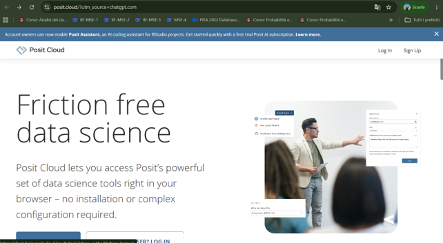
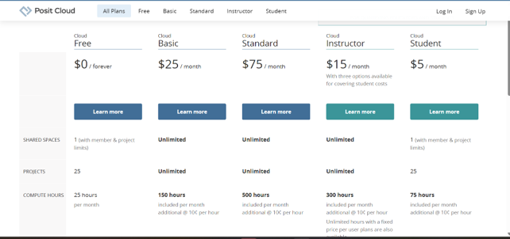
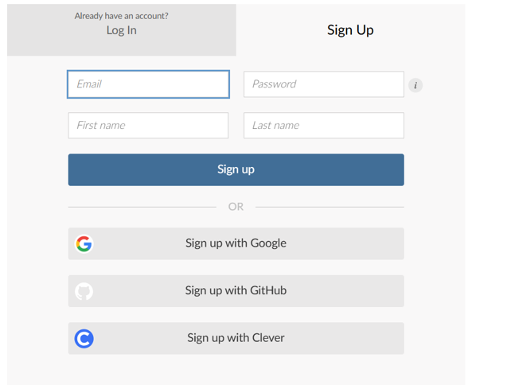
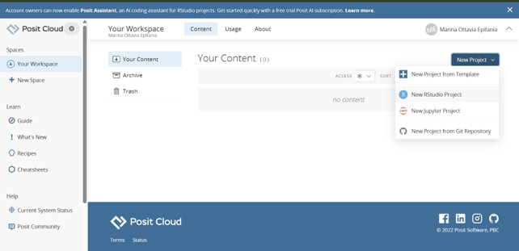
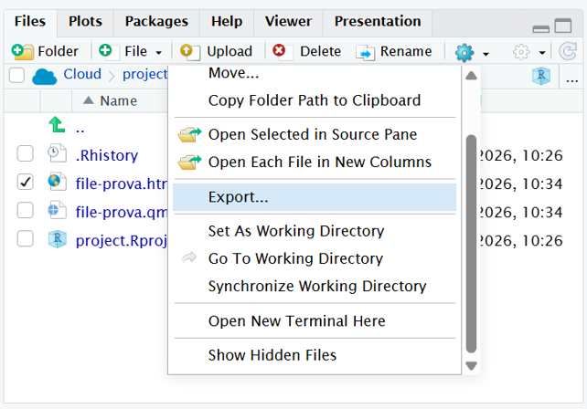

:::{.callout-warning}

Questo materiale è riadattato dal materiale preparato dalla Dott.ssa Margherita Calderan

:::

# Introduzione 

R è un linguaggio di programmazione nato negli anni '90 come erede del software S. Si tratta di un linguaggio object-oriented, completamente open source, gratuito e sviluppato specificamente per le analisi statistiche. Uno dei suoi principali punti di forza è l'ampia comunità internazionale di utenti e sviluppatori, che lavora costantemente per migliorarlo, ampliarne le funzionalità e correggerne eventuali problemi. Inoltre, imparare a utilizzare R permette di acquisire conoscenze trasversali sui linguaggi di programmazione, aiutando a entrare nelle logiche della programmazione in modo graduale e accessibile.

## R e RStudio

R e RStudio sono due strumenti diversi. 

R è il linguaggio di programmazione e il motore che esegue i comandi e le analisi statistiche. 


RStudio è un Integrated Development Environment (IDE), cioè un ambiente di sviluppo che rende più semplice e intuitivo lavorare con R, offrendo un'interfaccia grafica con editor di script, console, gestione dei file, visualizzazione di grafici e altro. I due programmi devono essere installati separatamente: 

1. Installare R, il linguaggio di programmazione vero e proprio (@sec-r e @sec-r-mac).
2. Installare RStudio, l'IDE creata da **Posit** (precedentemente nota come RStudio Inc.) che rende l'uso di R molto più semplice e intuitivo (@sec-rstudio).


# Installare R su Windows {#sec-r}

Per installare R su un sistema operativo Windows, segui questi passaggi:

1. **Visita il sito ufficiale CRAN** (The Comprehensive R Archive Network) alla pagina dedicata a Windows: [https://cran.r-project.org/bin/windows/base/](https://cran.r-project.org/bin/windows/base/).
2. **Scarica l'installer**: Clicca sul link "Download R-X.X.X for Windows" (dove X.X.X rappresenta l'ultima versione disponibile, ad esempio 4.5.2). Verrà scaricato un file `.exe`.
3. **Esegui l'installazione**:
   - Fai doppio clic sul file scaricato.
   - Scegli la lingua (Italiano).
   - Accetta i termini di licenza (GNU GPL).
   - Mantieni le impostazioni predefinite cliccando sempre su "Avanti" (Next). Questo installerà i file core a 64-bit e le dipendenze necessarie.


# Installare R su macOS {#sec-r-mac}

L'installazione su Mac richiede di prestare attenzione al tipo di processore del tuo computer (Intel o Apple Silicon).

1. **Verifica il tuo processore**: Clicca sul logo Apple () in alto a sinistra > "Informazioni su questo Mac". Controlla se hai un processore "Intel" o un chip "Apple M1/M2/M3/M4".
2. **Visita la pagina CRAN per Mac**: [https://cran.r-project.org/bin/macosx/](https://cran.r-project.org/bin/macosx/).
3. **Scarica il pacchetto corretto**:
   - Se hai **Apple Silicon (M1/M2/M3/M4)**: clicca sul file che termina con `-arm64.pkg` (es. `R-4.5.2-arm64.pkg`).
   - Se hai **Mac Intel**: clicca sul file che termina con `-x86_64.pkg`.
4. **Esegui l'installazione**:
   - Apri il file `.pkg` scaricato.
   - Segui la procedura guidata cliccando su "Continua" e inserisci la password del tuo Mac quando richiesta per autorizzare l'installazione.


# Installare RStudio Desktop {#sec-rstudio}

Dopo aver installato R, puoi procedere con l'installazione di RStudio. RStudio rileverà automaticamente la versione di R appena installata.

1. **Vai al sito di Posit**: [https://posit.co/download/rstudio-desktop/](https://posit.co/download/rstudio-desktop/).
2. **Scarica RStudio**: Scorri verso il basso fino alla sezione download. Il sito riconoscerà automaticamente il tuo sistema operativo (Windows o Mac) e ti proporrà il pulsante di download corretto.
   - *Windows*: Scaricherai un file `.exe`.
   - *Mac*: Scaricherai un file `.dmg`.
3. **Installazione**:
   - **Windows**: Esegui il file `.exe` e segui le istruzioni standard cliccando su "Avanti".
   - **Mac**: Apri il file `.dmg` e trascina l'icona di RStudio nella cartella "Applicazioni".


# Come usare Posit Cloud (Alternativa senza installazione)


**Posit Cloud** è una valida alternativa nel caso in cui non si voglia installare nuovi programmi o ci siano problemi di compatibilità (ad esempio su un Chromebook o un tablet).

Posit Cloud è la versione cloud di RStudio: funziona interamente nel tuo browser ed è gratuita per un uso base.

## Passaggi per iniziare con Posit Cloud:
 [https://posit.cloud/](https://posit.cloud/)
 
```{r}
#| label: fig-posit 
#| fig-cap: Registrazione su posit
#| fig-subcap: 
#|   - "Home page di Posit - cliccare su sign up"
#|   - "Selezione del piano gratuito"
#|   - "Registrazione con il proprio account unitn"
#|   - "Creazione di un nuovo progetto RStudio"
#| echo: false
library(knitr)




```
 
A questo punto, si ha la stessa interfaccia di RStudio che si ha in locale usando un PC e si possono svolgere le stesse identiche operazioni con gli stessi comandi. 

Questo vuol dire che i comandi e le routine spiegate a lezione sull'utilizzo di RStudio possono essere interamente riprodotte su Posit online. 

:::{.callout-warning}

Nella versione free si hanno **25 ore** di accesso libero ai server di Posit **al mese** (meno di un'ora al giorno). 

Ricordatevi quindi di chiudere la sessione (e fare il logout) quando non lo utilizzate. 

:::

:::{.callout-caution}

Posit cloud si appoggia sulla rete (ovviamente). Se non ne avete necessità, vi consiglio di usare RStudio con l'installazione sul vostro PC, per evitare di sovraccaricare troppo la rete -- che già non se la passa benissimo -- per chi ha davvero necessità di usare il servizio. 

:::

## Posit e quarto

Per l'utilizzo di quarto per la generazione di report, è necessario sbloccare i pop up: 

* Google Chrome (Windows/macOS)

> Impostazioni --> Privacy e sicurezza --> Impostazioni sito --> Popup e reindirizzamenti

*  Mozilla Firefox (Windows/macOS)

>  Impostazioni --> Privacy e sicurezza --> Permessi --> Blocca finestre pop-up --> Eccezioni…
Aggiungere Posit Cloud tra i siti autorizzati. 

*  Microsoft Edge (Windows/macOS)

> Impostazioni  -->  Cookie e autorizzazioni sito  -->  Popup e reindirizzamenti
Nella sezione Consenti, aggiungere Posit Cloud. 

*  Safari (Mac)

> Impostazioni  -->  Siti web --> Finestre a comparsa
Individua Posit Cloud e seleziona Consenti. 

* Safari (iPad)

> Impostazioni  -->  App  -->  Safari  -->  Blocca finestre a comparsa
Disattivare temporaneamente questa opzione. 

* Chrome (Android)

> Impostazioni --> Impostazioni sito --> Popup e reindirizzamenti
Consentire i pop-up.


## Scaricare il report 

```{r}
#| fig-cap: Scaricare il documento hmtl
#| echo: false



```

