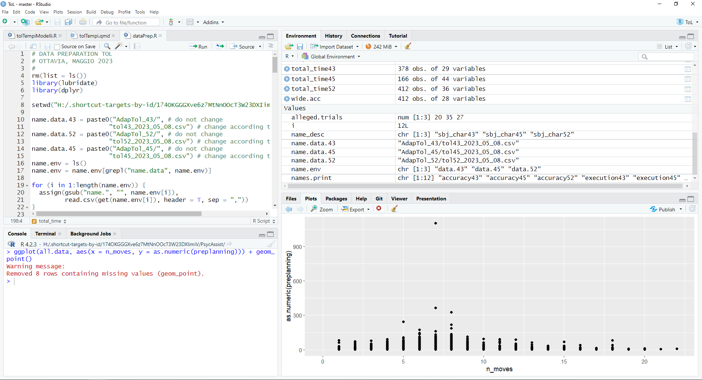
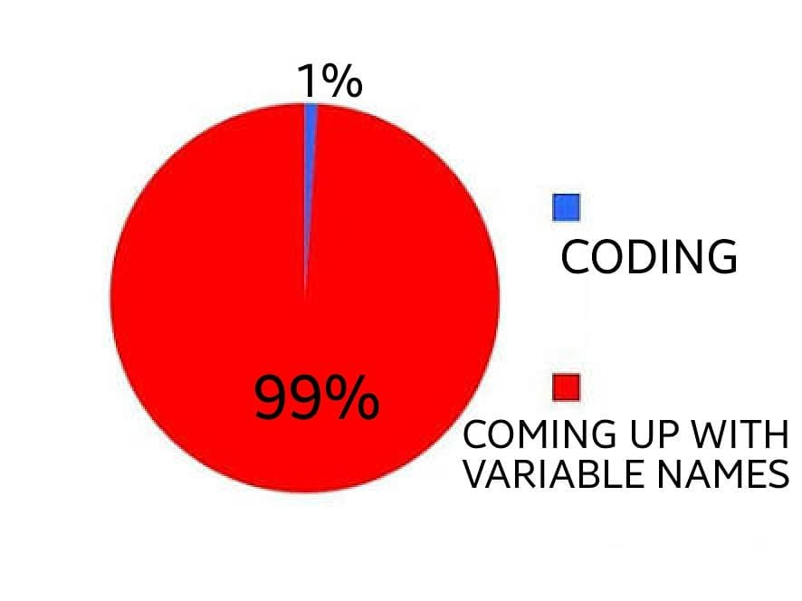
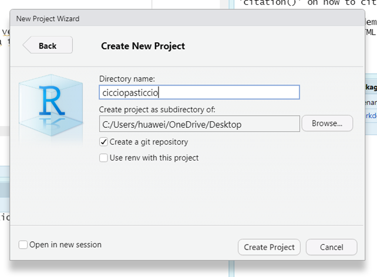
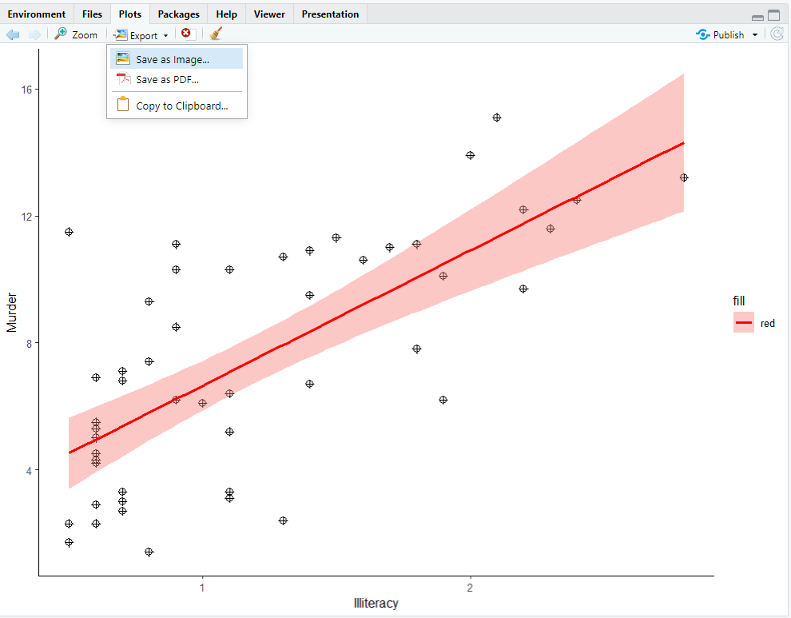

```{r setup, include=FALSE}
library(kableExtra)
library(tidyverse)
knitr::opts_chunk$set(echo = TRUE, 
                      eval = TRUE, 
                      message = FALSE, 
                      comment="", 
                      tidy=FALSE, 
                      warning = FALSE, 
                      fig.align = "center", 
                      out.width = "70%")
library(ggplot2)
library(gridExtra)
library(knitr)
library(tidyverse)
# hook_output <- knitr::knit_hooks$get("output")
# knitr::knit_hooks$set(output = function(x, options) {
# if (!is.null(n <- options$out.lines)) {
# x <- xfun::split_lines(x)
# if (length(x) > n) {
# # truncate the output
# x <- c(head(x, n), "....\n")
# } 
# x <- paste(x, collapse = "\n")
# } 
# hook_output(x, options)
# })
hook_output = knit_hooks$get('output')
knit_hooks$set(output = function(x, options) {
  # this hook is used only when the linewidth option is not NULL
  if (!is.null(n <- options$myline)) {
    x = xfun::split_lines(x)
    # any lines wider than n should be wrapped
    if (any(nchar(x) > n)) x = strwrap(x, width = n)
    x = paste(x, collapse = '\n')
  } else if (!is.null(n <- options$out.lines)) {
x <- xfun::split_lines(x)
if (length(x) > n) {
# truncate the output
x <- c(head(x, n), "....\n")
}
x <- paste(x, collapse = "\n")
}
  hook_output(x, options)
})
set.seed(9999)
library(knitr)


library(faux)

babies = rnorm_multi(n = 10, 
                     varnames = c("genere", "peso", "altezza"),
                     mu = c(0, 8, 80), 
                     sd = c(1, 4, 10), 
                     r = c(.30, .50, .80), 
                     empirical = F)
babies$id = paste("baby", 1:nrow(babies), sep ="")
babies = babies[, c("id", "genere", "peso", "altezza")]
babies$genere = norm2likert(babies$genere, 
                            prob = c(.50, .50), 
                            labels = c("m", "f"))
babies$peso = norm2gamma(babies$peso, 
                         10, 1)


dataTol <- rnorm_multi(n = 100, 
                  mu = c(0, 20, 20),
                  sd = c(1, 5, 5),
                  r = c(0.5, 0.5, 0.8), 
                  varnames = c("A", "B", "C"),
                  empirical = FALSE)
dataTol$A = (norm2likert(dataTol$A, c(.17, .17, .17, .17, .17, .17)))
dataTol$B = norm2binom(dataTol$B, size = 1, prob = .90)
dataTol$C = norm2gamma(dataTol$C, shape = 2, rate = 4)

# prendo la correlazione dei dati Tol che ho e simulo dei dati nuovi a partire da quelli 

my_data = rnorm_multi(n = 100, 
                      mu = c(10, 1000, 5), 
                      sd = c(4, 500, 1), 
                      r = c(.80, .30, 0.0), 
                      varnames = c("benessere", "stipendio", "genere"))
my_data$benessere = norm2pois(my_data$benessere, 
                              5)
my_data$stipendio = norm2trunc(my_data$stipendio, 
                               min = 300)
my_data$genere = norm2likert(my_data$genere, prob = c(.49, .51), 
                             labels = c("m", "f"))
months = round(runif(15, 6,  16))
weight = seq(3, 11, length.out = 15) 
id = paste0("sbj", 1:15)
babies = data.frame(id, months, weight)
```


# Introduzione 

Prima di iniziare: Scaricate la cartella "data" dal moodle del corso in modo da poter svolgere le esercitazioni!

`R` è un software open source per il calcolo statistico, la grafica e molto altro

## Installazione

> È necessario installare `R` (disponibile [https://cran.r-project.org/bin/windows/base/](https://cran.r-project.org/bin/windows/base/))
 
`RStudio` è l'IDE perfetto per `R`  $\rightarrow$consente un utilizzo di `R` migliore e più semplice  

> `RStudio` si può installare dopo aver installato `R` (disponibile  [https://posit.co/download/rstudio-desktop/](https://posit.co/download/rstudio-desktop/))

`R` funziona su Windows, MacOs, Unix

## RStudio IDE

La schermata di RStudio è suddivisa in 4 pannelli: 

- Alto sx: è l'area dedicata agli script di codice
- Alto dx: l'area dove è possibile vedere quello che è presente all'interno dell'ambiente di R (i.e., tutti gli oggetti, le variabili, i dataframe che sono stati caricati/creati per le analisi)
- Basso sx: la console di R, dove vengono mostrati gli output delle operazioni e i codici eseguiti
- basso dx: l'area dei grafici


```{r, echo = FALSE, out.width="110%", fig.align='center'}

```


### Console

I comandi nella console vengono eseguiti ma il codice non viene salvato e scompare sequenzialmente.

Possono essere recuperati utilizzando la freccia verso l'alto.

Per eseguire qualsiasi comando nella console $\rightarrow$ Invio (o `Enter`)

L'output appare immediatamente nella console.

### Script 

Si possono salvare gli script con tutte e righe di codice che servono per le analisi

Per far "correre" qualsiasi comando nello script
 $\rightarrow$ Ctrl + Invio (or `ctrl + Enter` or `cmd + Enter`) oppure utilizza semplicemente il pulsante "Run" in cima allo script.

L'output appare nella console.

Si possono inserire commenti (i.e., righe di codice che non vengono eseguite) inserendo `#` $\rightarrow$ tutto il testo dopo `#` non viene eseguito


Per fare lo switch alla console $\rightarrow$ `ctrl + 2`

Per fare lo switch allo script $\rightarrow$ `ctr + 1`


# Working directories


Bisogna conoscere le working directories (da qui in avanti indicate come `wd`), ovvero le cartelle dove si lavor, dove si salvano i dati ecc. 

```{r eval=FALSE}
getwd() # per sapere in quale wd si sta lavorando

dir() # lista degli oggetti all'interno della wd 
```

Per cambiare la wd: 

```{r eval = FALSE}
setwd("C:/Users/huawei/OneDrive/Documenti/GitHub/RcouRse")
```

# Basics

## Calcolat`R`ice

```{r eval = FALSE} 
3 + 2   # più
3 - 2   # meno
3 * 2   # per
3 / 2   # diviso
sqrt(4) # radice quadrata
log(3)  # logaritmo naturale
exp(3)  # esponenziale
```


Parentesi e simili:

> `()` `[]` `{}` `""` `:` `;` `,`

L'uso delle parantesi funziona come se si stesse scrivendo un'equazione:

```{r eval = FALSE}
(3 * 2)/ sqrt(25 + 4) # Look at me!
```

`R` ignora tutto quello dopo # (è un commento)


## Assign 

I risultati delle operazioni possono essere "memorizzati" in oggetti (variabili, in senso informatico) con nomi specifici definiti dagli utenti

Per assegnare un valore a un oggetto, si possono utilizzare due operatori:

1. `x = exp(2^2)`

2. `X <- log(2^2)`

Gli elementi a destra del simbolo vengono assegnati all'oggetto a sinistra

Attenzione! `R` e case sensitive: `x` e `X` sono due oggetti diversi!!!

## Nomi delle variabili

```{r echo = FALSE, out.width="45%", fig.align='center'}

```

Nomi di variabili validi sono lettere, numeri, punti, underscore (e.g.,
`variable_name`)


I nomi delle variabili non possono iniziare con numeri

L'idea per i nomi delle variabili è di dare indicazione di cosa contengono senza stare a scrivere divine commedie, ad esempio 

:::: {.columns}

::: {.column}
Buoni nomi per le variabili: 

- `mean_rt`

- `sum_age`

- `prop_item`

:::

::: {.column}
Pessimi nomi per variabili: 

- `x`

- `y`

- `ciccio`

:::

::::


# Chiedere aiuto

## 

 `R` community is the best feature of `R`

Basta copiare & incollare qualsiasi messaggio di errore o avviso in Google o chiedere a Google "come fare **[qualcosa]** in R". 


Chiedete a `R` di aiutarvi! Basta scrivere `?` nella console seguito dal nome della funzione che si vuole conoscere:

    ?mean()

Mostra la help page della funzione `mean()` 

# Ordine, ordine e ancora ordine

## R projects for the win

Gestire i directory di lavoro è un vero e proprio incubo. Per evitare di doverle gestire, si possono usare i porgetti di `R`

Un progetto R crea automaticamente una sorta di isola sul vostro pc con le sue sottoisole (che sono le sottocartelle che create voi)

Sono davvero comodi almeno per due motivi:

1. Permettono di avere diverse istanze di R aperte allo stesso tempo $\rightarrow$ Potete lavorare a progetti diversi contemporaneamente 

2. Tutti i file sono sempre a disposizione, senza preoccuparsi delle wd

## Creare un nuovo `R` project

File $\rightarrow$ New project 
e scegliete quello che fa al caso vostro (a meno che non abbiate già inizializzato un directory per il tuo progetto, selezionate una nuova directory):

- `R` project "basic"

- `R` package

- `Shiny` project

e tanto altro


##  Creare un nuovo R project

File  $\rightarrow$ New project: 


```{r echo = FALSE, out.width = "100%"}
knitr::include_graphics("img/project1.png")
```


### Selezionare il tipo di progetto

```{r echo = FALSE, out.width = "100%"}
knitr::include_graphics("img/project2.png")
```


### Assegnargli una directory e dargli un nome

```{r echo = FALSE, out.width = "100%"}

```


## Buttare via la spazzatura

L'ambiente R dovrebbe essere sempre ordinato

Per pulirlo:

```{r eval = FALSE}
ls() # lista tutti gli oggetti nell'ambiente
rm(A) # rimuove l'oggetto A dalla directory
rm(list=ls()) # rimuove tutto dall'ambiente
```


## Salvare l'ambiente

Per salvare tutti i risultati delle analisi in formato ambiente di R:

```{r eval = FALSE}
save.image("my-computations.RData")
```
 
Per ricaricare l'ambiente in R:

```{r eval=FALSE}
load("my-computations.RData")
```

::: {.callout-caution collapse="true"}
## Attenzione!

I codici di prima, dove viene salvato e ricaricato l'ambiente, presuppone che l'ambiente di R venga salvato nella stessa wd dove è presente lo script
:::

## Quando salvare l'ambiente?

I calcoli sono lenti e hai bisogno che siano sempre e facilmente accessibili

La pratica migliore è salvare lo script e documentarlo in un file `RMarkdown` $\rightarrow$ Riproducibilità!


## Your turn!


```{r echo = FALSE, fig.align='center', out.width="10%"}
knitr::include_graphics("img/work.png")
```


- Crea un progetto R per questo corso nella tua cartella "documenti" (scegli un nome carino :)

- Crea un nuovo script R (`shift + ctrl + n`)

- Calcolatrice utilizzando lo script:
  - $\sqrt{15} \times 14 - \frac{22}{4}$ [48.72177]
  - $\frac{\sqrt{7-\pi}}{3 \times (45-34)}$ [0.05952372]

- Salva lo script

- Assegna i risultati del primo calcolo a una variabile chiamata `my_results`

<details><summary>See solution</summary>
```{r}
# Calculator
sqrt(15) *14 - 22/4
# Calculator 
sqrt(7 - pi)/(3*(45 -34))
# assign
my_results = sqrt(15) *14 - 22/4
```

</details>

# Strutture in `R`

## Funzioni e loro argomenti

Quasi tutto si fa attraverso le funzioni, composte da: 

- Un nome: `mean`

- un paio di parentesi: `()`

- degli argomenti: `na.rm = TRUE`

```{r}
mean(1:5, trim = 0, na.rm = TRUE)
```


Gli argomenti possono essere impostati con valori predefiniti; la funzione di ogni argomento è spiegata esaustivamente nell'help della funzione stessa, e.g., `?mean()` 

Gli argomenti possono essere specificati:

- senza un nome (seguendo il loro ordine di default) 

- con il loro nome (in qualsiasi ordine) $\rightarrow$ *keyword matching*

```{r eval=FALSE}
mean(x, trim = 0.3, na.rm = TRUE)
```


Alcune funzioni funzionano anche senza argomenti:
    
    ls(), dir(), getwd()
    
Per vedere il codice di una funzione, basta scrivere il suo nome senza parentesi nella console e premere invio

    chisq.test

## `concatenate`, `c()`

Una delle funzioni più usate di R.

Concatena diverse variabili insieme per creare una nuova unica variabile


```{r}
x = c(1, 2, 3) # crea un vettore concatenando 1,2,3
x
X = 1:3 # crea lo stesso identico vettore
X
x == X
```


## Vettori


Tipi di variabili diverse $\rightarrow$ Tipi di vettori diversi: 

- `int`: Numeri interi `(1,2, 0, -5)`
- `num`: Numeri `(-0.56, 3, 4.5)`
- `logi`: Logico (`TRUE` vs `FALSE`)
- `chr`: characters `("a", "b", "c")`
- `factor`: factor con diversi livelli


## `int` and `num`

`int`: numeri interi: `r -3:3`

```{r}
months = c(5, 6, 8, 10, 12, 16)
```

```{r echo = FALSE}
months
```


`num`: tutti i numeri da $-\infty$ a $\infty$: `r rnorm(6)`

```{r}
weight = seq(3, 11, by = 1.5) 
```

```{r echo = FALSE}
weight
```

## `logi`

Valori loigici, `TRUE` (`T`) o `FALSE` (`F`)

```{r}
v_logi = c(TRUE, TRUE, FALSE, FALSE, TRUE)
```

```{r echo = FALSE}
v_logi
```

I vettori logici si possono ottenere attraverso il confronto dei valori in vettori di altro tipo, ad esempio:

```{r}
months > 12
```

restituisce un vettore logico dove `FALSE` indica tutti i valori all'interno di `months` che sono inferiori o uguali a 12, `TRUE` indica tutti i valori maggiori di 12

## `chr` and `factor`

`chr`: characters: `r c(letters[1:3], LETTERS[4:6])`

```{r}
v_chr = c(letters[1:3], LETTERS[4:6])
```

```{r echo = FALSE}
v_chr 
```


`factor`: usa u numeri o i characters per identificare i livelli della variabile 

```{r}
ses = factor(rep(c("low", "medium", "high"), each = 2))
```

```{r echo = FALSE}
ses
```

Si può cambiare l'ordine dei livelli: 

```{r}
ses1 = factor(ses, levels = c("medium", "high", "low")) 
```
```{r echo = FALSE}
ses1
```


## Creare i vettori


I vettori si possono creare (anche) **c**oncatenando insieme variabili diverse

Si possono creare con la funzione `c()` 

Tutti gli elementi all'interno di `c()` devono essere separati da una virgola


Concantenare gli oggetti con la funzione `c()`: `vec = c(1, 2, 3, 4, 5)`

Utilizzare le sequenze: 

```{r}
-5:5 # vettore di numeri da -5 a 5

seq(-2.5, 2.5, by = 0.5) # sequenza di numeri da -2.5 a 2.5 in step da 0.5 
```

Ripetere gli elementi:

```{r}
# ripete gli elementi da 1a 3 per 4 volte
rep(1:3, 4)
```


```{r}
rep(c("condA", "condB"), each = 3)
```

```{r}
rep(c("on", "off"), c(3, 2))
```

```{r}
paste0("item", 1:4)
```


##  Non mischiare tra loro i vettori

`int` + `num` $\rightarrow$ `num` 

`int`/`num` + `logi` $\rightarrow$ `int`/`num` 

`int`/`num` + `factor` $\rightarrow$ `int`/`num` 

`int`/`num` + `chr` $\rightarrow$ `chr`

`chr` + `logi` $\rightarrow$ `chr`


## Vettori e operazioni

I vettori possono essere sommati/sottratti/divisi e moltiplicati tra loro.

```{r}
a = c(1:8)
a
b = c(4:1)
b 

a - b
```

Se non hanno la stessa lunghezza e un vettore non ha una lunghezza che è un multiplo del'altro vettore si ottiene un messaggio di avvertimento 

Se si applica una funzione, questa viene applicata a tutti gli elementi all'interno del vettore

```{r}
sqrt(a)
```

Allo stesso modo, la stessa operazione può essere applicata a tutti gli oggetti all'interno del vettore 

```{r}
(a - mean(a))^2 # deviazione dalla media al quadrato
```


## Your turn! 

```{r echo = FALSE, fig.align='center', out.width="19%"}
knitr::include_graphics("img/work.png")
```


- Crea un nuovo script e salvalo all'interno del progetto di R

- Assegna i seguenti valori a una variabile chiamata `my_var` (i valori devono essere **concatenati** tra loro)

> 23, 24, 25, 27, 28, 29, 30

- Calcola la media di `my_var` usando la funzione `mean()`

- Calcola la media di `my_var`usando le funzioni  `sum()` e `length()`

- Trova il valore minimo (`min()`) e massimo (`max()`) di `my_var` 

<details><summary>See solution</summary>
```{r}
# crea il vettore e assegnalo a my_var
my_var = c(23, 24, 25, 27, 28, 29, 30)
# calcola la media
mean(my_var)
# calcola la media usando altre funzioni
sum(my_var)/length(my_var)
# trova il minimo e il masssimo
min(my_var); max(my_var)
```
</details>

## Indicizzare gli oggetti all'interno di un vettore

 In questo ambito, indicizzare è vuol dire aver accesso a un particolare elemento all'interno del vettore, con una sua particolare posizione

```{r eval=TRUE}
names = c("Pasquale", "Egidio", "Giulia", "Livio", "Andrea")
```


<div style="text-align:center; margin-top:20px;">
  <table border="1" style="border-collapse:collapse; width:80%; margin:auto;">
    <thead>
      <tr>
        <th style="width:20%; border:1px solid black;">Pasquale</th>
        <th style="width:20%; border:1px solid black;">Egidio</th>
        <th style="width:20%; border:1px solid black;">Giulia</th>
        <th style="width:20%; border:1px solid black;">Livio</th>
        <th style="width:20%; border:1px solid black;">Andrea</th>
      </tr>
    </thead>
    <tbody>
      <tr>
        <td style="border:1px solid black; text-align:center;">1</td>
        <td style="border:1px solid black; text-align:center;">2</td>
        <td style="border:1px solid black; text-align:center;">3</td>
        <td style="border:1px solid black; text-align:center;">4</td>
        <td style="border:1px solid black; text-align:center;">5</td>
      </tr>
    </tbody>
  </table>
</div>

I vettori si indicizzano usando il numero corrispondente alla posizione dell'oggetto che si vuole estrarre all'interno di parentesi quadre: `vector_name[index]`


`names[1]` $\rightarrow$  `r names[1]`

`names[3]` $\rightarrow$  `r  names[3]`

`names[seq(2, 5, by = 2)]` $\rightarrow$  `r names[seq(2, 5, by = 2)]`

## Esempi di indicizzazione di vettori


```{r}
weight
```


```{r eval=TRUE}
weight[2] # secondo elemento di weight
(weight[6] = 15.2) # sostituisce il sesto elemento di weight
weight[seq(1, 6, by = 2)] # elementi 1, 3, 5
weight[2:6] # elementi dal 2 al 6 (incluso)
weight[-2] # rimuove il secondo elemento
```


## Indicizzare usando la logica

```{r}
weight
```


Quali sono i valori $> 7$ all'interno di `weight`?

```{r}
weight > 7
```


"Filtra" il vettore con la logica

```{r  eval=TRUE}
weight[weight > 7] # solo i valori > di 7
weight[weight >= 4.5 & weight < 8] # valori compresi tra 4.5 e 8
```

## Your turn! 


```{r echo = FALSE, fig.align='center', out.width="10%"}
knitr::include_graphics("img/work.png")
```

- Considerando `my_var`
  - Estrarre il terzo elemento
  - Estrai tutti gli elementi dispari e assegnali a una nuova variabile  `my_vector1`
  - Estrai tutti gli element $> 25$ da `my_vector1`
  
<details><summary>See solution</summary>
```{r}
# Terzo elemento di my_var
my_var[3]
# Estrai tutti gli elementi dispari da my_var e assegnali a my_vector1
my_vector1 = my_var[seq(1, length(my_var), by = 2)]
# Estrai tutti gli elementi maggiori di 25 da my_vector1
my_vector1[my_vector1 > 25]
```
</details>


## Matrici ed arrays

Per creare una matrice:

`matrix(data, nrow, ncol, byrow = TRUE)`

Crea una matrice $3 \times 4$: 

```{r}
A = matrix(1:12, nrow=3, ncol = 4, byrow = TRUE)
```

Etichette:


```{r, tidy=FALSE}
rownames(A) = paste("a", 
                    1:nrow(A), sep ="_") 
colnames(A) = paste("b", 
                    1:ncol(A), sep ="_")
A
```

Trasposizione:

```{r}
t(A)
```


Le matrici si possono creare attraverso la concatenazione di colonne e righe:

```{r eval=TRUE}
cbind(a1 = 1:4, a2 = 5:8, a3 = 9:12) # concatenazione per colonna
rbind(a1 = 1:4, a2 = 5.8, a3 = 9:12) # concatenazione per riga
```

##  Arrays

Per cerare un array:


`array(data, c(nrow, ncol, ntab))`


```{r}
my_array = array(1:30, c(2, 5, 3)) # 2 x 5 x 3 array
```


```{r echo=FALSE, out.lines=14}
my_array
```

## Indicizzare gli elementi in una matrice:

```{r echo = FALSE, results='asis'}

my.mat = rbind("[1,]" = c("$[1, 1]$", "$[1, 2]$", "$[1, 3]$"), 
       "[2,]" = c("$[2, 1]$", "$[2, 2]$", "$[2, 3]$"), 
       "[3,]" = c("$[3, 1]$", "$[3, 2]$", "$[3, 3]$"))
colnames(my.mat) = c("[,1]", "[,2]", "[,3]")
my.mat %>% kable(align = "c")

```

Stessa logica usata per i vettori ma aggiungendo la seconda dimensione:

 `matrix_name[row, column]`


```{r eval = TRUE}
A[2, 3] # cella della seconda riga nella terza colonna

A[2, ] # seconda riga

A[, 3] # terza colonna
```

## Indicizzare gli elementi in un array

Oltre alle righe e alle colonne, va considerata anche la terza dinmensione, il `tab`

 `array_name[row, col, tab]`

```{r}
#| code-fold: true
my_array[2, 1, 3] # cella nella seconda riga della prima colonna della terza tab

my_array[, , 3] # terza tab

my_array[1, ,2] # prima riga della seconda tab
```


## Your turn! 


```{r echo = FALSE, fig.align='center', out.width="19%"}
knitr::include_graphics("img/work.png")
```


- Crea una matrice $3 \times 3$ con la tabella del 3 fino a 24
- Assegna la matrice alla variabile `my_mat`
- Dai un nome alle righe come "row" e alle colonne come "column"
- Trasponi my_mat e assegnala alla variabile `my_t`
- Indice da `my_t`:
  - La prima riga
  - La seconda colonna
  - La cella $[1,2]$

<details><summary>See solution</summary>
```{r}
# Crea una matrice 3x3 con la tabella del 3 fino a 24
my_mat = matrix(seq(0, 24, by = 3), nrow = 3, ncol = 3)

# Assegna la matrice alla variabile `my_mat`
my_mat

# Dai un nome alle righe come "row" e alle colonne come "column"
rownames(my_mat) = paste("row", 1:nrow(my_mat), sep = "_")
colnames(my_mat) = paste("column", 1:ncol(my_mat), sep = "_")

# Trasponi `my_mat` e assegna la trasposta alla variabile `my_t`
my_t = t(my_mat)

# Indice da `my_t`: 
  # - La prima riga
my_t[1, ]

  # - La seconda colonna
my_t[,2]

  # - La cella [1,2]
my_t[1,2]
```
</details>

## Liste

Possono contenere diversi tipi di oggetti (e.g., vettori, data frames, altre liste): 

```{r}
my_list = list(w = weight, m = months, s = ses1, a = A)
```

Gli elementi nelle liste possono essere indicizzati con `$` oppure `[[]]` e il nome o la posizione dell'elemento che si vuole estrarre: 

Indicizzare `months`:

```{r}
my_list[["m"]] # my_list$m
```

Indicizzare `weight`: 

```{r}
my_list[[1]] # my_list$weight oppure my_list[["w"]]
```


## Your turn! 


```{r echo = FALSE, fig.align='center', out.width="15%"}
knitr::include_graphics("img/work.png")
```


- Creare una lista con i seguenti elementi
  - `my_mat`
  - `my_t`
  - I valori $> 25$ di `my_var`
  - Assegnare la lista all'oggetto `my_list`

<details><summary>See solution</summary>
```{r}

# - Creare una lista con i seguenti elementi
#   - `my_mat`
#   - `my_t`
#   - I valori $> 25$ di `my_var`
#   - Assegnare la lista all'oggetto `my_list`

my_list = list(my_mat, my_t, my_var[my_var > 25])
```
</details>

# Data frames

I data frames sono liste che contengono vettori anche di tipo diverso ma di stessa lunghezza:


```{r}
id = paste0("sbj", 1:6)
babies = data.frame(id, months, weight)
```

```{r echo=TRUE}
babies
```


## Working with data frames

Gli elementi nei data frame si possono indicizzare in modo diverso (e simile a quanto visto per le matrici):

```{r eval = TRUE}
babies$months # colonna "months"

babies$months[2] # secondo elemento della colonna months

babies[, "id"] # colunna id

babies[2, ] # seconda riga
```


Si può usare la logica per indicizzare gli elementi ed estrarre (od escludere) le osservazioni che soddisfano un determinato criterio:

```{r eval = TRUE}
#| code-fold: true
babies[babies$weight > 7, ] # tutte le osservazioni che mostrano weight > 7
babies[babies$id %in% c("sbj1", "sbj6"), ] # ossrevazioni dei sbj1 e sbj6
```

Alcune funzioni utili da applicare ai dataframe

```{r}
dim(babies) # mostra le dimensioni (numero righe e colonne) del data frame

names(babies) # nomi delle variabili

str(babies) # mostra le caratteristiche delle variabili nel data frame
```


```{r eval=FALSE}
View(babies) # apre il data viewer

plot(babies) # pariwise plot
```
 


```{r}
summary(babies) # calcola le statistiche descrittive
```


## Riordinare i valori (e il data frame)

`order()`: 

```{r}
babies[order(babies$weight), ] # riordina le righe del dataframe in ordine 
                # crescente di weight
```

```{r eval = FALSE}
babies[order(babies$weight,    # riordina le righe in ordine decrescente
             decreasing = T), ] 
```


## Aggregate

Aggrega e applica una funzione su una variabile di confronto a seconda di una o più variabili di raggruppamento (per esempio è utile per calcolare le medie dei tempi di risposta in diverse condizioni sperimentali): 

```{r eval = FALSE}
# Una variabile di confronto e una variabile di raggruppamento
aggregate(y ~ x, data = data, FUN, ...)

# Più variabili di confronto e di raggruppamento
aggregate(cbind(y1, y2) ~ x1 + x2, data = data, FUN, ...)
```

## Un esempio

L'esempio è basato su un dataset interno a R, `ToothGrowth`, dove si investiga la crescita dei denti delle cavie in base alla somministrazione di vitamina C

```{r}
ToothGrowth # Crescita dei denti nelle cavie con la somministrazione di Vitamina C
```

Per vedere la lunghezza media `len` (variabile di confronto) a seconda di due variabili di raggruppamento (`supp + dose`)

```{r}
aggregate(len ~ supp + dose, data = ToothGrowth, mean)
```

## Reshaping: Long to wide

Solitamente i dati sono organizzati o in wide format (i.e., una riga corrisponde a una singola unità statistica) o in long format (i.e., una riga corrisponde a una singola osservazione). 

```{r}
head(Indometh) # Long format
```

Per passare da long format a wide forma (e viceversa) si utilizza la funzione `reshape()`

### Long to wide


```{r tidy=TRUE, tidy.opts=list(width.cutoff=60), out.lines=3}
# From long to wide
df.w <- reshape(Indometh, v.names="conc", 
                timevar="time",
                idvar="Subject", direction="wide")
df.w
```


### Reshaping: Wide to long

```{r tidy=TRUE, tidy.opts=list(width.cutoff=60)}
# From wide to long
df.l <- reshape(df.w, varying=list(2:12), 
                v.names="conc", 
                idvar="Subject", direction="long",
times=c(.25, .5, .75, 1, 1.25, 2, 3, 4, 5, 6, 8))
```

```{r echo=FALSE, out.lines=4}
df.l
```

```{r out.lines=4}
df.l[order(df.l$Subject), ] # rirodina il data farme per soggetti

```


## Your turn! 


```{r echo = FALSE, fig.align='center', out.width="19%"}
knitr::include_graphics("img/work.png")
```

- Crea un data frame con 10 osservazioni e le seguenti colonne:

  - `id`: `character`, ID dei soggetti
  - `ses`: `factor`, livello socio economico con tre livelli, `low`, `medium`, `high` (3 `low`, 5 `medium`, 2 `high`)
  - `income`: `numeric` (e.g., `runif(10, min = 1110, max = 5430)`)

- Applicare i seguenti filtri: 
  - Soggetti con `ses == high`
  - Soggetti con `income` > 2000


<details><summary>See solution</summary>
```{r}
set.seed(999) # imposta un seed in modo che tutti si abbia gli stessi risultati
ids = paste("sbj", 1:10, sep = "_")
ses = factor(c(rep("low", 3), rep("medium", 5), rep("high", 2)), 
             levels = c("low", "medium", "high"))
income = runif(10, min = 1110, max = 5430)
income = income[order(income)]
dati = data.frame(ids, ses, income)

dati[dati$ses == "high", ]

dati[dati$income > 2000, ]

```
</details>


# Data input and output

## Leggere file esterni

File di testo `ASCII` o spread sheet possono essere imporati con la funzione
`read.table()`

```{r eval = FALSE}
data = read.table("C:/RcouRse/file.txt", header = TRUE)
```


Argomenti utili: 

- `header`: Se la rpima riga è occupata dai nomi delle variabili, va messo `TRUE`
- `sep`: separatore delle colonne (e.g., virgola, `\t`)
- `dec`: Se i deciminali sono nel formato `1.2` oppure`1,2`?


```{r eval = F, tidy=FALSE}
data = read.csv("C:/RcouRse/file.csv", 
                header = TRUE, sep = ";", 
                dec = ",")
```

In alternativa alla funzione `read.csv()`, si può utilizzare la funzione `read.csv2()`, dove il default per il separatore di colonna è ";". Per vedere se i dati sono stati importati correttamente: 

```{r}
data = read.csv("data/benessere.csv")
head(data) # mostra le prime 6 righe del dataset
```
I dati sono importati correttamente! Si hanno le variabili nelle rispettive colonne. 

Se i dati non vengono importati correttamente, si ha una situazione del genere: 

```{r}
data = read.csv2("data/benessere.csv")
head(data) # mostra le prime 6 righe del dataset
```

Dove tutte le variabili vengono "schiacciate" in un'unica colonna

Da SPSS (file con estensione `.sav`):

```{r eval=FALSE}
install.packages("foreign")
library(foreign)
data = read.spss("data.sav", to.data.frame = TRUE)
```


## Combinare data frame diversi

Se hanno lo stesso numero di colonne o lo stesso numero di righe:

```{r eval = FALSE}
all_data = rbind(data, data1, data2) # stesso numero di colonne
all_data = cbind(data, data1, data2) # stesso numero di righe
```

Se hanno numeri di righe/colonne diverse ma condividono almeno una carattertistica contenuta in una colonna (e.g., `ID`): 

```{r eval=FALSE}
all_data = merge(data1, data2, 
                 by = "ID")
```

Se ci sono IDs differenti nei due dataset, la funzione aggiunge automaticamente delle righe, mettendo NA nelle colonne del dataframe in cui l'osservazione non era presente

`all_data` contiene tutte le colonne che erano presenti in `data1` e `data2`. 

## Esportare i dati

Per esportare i dati in formato txt o csv: 

```{r eval=FALSE}
write.table(data, # il dataset che si vuole salvare 
            file = "data/mydata.txt", # directory/nome_del_file.estensione
            header = TRUE, # La prima riga contiene i nomi delle variabili?
            sep = "\t",  # separatore di colonna
            ....) # altri argomenti (leggere la documentazione)
```

Si può esportare direttamente tutto l'ambiente:

```{r eval=FALSE}
save(dat, file = "exp1_data.rda") # Salva solo un oggetto specifico
save(file = "the_earth.rda")      # salva tutto l'ambiente
load("the_earth.rda")             # importa l'mabiente salvato
```


# Basics of Programming 


Bisogna essere pronti a sbagliare, TANTO

Coding is ~~hard~~ art

L'ideale è suddividere il problema in sotto-problemi

Da tenere a mente: You're not alone! $\rightarrow$ `stackoverflow` (o Google o CHATGPT) sono degli ottimi aiuti


## `ifelse()`

Esecuzione condizionata:

`ifelse(test, if true, if false)` 

```{r eval=TRUE}
ifelse(weight > 7, "big boy", "small boy")
```

Pros:

- è davvero facile da usare

- Si possono concatenare diversi `ifelse()`


Cons:

- Funziona bene finché la condizione da testare è semplice


## `if () {} else {}`

Nel caso si abbiano condizioni più complesse

```{r eval = FALSE}
if (test_1) {
  command_1
} else {
  command_2
}
```


## `if () {} else {}`

Si possono mettere più condizioni all'interno dello stesso ciclo

```{r eval = FALSE}
if (test_1) {
  command_1
} else if (test_2) {
  command_2
} else {
  command_3
}
```

`test_1` (e `test_2`) **devono** risultare in `TRUE` o `FALSE`, altrimenti non funziona. Se ci sono valori particolari tipo i missing, codifictai come NA, va specificato

```{r eval = FALSE}
if(!is.na(x)) y <- x^2 else stop("x is missing")
```

## Loops 

`for()` e `while()`

Ripete un comando per un numero specifico di iterazioni 

```{r eval = FALSE}
# Don't do this at home
x <- rnorm(10)      
y <- numeric(10)   # crea un contenitore vuoto per mettere i risultati
for(i in seq_along(x)) { # itera tante volte quanti sono gli elementi inx
y[i] <- x[i] - mean(x)
}
```

In realtà quel codice poteva essere scritto in maniera molto più semplice:

```{r eval=FALSE}
y = x - mean(x)
```

## Sempre meglio evitare i loop

I loop possono essere evitati attraverso l'useo della funzione `apply()`! 

    apply(X, margin, fun)
    
`X`: l'elemento su cui vi vuole ripetere la funzione

`margin`: può essere 1 (la funzione viene ripetuta attraverso le colonne, si ottengono i valori marginali di riga) oppure 2 (la funzione viene ripetuta attraverso le righe, si ottengono i valori marginali di colonna)

```{r eval = T, tidy=FALSE}
X <- matrix(rnorm(20),
            nrow = 5, ncol = 4)
apply(X, 2, max) # si ottiene ik valore massimo per ogni colonna (vettore di lunghezza 4)
apply(X, 1, max) # si ottiene ik valore massimo per ogni riga (vettore di lunghezza 5)

```


Alternativa (sconsigliata) utilizzando un ciclo `for()`

```{r eval =T}
y = NULL
for (i in 1:ncol(X)) {
  y[i] = max(X[, i])
}
y
```


# Importare i dati 

## `Import csv`

Attraverso la funzione `read.csv()`

```{r, myline=60}
data = read.csv("data/benessere.csv", # directory/nome_file.csv
                header = TRUE,  # prima riga occupata dai nomi delle variabili
                sep =",", # separatore di colonne  
                dec = ".") # separatore di decimali
head(data)
```


# Calcolo dei punteggi somma

L'assunto è che il data set sia in wide format, ovvero che ogni riga corrisponda a una unità statistica

- Somma attraverso le colonne $\rightarrow$ Punteggi somma marginali di riga

> `rowSums()` (`rowMeans()` se si vuole calcolare la media)

- Somma attraverso le righe $\rightarrow$ Punteggi somma marginali di colonna

> `colSums()` (`colMeans()` se si vuole calcolare la media)


## Dati del benessere


```{r}
# va installato il pacchetto readxl attraverso il codice install.packages("readxl")
# da far correre solo una volta in console
library(readxl)  
benessere = read_xlsx("data/datiBenessere.xlsx")

head(benessere)

```


Se si volessero calcolare i punteggi marginali di riga, si sarebbe tentati di fare:


```{r}
rowSums(benessere)
```

Il problema è che ha poco senso fare una cosa del genere! Nei punteggi somma sono inclusi anche le età, gli id, il genere eccetera


## Condizioni basate sulle etichette delle variabili

Deve essere presente una regular expression, una sorta di radice comune delle etichette del dataframe:

```{r myline=50}
colnames(benessere)
```

I nomi delle variabili che contengono la stringa `item` $\rightarrow$ sono gli item del benessere

I nomi delle variabili che contengono la stringa `au` $\rightarrow$ sono gli item che valutano l'autostima

## 

`grep()`e `grepl()`: sono le funzioni che permettono di filtrare i dati a seconda delle  `reg`ular `exp`ression (`regex`)

`grep("regex", vector)`

`"regex"`: regular expression che si vuole trovare nel vettore

`vector`: vettore entro cui si vuole trovare la regex desiderata

La funzione `grepl("regex", vector)` funziona in modo analogo

Dall'esempio:

```{r myline = 80}
# vettore con i nomi delle variabili del dataset
(my_vector = colnames(benessere))
```

`grep()`

```{r}
# ottiene le posizioni delle colonne che hanno la stringa au
grep("au", my_vector)
```

`grepl()`

```{r}
# testa quali colonne contengono la stringa au
grepl("au", my_vector)
```


Per calcolare i punteggi somma per i soggetti (riportati sulle righe), va usata la funzione `rowSums()` condizionata su specifiche colonne:


```{r echo = T}
rowSums(benessere[, grep("item", 
                             colnames(benessere))])
```


Per assegnare i punteggi somma a una nuova variabile all'interno del dataframe


```{r}
benessere$score_ben = rowSums(benessere[, grep("item", colnames(benessere))])
```


## `summary()`

Permette di ottenere delle prime statistiche descrittive di una variabile o di una dataframe


```{r}
babies <- read.table("data/babies.tab")
summary(babies$peso)
```


## data set


```{r}
summary(babies)
```


## `table()`

Permette di ottenere delle tavole di frequenze per le variabili categoriali

```{r}
table(babies$genere)
```


## Tabelle di frequenza a doppia entrata


```{r}

benessere = read.csv("data/benessere.csv", header = T)
# viene creata una nuova variabile dicotomica di benessere basso (se sotto la media)
# o alto (se sopra la media)
benessere$new_benessere = with(benessere, 
                               ifelse(benessere > mean(benessere), 
                                      "low", 
                                      "high"))
with(benessere, table(genere, new_benessere))

```

## `table()` e percentuali
 

Nel caso di una singola variabile, basta dividere le frequenze di ogni categoria per il numero totale di osservazioni e moltiplicare per 100

```{r}
(table(babies$genere)/nrow(babies))*100
```

Nel caso di tabelle a doppia entrata, vanno calcolati prima i valori marginali di riga

```{r}
my_perc = table(benessere$genere, benessere$new_benessere)
# calcola i valori marinali di riga per il genere
(my_perc = cbind(my_perc, rowSums(my_perc)))
(my_perc[,1]/my_perc[,3])*100 # percentuale di maschi e femmine con benessere alto
(my_perc[,2]/my_perc[,3])*100 # percentuale di maschi e femmine con benessere basso

```


## `aggregate()`

Aggrega una variabile (o più variabili) di confronto a seconda di una (o più) variabile di raggruppamento, permettendo di applicare delle funzioni sui singoli gruppi. Ad esempio, è utile per ottenere la media dei tempi di risposta in diverse condizioni sperimentali: 


```{r eval = FALSE}
# una variabile di confronto y e una variabile di raggruppamento x
aggregate(y ~ x, data = data, FUN, ...)

# più variabili di confronto y1 e y2 e più variabile di confronto x1 e x2
aggregate(cbind(y1, y2) ~ x1 + x2, data = data, FUN, ...)
```

Un esempio sui punteggi del benessere

```{r}
benessere = read.csv("data/benessereScores.csv", 
                     header = T, sep =",")
head(benessere)

```

Si può calcolare la media del punteggio di autostima (variabile di confronto) a seconda del genere (variabile di raggruppamento a due livelli):

```{r}
aggregate(score_au ~ genere, data = benessere, mean)
```

Oppure si può calcolare la media sia del punteggio di benessere che di autostima *contemporaneamente* a seconda del genere

```{r}
aggregate(cbind(score_ben, score_au) ~ genere, 
          data = benessere, mean)
```


## Your turn! 


```{r echo = FALSE, fig.align='center', out.width="10%"}
knitr::include_graphics("img/work.png")
```

Utilizzano il data set "benessereScores.csv"

- Ricodificare la variabile `frat` in modo che diventi una variabile dicotomica a due livelli: 
    - livello `siblings` se `frat == 0`
    - livello `no_siblings` se `frat != 0`
Suggerimento: funzione `ifelse()`

- calcolare la media di `score_ben` a seconda della variabile `siblings`

- calcolare la media di `score_ben` e `score_au`  a seconda della variabile `sibilings` e `gender` (assegnare il risultato alla variabile `mean_dep`)

- calcolare la deviazione standard di `score_ben` e `score_au`  a seconda della variabile `sibilings` e `gender` (assegnare il risultato alla variabile `sd_dep`)

- Unire (con la funzione `merge()`) `mean_dep` e `sd_dep` e assegnare il risultato alla variabile `descr`


::: {.callout-caution collapse="true"}
## WARNING!

Quando si utilizza la funzione `merge()` i nomi delle variabili devono essere diversi
:::


<details><summary>See solution</summary>

```{r echo = TRUE, myline = 80}
# ricodifica la variabile frat in modo che dica "no" quando la persona ha 0 fratelli
# e assegnala a una nuova colonna nel dataframe chiamata "siblings"
benessere$siblings = ifelse(benessere$frat == 0, 
                            "no", "yes")
# calcola la media per score_ben e score_au in base a siblings e genere
mean_dep = aggregate(cbind(score_ben, score_au) ~ siblings + genere, 
                     data = benessere, mean)
# rinomina le colonne in modo che abbiano l'etichetta "mean"
colnames(mean_dep)[3:4] = paste("mean", colnames(mean_dep)[3:4], sep = "_")
# calcola la deviazione standard per score_ben e score_au in base a siblings e genere
sd_dep = aggregate(cbind(score_ben, score_au) ~ siblings + genere, 
                     data = benessere, sd)
# rinomina le colonne in modo che abbiano l'etichetta "sd"
colnames(sd_dep)[3:4] = paste("sd", colnames(sd_dep)[3:4], sep =  "_")
# unisci i due dataframe
descr = merge(mean_dep, sd_dep)
descr
```

</details>

## `tidyverse()`

`tidyverse()` è un pacchetto specifico pensato per il data science che permette un utilizzo più agevole e forse inutitivo delle funzioni di base di R. 

```{r eval = FALSE}
install.packages("tidyverse") # installa il pacchetto ( va fatto solo una volta)
library(tidyverse) # carica la libreria e la rende disponibile
```

Tutto il suo funzionamento si base sull'operatore %>% (Pipe)

Lo si ottiene con la combinazione di tasti `shift + ctrl + M`

La logica del suo funzionamento è molto semplice:

```{r eval = FALSE}
object %>%   # oggetto su cui si vogliono svolgere le operazioni 
  grouping %>% # eventuali variabili di ragguppamento
  function # la o le funzioni che si vogliono applicare
```

## Statistice descrittive con `tidyverse`

Per ottenere le statistiche descrittive (media e ds) del punteggio di benessere e autostima considerando le variabili di raggruppamento siblings e genere 

```{r}
benessere %>%  # oggetto (dataframe) su cui si vuole lavorare
  group_by(siblings, genere) %>%  # variabili di raggruppamento
  summarise(m_benessere = mean(score_ben),  # funzioni che si vogliono applicare e variabili di confronto
            sd_benessere = sd(score_ben), 
            m_au = mean(score_au), 
            sd_au = sd(score_au))
```

## Your turn! 


```{r echo = FALSE, fig.align='center', out.width="15%"}
knitr::include_graphics("img/work.png")
```

- Calcolare minimo, massimo e mediana di  `score_au` e `score_ben` con `tidyverse`

- Importare il dataset `babies` e calcolare media e deviazione standard delle variabili `peso` e `altezza` con `tidyverse`

<details><summary>See solution</summary>
```{r}
benessere %>% 
    summarise(min_ben = min(score_ben),  
            max_ben = max(score_ben), 
            median_ben = median(score_ben),
            min_au = min(score_au), 
            max_au = max(score_au), 
            median_au = median(score_au))

# importa il dataset babies
babies = read.table("data/babies.tab")
# calcola le statistiche descrittive
babies %>%  
  summarise(mean_weight = mean(peso), 
            sd_weight = sd(peso), 
            mean_height = mean(altezza), 
            sd_height = sd(altezza))

```

</details>

# Grafici

Si hanno a disposizione i grafici "tradizionali" per cui non è necessario scaricare ulteriori pacchetti e i grafici prodotti con ggplot, per cui è necessario scaricare il pacchetto  `ggplot2`

Per entrambe le tipologie: 

- Funzioni di alto livello $\rightarrow$ Quelle che effettivamente producono il grafico
- funzioni di basso livello $\rightarrow$ Quelle che lo rendono più carino


## Grafici tradizionali

### Funzioni di alto livello:

```{r eval = FALSE}
plot()      # scatter plot, specialized plot methods
boxplot()
hist()      # histogram
qqnorm()    # quantile-quantile plot
barplot()
pie()       # pie chart
pairs()     # scatter plot matrix
persp()     # 3d plot
contour()   # contour plot
coplot()    # conditional plot
interaction.plot()
```


`demo(graphics)` produce un tour guidato di tutte le funzioanalità grafiche!

### Low level functions

```{r eval = FALSE}
points()       # add points
lines()        # add lines
rect()
polygon()
abline()       # add line with intercept a, slope b
arrows()
text()         # add text in plotting region
mtext()        # add text in margins region
axis()         # customize axes
box()          # box around plot
legend()
```

Il layout dei plot è molto importante ed è costituito da due regioni principali:

- La regione del plot (quella che effettivamente contiene il plot)
- La regione dei margini (dove sono contenuti i margini e le etichette degli assi)

Ad esempio, per ottenere uno scatterplot: 

```{r eval = FALSE}
x <- runif(50, 0, 2) # genera 50 valori casuali da una distribuzione uniforme
y <- runif(50, 0, 2) # genera 50 valori casuali da una distribuzione uniforme
# produce il plot
plot(x, y, # variabili sull'asse x e y, rispettivamente 
     main="Title", # titolo del grafico
     sub="Subtitle", # sottotitolo 
     xlab="x-label", # etichetta asse x
     ylab="y-label") # etichetta asse y
text(0.6, 0.6, "Text at (0.6, 0.6)") # aggiunge del testo al grafico
# aggiunge linee orizzontal e verticali
abline(h=.6, v=.6, lty=2) 
```


<!-- Le regioni dei margini -->

<!-- ```{r eval=TRUE, echo=FALSE, out.width="90%"} -->
<!-- x <- runif(50, 0, 2) # 50 uniform random numbers -->
<!-- y <- runif(50, 0, 2) -->
<!-- plot(x, y, main="Title", -->
<!--      sub="Subtitle", xlab="x-label", -->
<!--      ylab="y-label", cex.lab=1.5) # produce plotting window -->
<!-- text(0.6, 0.6, "Text at (0.6, 0.6)") -->
<!-- abline(h=.6, v=.6, lty=2) # horiz. and vert. lines -->

<!-- for(side in 1:4) mtext(-1:4, side=side, at=.7, line=-1:4) -->
<!-- mtext(paste("Side", 1:4), side=1:4, line=-1, font=2) -->
<!-- ``` -->


## `plot()`

```{r eval = FALSE}
plot(x) # una variabile
plot(x, y) # scatter plot
plot(y ~ x) # scatter plot (codice alternativo)
```

Si uò cambiare il colore degli elementi del grafico anche condizionando su specifiche variabili di raggruppamento:

```{r out.width="70%"}
with(benessere, 
     plot(score_au, 
          col = ifelse(genere == 1, "blue", "pink"), # condiziona il colore tale per cui se è maschio è blu
          pch = ifelse(genere == 1, 3, 16))) # condiziona la forma del puntino 
# inserisce la legenda
legend(x = 100, y = 48, # coordinate specifiche per la legenda 
       c("Male", "Female"), # etichette 
       pch = c(3, 16),  # mappe dei puntini
       col =c("blue", "pink"), # mappe del colore 
       cex = 2) # grandezza del testo
```


## Esempio di scatterplot: `plot(x, y)`


```{r out.width="70%"}
with(benessere, 
     plot(score_au, score_ben))

```

## Esempio di scatterplot: `plot(y ~ x)`


```{r out.width="70%"}
with(benessere, 
     plot(score_ben ~ score_au))
```

Agli scatterplot si può aggiungere anche la linea che indica il modello di regressione

```{r out.width="70%"}
with(benessere, 
     plot(score_ben ~ score_au))
# aggiunge la linea
abline(lm(score_ben ~ score_au, data = benessere),# specifica il modello di regressione per le coordinate della linea
          col = "blue", 
       lty = 3, # tipo di linea 
       lwd = 3) # spessore della linea
```


## Esempio di scatterplot quando x è una variabile categorica: `plot(y ~ x)` 


```{r}
benessere$genere <- factor(ifelse(benessere$genere == 1, 
                           "maschio", "femmina"))
plot(score_au ~ genere, data = benessere)

```

equivale ad usare la funzione `boxplot(y ~ x)`


```{r}
boxplot(score_au ~ genere, data = benessere)
```


## `hist()`

Serve per produrre l'istogramma delle frequenze per variabili continue

```{r}
hist(benessere$score_au, # la variabile che si vuole plottare
     breaks = 20) # il numero di bins
```


Si può plottare la funzione di densità della variabile plottat in istogramma (solo per variabili conitnue)

```{r out.width="60%"}
#| code-fold: true
hist(benessere$score_au, 
     density=20, # va specificato che si vuole aggiungere l'istogramma 
     breaks=20, 
     prob=TRUE, # va specificato che sull'asse delle y dovranno esserci valori di probabilità 
     col = "darkblue")
curve(dnorm(x, mean=mean(benessere$score_au),  # si utilizza la funzione dnorm() per avere la densità
            sd=sd(benessere$score_au)), 
      col="darkblue", lwd=4, 
      add=TRUE, # fa in modo che la funzione di densità venga aggiunta al grafico
      yaxt="n")
```

## Modificare il layout

Si possono plottare più grafici in un'unica finesra modifcando il layout


```{r eval=FALSE, myline = 60}
par(mfrow=c(nrows, ncolumns)) #  i pannelli vengono riempiti per riga
par(mfcol=c(nrows, ncolumns)) # i pannelli vengono riempiti per colonna
```

## Multi plot: Righe


```{r echo = TRUE}
#| code-fold: true
par(mfrow=c(1, 2)) # specifica che si vuole una riga e due colonne

hist(benessere$score_au,density=50, breaks=20, prob=TRUE, 
     main = "Score au")
curve(dnorm(x, mean=mean(benessere$score_au), 
            sd=sd(benessere$score_au)), 
      col="springgreen4", lwd=2, add=TRUE, yaxt="n")

hist(benessere$score_ben,density=50, breaks=20, prob=TRUE, 
     main = "Score benessere")
curve(dnorm(x, mean=mean(benessere$score_ben), 
            sd=sd(benessere$score_ben)), 
      col="royalblue", lwd=2, add=TRUE, yaxt="n")

```


## Multi plot: colonne


```{r echo = T, eval = T}
#| code-fold: true
par(mfcol= c(2,2))
# primo pannello in alto a sinistra
hist(benessere$score_au,density=50, breaks=20, prob=TRUE, 
     main = "Score au")
curve(dnorm(x, mean=mean(benessere$score_au), 
            sd=sd(benessere$score_au)), 
      col="springgreen4", lwd=2, add=TRUE, yaxt="n")
# secondo pannello in basso a sinistra
hist(benessere$score_ben,density=50, breaks=20, prob=TRUE, 
     main = "Score benessere")
curve(dnorm(x, mean=mean(benessere$score_ben), 
            sd=sd(benessere$score_ben)), 
      col="royalblue", lwd=2, add=TRUE, yaxt="n")
# terzo pannello in alto a destra
with(benessere, 
     plot(score_au, score_ben, frame = FALSE))
# quarto pannello in basso a adestra
with(benessere, 
     plot(score_au, score_ben, frame = FALSE))
abline(lm(score_ben ~ score_au, data = benessere), col = "blue", lwd = 2)


```


## `barplot()`

Serve per ottenere il plot delle frequeunze per le categorie di una variabile categoriale


```{r}
freq_item1 = table(benessere$item1)
barplot(freq_item1, 
        main = "Item 1 - Frequencies")

```

## `barplot()`: Frequenze relative


è necessario calcolare prima le proporzioni sul totale per ogni categoria di risposta


```{r}
#| code-fold: true
perc_item1 = freq_item1/sum(freq_item1)
barplot(perc_item1, 
        ylim = c(0, 1), # setta l'asse delle y ad essere compreso tra 0 e 1 
        main = "Item 1 - Realtive frequencies")

```


Nel caso si voglia vedere la frequenza relativa in vase a una variabile di raggruppamento, vanno prima calcolate le frequenze relative per ognuno dei gruppi considerati


```{r}
#| code-fold: true
# tabella a doppia entrata delle frequeunze di risposta all'item 1 in base al genere
perc_item1_gender = table(benessere$genere, benessere$item1)
# calcola le frequeunze relative sul totale delle risposte per il livello 1
perc_item1_gender[1,] = perc_item1_gender[1,]/table(benessere$item1)
# calcola le frequeunze relative sul totale delle risposte per il livello 2
perc_item1_gender[2,] = perc_item1_gender[2,]/table(benessere$item1)
# produce il plot, automaticamente suddiviso nei due gruppi
barplot(perc_item1_gender, ylim=c(0,1), 
        legend = rownames(perc_item1_gender))
abline(h = .5, lty = 2, col = "red")
```


## Multi plot: Esempio su tutti gli item

Si può ottenere un grafico come quello illustrato in precedenza per tutti gli item, 
ripetendo il procedimento per oguno degli item attraverso l'applicazione di un ciclo for

```{r, out.width="100%"}
#| code-fold: true
# isola le etichette degli item di interesse
item_ben = benessere[, grep("item", colnames(benessere))]
# predispone il layout per ospitare tutti i grafici
par(mfrow = c(2, round(ncol(item_ben)/2  + 0.2)))
temp = NULL # crea una variabile temporanea dove mettere le tabelle delle frequeunze necessarie per il plot
for (i in 1:ncol(item_ben)) { # il ciclo itera per ognuno degli item
  temp = table(benessere$genere, item_ben[,i]) # calcola le frequeunze per ogni item a sceonda del genere
  for (j in 1:nrow(temp)) {
    temp[j,] = temp[j,]/table(item_ben[,i]) # calcola le frequeunze percentuali
  }
barplot(temp, ylim=c(0,1), legend = rownames(temp), # produce il plot
        main = colnames(item_ben)[i])
abline(h = .5, lty = 2, col = "red")
}

```


## `interaction.plot()`

è possibile anche ottenere un grafico che mostra la relazione tra la variabile $x$ e $y$ dato l'effetto della variabile $z$ 

`interaction.plot(x, z, y)`

Riprendendo l'esempio dei bambini, è possibile che la relazione tra peso e altezza vari in base al genere?


```{r , out.width="70%"}
#| code-fold: true
babies = read.table("data/babies.tab")
# plot base relazione peso e altezza
plot(altezza ~ peso, data = babies, 
     col = ifelse(genere == "f", "pink", "blue"), 
     pch = 16, main = "Weight - height", 
     cex = 3)
```


## 


```{r tidy=F, out.lines = 5}
#| code-fold: true
babies$cat_weight = with(babies, 
                         ifelse(
                           peso <= quantile(babies$peso)[2], 
                           "light", ifelse(peso > quantile(babies$peso)[2] & 
                                    peso > quantile(babies$peso)[4], "medium", 
                                    "heavy")))
babies$cat_weight = factor(babies$cat_weight,
                           levels = c("light", 
                                      "medium", 
                                      "heavy"))


babies
```

## 

```{r}
with(babies, 
     interaction.plot(cat_weight, genere, altezza))

```

## `ggplot2` 


`ggplot2` (Grammar of Graphics plot, Wickman, 2016) è uno dei pacchetti migliori per ottenere dei grafici d'effetto con (relativamente) poco sforzo

```{r eval=FALSE}
install.packages("ggplot2") # installa il pacchetto (da far correre solo la priuma volta)
library(ggplot2) # carica il pacchetto 
```

La funzione `ggplot()` è las base del funzionamento del pacchetto. Il suo funzionamento prevede fondamentalmente 3 elementi principali: 

```{r eval = FALSE}
ggplot(data, # il dataframe da cui si vogliono prendere le variabili da plottare
       aes(x = x, y = y)) + # aes sta per aestetichs, definisce le variabili da plottare sulla x, y, i colori, le forme eccetera
  geom_graph.type() # definisce il tipo di grafico specifico che si vuole ottenere 
  
```

(alcuni) Argomenti di `aes()`: 

- `x` = variabile asse x
- `y` = variabile asse y 
- `col` = variabile per distinguere i colori delle linee/contorni (factor o charcater)
- `fill` =  variabile per distinguere il riempimento delle figure (factor o charcater)
- `shape` =  variabile per distinguere la forma delle figure (factor o charcater) 
- `size` = variabile per distinguere la grandezza delle figure (numeric o integer)
- ....

Alcuni tipi di grafici: 

- `geom_point()` = plotta punti, se vengono date le variabili x e y è uno scatterplot
- `geom_line()` = plotta le linee
- `geom_boxplot()` = per ottenere i boxplot
- `geom_violin()` = per ottenere i violinplot
- `geom_hist()`: istogramma
- `geom_bar()`: barplot
- ....


Un esempio di scatterplot basato sul dataset `rock` (è un dataset interno a `R`)

```{r}
ggplot(rock, 
       aes(y=peri,
           x=shape, 
           color =shape, # il colore viene definito sulla base della forma delle rocce
           size = peri)) + # la grandezza dei punti è definita dalla lunghezza del perimentro
  geom_point() + # produce lo scatterplot
  theme_bw() + # cambia lo sfondo del grafico
  theme(legend.position = "none") # toglie la legenda
```


Un altro esempio, dove si crea un data frame dove si hanno due a disposizione i tempi medi di risposta di due gruppi (variabile `gruppo`, livelli `a1` e `a2`) in tre wave temporali (variabile `tempo`, tre livelli, `b1`, `b2, `b3`):

```{r eval=T}
dat <- read.table(header=TRUE, text="
gruppo tempo rt
a1 b1 825
a1 b2 792
a1 b3 840
a2 b1 997
a2 b2 902
a2 b3 786
")
# le variabili gruppo e tempo vengono forzate ad essere factor
dat[,1:2] = lapply(dat[,1:2], as.factor)
```


A livello grafico, si può investigare se la relazione tra i tempi di risposta e la wave temporale cambia in base all'appartenenza di gruppo (interaction plot):


```{r}
#| code-fold: true
ggplot(dat, 
       aes(x = tempo, 
           y = rt, 
           group = gruppo, 
           color= gruppo, 
           shape = gruppo, 
           linetype = gruppo)) +  
  geom_point(size = 5) + 
  geom_line(size=1)  + theme_classic() +
  ylab("RT") +  scale_linetype_manual("Task", values =c(3,4),
                                labels = c("A1", "A2")) +
  scale_x_discrete(labels = c("B1", "B2", "B3")) 
```

## Scatter plot con `ggplot2`


```{r eval = TRUE}
#| code-fold: true
states = data.frame(state.x77)
ggplot(states,  # raw data
               aes(x = Illiteracy, y = Murder)) + 
  geom_point(size =3, pch=3) + theme_classic() + theme(legend.position = "none")
```

Per aggiungere la linea del modello di regressione con tanto di banda che indica l'errore standard della stima, si utilizza la funzione `geom_smooth()` (si possono specificare vari modelli oltre al modello lineare).


```{r}
#| code-fold: true
ggplot(states,  # raw data
               aes(x = Illiteracy, y = Murder)) + 
  geom_point(size =3, pch=10) + theme_classic() + 
  geom_smooth(method="lm", color="red", aes(fill="red")) 
```

## Multi plot

Per ottenere i multiplot combinando plot di analisi differenti (e.g, grafico delle statistiche descrittive e grafico dei risultati), è necessario installare il pacchetto `gridExtra`
 

```{r eval = FALSE}
install.packages("gridExtra") # installa il pacchetto, da usare solo una volta
library(gridExtra) # carica il pacchetto e lo rende usabile
```

I multi plot si ottengono con la funzione `grid.arrange()`


```{r }
#| code-fold: true
murder_raw = ggplot(states,  # scatterplot
               aes(x = Illiteracy, y = Murder)) + geom_point(size =3, pch=3) + theme_classic() + theme(legend.position = "none")

murder_lm = ggplot(states,  # scatterplot con  modello di regerssione
               aes(x = Illiteracy, y = Murder)) + geom_point(size =3, pch=3) + theme_classic() + 
  geom_smooth(method="lm", color="red", aes(fill="red")) + theme(legend.position = "none")
grid.arrange(murder_raw, # primo plot
             murder_lm, # secondo plot
             nrow=1) # numero di righe
```


## Multi plot II

```{r}
states = data.frame(state.x77, state.name = state.name,
                    state.region = state.region)
```


Nel caso in cui si voglia vedere la relazione tra due variabili nei vari livelli definiti da una terza variabile presente sempre nello stesso dataframe, si può usare la funzione `facet_wrap()` inclusa nel pacchetto `ggplot2`. 

Ad esempio, prendendo come riferimento il dataset disponibile all'interno di R `state.x77` si vuole vedere se la relazione tra illiteracy e numero di omicidi varia al variare della macro area geografica considerata (`r levels(states$state.region)`)


```{r eval=FALSE}
#| code-fold: true
# si crea il dataframe corretto a partire da state.77
states = data.frame(state.x77, state.name = state.name,
                    state.region = state.region)

ggplot(states, 
       aes(x = Illiteracy, y = Murder )) + geom_point() +
  facet_wrap(~state.region) # imposta automatiacamente di suddividere i grafici a seconda della state region
```


## `boxplot()` e `violinplot()`

Per ottenere i boxplot e i violin plot, i dati devono essere riorganizzati in formato long, come nell'esempio qui sotto:

```{r echo = FALSE}
data.frame(id = rep(paste0("sbj", 1:3), each = 2), 
           condition = rep(c("A", "B"),  length.out = 6), 
           mean_time = rgamma(6, 10, 3))

```

Prendiamo ad esempio i dati del benessere, facendo esclusivamente riferimento ai punteggi di scala dell'autostima e del benessere:

```{r}
# seleziona solo le variabili di interesse
small = benessere[, c("ID", "score_au", "score_ben")]
# trasforma il dataframe in fromato long
score_long  = reshape(small, 
        idvar = "ID", 
        times =names(small)[-1], 
        timevar = "score", v.names = "value",
        varying = list(names(small)[-1]), 
        direction = "long")
head(score_long)
```


Boxplot:

```{r }
#| code-fold: true
ggplot(score_long, 
       aes(x = score, y = value,
           fill = score)) + 
  geom_boxplot()
```


Violinplot:


```{r}
#| code-fold: true
ggplot(score_long, 
       aes(x = score, y = value,
           fill = score)) + 
  geom_violin() 
```


```{r}

score_long = merge(score_long, benessere[, c("ID", "genere")])

ggplot(score_long, 
       aes(x = score, y = value,
           fill = genere)) + geom_violin(trim = FALSE) 
```

## Grafici a barre ed istogrammi 

`geom_hist()`: Istograma per variabili continue

`geom_bar()`: Grafico a barre per variabili categoriali 

Argomenti

- `geom_bar(stat = "count")`: conta automaticamente le frequeunze per ogni categoria, **per cui non c'è bisogno di specificare una variabile y in `aes()`**

- `geom_bar(stat = "identity")`: associa un valore presente nel dataframe alla variabile y **che deve essere specificata in aes()`**


## `geom_bar(stat = "count")`:

Ad esempio, per ottenere le frequenze di risposta di un item:

```{r}
ggplot(benessere, 
       aes(x = item5)) + geom_bar(stat = "count") # conta automaticamente le frequeunze
```


## `geom_bar(stat = "identity")`

Per lo stesso item, si vuole plottare la proporzione di risposte epr ogni categoria $\rightarrow$ si vuole specificare il valore delll'asse y

```{r}
item_5 = data.frame(table(benessere$item5)/nrow(benessere))
ggplot(item_5, 
       aes(x = Var1, 
           y = Freq)) + # viene specificata la variabile da plottare sulla y
  geom_bar(stat = "identity") # va specificato che si ha una variabile y

```


## Un esempio completo

Si possono mettere insieme le funzioni da `tidyverse` per ottenere più facilmente e velocemente grafici informativi sulle proprie variabili. 

Ad esempio mettiamo di volere vedere la proporzione di risposte in ogni categoria di ogni item per la misurazione del benessere:


```{r}
#| code-fold: true
# seleziona solo le colonne con gli id dei soggetti e gli item di benessere
new_item = benessere[, c(grep("ID", colnames(benessere)), 
                        grep("item", colnames(benessere)))]
new_item = pivot_longer(new_item, # funzione di tidyverse per girare i dati 
             cols = !ID, 
             names_to = "item", 
             values_to = "value")

```

Vanno calcolate le proporzioni per ogni categoria per ogni item


```{r}
#| code-fold: true
proporzione = new_item %>% 
  group_by(item, value) %>% 
  summarise(prop = n()/nrow(benessere))
proporzione
```


e infine si può otttenere il grafico:


```{r}
ggplot(proporzione, 
       aes(x = value, y = prop)) + 
  geom_bar(stat = "identity") + 
  facet_wrap(~item) 

```


# Esportare i grafici

## Automaticamente:


```{r eval = F}
pdf("nome_grafico.pdf")
png("nome_grafico.png")          
tiff("nome_grafico.tiff")
jpeg("nome_grafico.jpeg")
bmp("nome_grafico.bmp")
```

Ma poi bisogna ricordarsi di chiudere il device grafico con:

```{r eval=FALSE}
dev.off()
```

Ad esempio, se si vuole salvare il violin plot ottenuto dai punteggi di benessere e autostima:

```{r eval=FALSE}
pdf("il_mio_violin.pdf")
ggplot(score_long, 
       aes(x = score, y = value,
           fill = score)) + geom_violin(trim = FALSE) 
dev.off()
```


## Manualmente:


```{r echo = FALSE, eval = TRUE, out.width="80%"}

```


