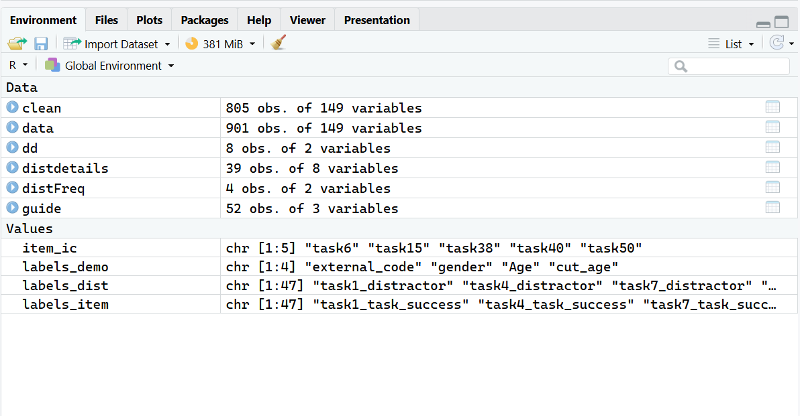
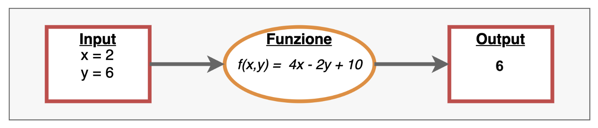

```{r include=FALSE}
myinclude = TRUE
```


# Rstudio

###


```{r, echo = FALSE, out.width="110%", fig.align='center'}
knitr::include_graphics("img/Rstudio.png")
```


### 

**Ambiente/Environment**. Contiene tutti gli oggetti che sono stati creati fino a quel momento nell'ambiente di lavoro

**Script**. File di tipo testuale dove salvare il codice usato per generare gli oggetti presenti nell'ambiente. Si possono combinare codice e commenti (righe che non vengono eseguite e interpretate come codice `#`)

```{r}
# codice per assegnare il numero 25 alla variabile x
x <- 25 
```

**Working directory**. La cartella dentro cui sta lavorando R in quel momento. Diventa di fondamentale importanza perché è dove R si aspetta che ci siano i file (e.g., i dati) con cui volete lavorare

### 
\small

:::{.callout-note}
## Console

I comandi nella console vengono eseguiti con click su Invio 

Il codice non viene salvato e scompare sequenzialmente.

L'output appare immediatamente nella console.

Per fare lo switch alla console $\rightarrow$ `ctrl + 2`

:::


:::{.callout-note}
## Script

Si possono salvare gli script di codice 

Per far "correre" qualsiasi comando nello script
 $\rightarrow$ Ctrl + Invio (o `cmd + Enter`)

L'output appare nella console.

Per fare lo switch allo script $\rightarrow$ `ctr + 1`

:::


# Working directories (`wd`)

## Hard way

### 

```{r}
# per sapere dove sta lavorando R
getwd()
```

La `wd` si può cambiare con il comando `setwd()`: 

```{r}
#| eval: false

setwd("C:/Users/Ottavia/Documents/altro-percorso")
```

## Easy Way: R Project 


### 

Crea automaticamente una working directory in cui potete trovare tutto il materiale necessario per delle analisi

\small

Struttura tipica

```text
my-project/
│
├── index.qmd
├── data/
│   └── mydata.csv
├── img/
│   ├── logo.png
│   ├── plot.jpg
│   └── illustration.svg
├── bibliography/
│   └── references.bib
└── slides/
    ├── intro.qmd
    └── advanced-topics.qmd
```


### {.plain} 

From `File` $\rightarrow$ New Project: 

```{r}
#| label: fig-project
#| echo: false
#| out-width: 100%
#| fig-align: center
#| layout-ncol: 3
#| fig-cap: Creare un progetto R in 3 step
#| fig-subcap: 
#|   - "Step 1"
#|   - "Step 2"
#|   - "Step 3"

library(knitr)
knitr::include_graphics("img/project1.png")
knitr::include_graphics("img/project2.png")
knitr::include_graphics("img/project3.png")
```

### 


```{r}
#| echo: false
#| out-width: 70%
#| fig-align: center
#| fig-cap: "Creare un nuovo script"

knitr::include_graphics("img/new-script.png")
```

    
Oppure la seguenza di tasti: `Ctrl + shift + n`

Per salvare uno script: Click sull'icona del salvataggio 

### 

```{r}
#| echo: false
#| fig-align: center
#| fig-cap: Indica il nome del progetto
knitr::include_graphics("img/progetto.png")
```


# Reporting con quarto 

### 

quarto è un markup language integarte con RStudio. 

Permette la creazione di documenti (sia pdf sia html) che possono contenre chunk di codice, ovvero delle parti dove viene eseguito il codice R, per ottenere risultati, tabelle e grafici.

In questo corso, useremo quarto per tutti gli esercizi.

Una parte dell'esame prevede l'utilizzo di quarto per lo svolgimento degli esercizi. 

A [questo link](https://arca-dpss.github.io/shine-with-quarto/) trovate maggiori informazioni su quarto e una guida veloce sul suo funzionamento 

### 


```{r}
#| echo: false
#| fig-align: center
#| label: fig-quarto
#| fig-cap: Crea un nuovo file quarto
#| layout-ncol: 2
#| fig-subcap: 
#|   - "Crea il file"
#|   - "Selezione tipo di file/dati"

library(knitr)
include_graphics("img/quarto0.png")
include_graphics("img/quarto1.png")

```


###

```{r}
#| echo: false
#| fig-align: center
#| fig-cap: Deafult documento di quarto
library(knitr)
include_graphics("img/quarto2.png")
```

In verde, lo YAML che controlla l'aspetto generale del documento 

In rosso, un chunk di codice eseguibile 

### 

:::{.callout-caution}
## Modifica importante allo YAML

```{markdown}
---
title: "Il mio file"
author: "Nome Cognome"
format: 
  html: 
   self-contained: true
editor: visual
---
```


:::


### 

Il chunk di codice funziona esattamente come R -- è sequenziale, va seguito l'ordine con cui vengono fatte le operazioni

Ogni volta che viene fatto il rendering del documento (`shift + ctrl + k` o freccina azzurra), viene creato un ambiente temporaneo dove viene eseguito il codice. 

L'ambiente temporaneo è indipendente dall'ambiente che vedere su R! 

Per creare un nuovo chunk: `shift + ctrl + i` oppure: 

```{r}
#| echo: false
#| out-width: 30%
include_graphics("img/chunk.png")
```


### 


```{r echo = FALSE, fig.align='center', out.width="10%"}
knitr::include_graphics("img/work.png")
```


1. Creare un progetto R sul desktop o nei documenti del PC/Mac

:::{.callout-warning}

Non creare il progetto dentro una cartella cloud (Google Drive, ICloud, Onedrive)
:::

2. Dentro al progetto R: 
  * Creare una cartella chiamata `data`
  * Creare uno script R e salvarlo nella cartella del progetto (`script`)
  * Creare un documento quarto (`primo-documento.qmd`) e salvarlo nella cartella 
  
3. In un chunk di codice del documento quarto (va bene quello predefinito) scrivere la funzione `dir()` e compilare il file 

# Elementi base 

## Calcolatrice

### 

```{r eval = FALSE} 
3 + 2   # più
3 - 2   # meno
3 * 2   # per
3 / 2   # diviso
```


Parentesi e simili:

> `()` `[]` `{}` `""` `:` `;` `,`

:::{.callout-warning}
## Attenzione!

Ogni parentesi ha un suo significato speciale! Lo vedremo via via
:::

## Assign (Crea oggetti)

### 
\small

Tutto quello che viene creato in R viene chiamato *oggetto* tramite l'"assegnazione" con specifici simboli, ovvero `<- ` oppure `=`:

```{r}
x <- 4 ; x 

X = 5 ; X
```

Gli elementi a destra del simbolo (contenuto) vengono assegnati all'elemento a sinsitra (contenitore) del simbolo

:::{.callout-warning}
## Attenzione!

R è case sensitive. `x` e `X` sono due oggetti diversi!
:::

## Nominare gli oggetti 

### 


```{r echo = FALSE, out.width="25%", fig.align='center'}
knitr::include_graphics("img/meme.jpg")
```

\small

Nomi validi sono lettere, numeri, punti, underscore (e.g., `variable_name`)

:::: {.columns}

::: {.column}
Buoni nomi per le variabili: 

- `mean_rt`

- `sum_age`

- `prop_item`

:::

::: {.column}
Pessimi nomi per variabili: 

- `x`

- `y`

- `ciccio`

:::

::::

### 

\footnotesize


Non deve contenere caratteri speciali come #, &, $, ?, etc.

Non deve essere una parola riservata ovvero quelle parole che sono
utilizzate da R con un significato speciale (`?reserved`).

```{r}
#| error: true
.01 = 5
1 = "a"
TRUE = 567
```

### Per convenzione

Queste istruzioni sono valide attraverso diversi linguaggi di programmazione

Fanno riferimento a nomi di oggetti composti da più nomi e/o molto lunghi: 

1. `first_data`, ovvero separare i termini con un underscore (e.g., `my_data`)
2. `firstData`, ovvero la prima parola tutta minuscola, la seconda con la prima lettera maiuscola (e.g., `unitnData` invece di `university_of_trento_data`)

### 


```{r echo = FALSE, fig.align='center', out.width="10%"}
knitr::include_graphics("img/work.png")
```

1. Creare un nuovo chunk di codice e creare i seguenti oggetti:
  - $10 + 15$ (nome dell'oggetto: `somma`)
  - $\frac{5}{10} \times 3 -2$ (nome dell'oggetto: `operazione_1`)

2. Compilare il documento

### L'ambiente 

Gli oggetti finisco nell'ambiente (`environment`) di R. 

La funzione `ls()` permette di vedere tutti gli oggetti all'interno dell'ambiente

```{r}
#| echo: false
#| fig-align: center
#| fig-cap: "Ambiente di R"

```

### 

`rm()` (remove) è la funzione preposta per rimuovere gli oggetti dall'ambiente di R: `rm("oggetto")`

Il codice `rm(list = ls())` permette di eliminare tutti gli oggetti nell'ambiente in un colpo solo (equivale alla scopetta)


# Pacchetti e Funzioni 

## Funzioni

###

Ogni cosa fatta in R di fatto è riassumbile nelle operazioni fatte su oggetti 

Le operazioni sono le **funzioni**, che permettono di modificare gli oggetti esistenti e di creare di nuovi

```{r}
#| echo: false 

vettore = 1:5
```

```{r}
vettore

sum(vettore)
```

###

Le funzioni in R sono come le funzioni matematiche $f(\cdot)$, dove viene preso un input, viene elaborato secondo e le regole della funzione e si ottiene un output:


{fig-align="center"}


### 
    
    mean(x, trim = 0, na.rm = FALSE, ...)

- Nome della funzione: `mean`
- Parentesi che racchiudono gli argomenti della funzione
- argomenti: 
  - **obbligatori**, senza valori predefiniti senza di cui la funzione non può funzionare
  - **facoltativi** con valori di default (`trim = 0`, `na.rm = FALSE`)
  
\small 

```{r}
mean(1:5)
mean(1:5, trim = 0.3)
```


### 

`?funzione` permette di accedere all'help della funzione per scoprire esattamente cosa fa una funzione: 

```{r}
#| eval: false
?mean
```

```{r}
#| echo: false
#| out-width: 70%
#| fig-align: center
knitr::include_graphics("img/mean.png")
```


###

Ne eistono di predefinite all'installazione di R, se ne possono definire di nuove autonomamente, si possono installare dei "pacchetti" dal CRAN (comprehensive R archive network) o da un file locale, a seconda delle operazioni che si vogliono svolgere.

```{r}
#| lst-label: lst-install
#| lst-cap: Codice per installare e caricare un pacchetto
```


```{r}
#| eval: false

install.packages("nomePacchetto") # installa
library(nomePacchetto) # carica il pacchetto
```

# Operatori

## Operatori Matematici

### 

| Funzione | Cosa fa?        | Esempio     | Risultato |
|----------|-----------------|-------------|-----------|
| `+`      | addizione       | `5.4 + 6.1` | `11.5`    |
| `-`      | sottrazione     | `9 - 4.3`   | `4.7`     |
| `*`      | moltiplicazione | `7 * 1.4`   | `9.8`     |
| `/`      | divisione       | `9/3`       | `3`       |
| `%%`     | resto           | `9%%2`      | `1`       |
| `^`      | potenza         | `15 ^ 2`    | `225`     |


---

| Funzione | Cosa fa?               | Esempio           | Risultato |
|----------|------------------------|-------------------|-----------|
| `abs()`    | valore assoluto        | `abs(-8)`         | `8`       |
| `sqrt()`   | radice quadrata        | `sqrt(225)`       | `15`      |
| `exp()`    | funzione esponenziale  | `exp(0)`          | `1`       |
| `log()`    | logaritmo naturale     | `log(1)`          | `0`       |
| `round()`  | arrotondamento, intero | `round(1.738)`    | `2`       |
| `round()`  | arrotondamento         | `round(1.738, 2)` | `1.74`    |


## Operatori Relazionali

###

In R è possibile valutare se una data relazione è vera o falsa. R valuterà le proposizioni e ci restituirà il valore **`TRUE`** se la proposizione è vera oppure **`FALSE`** se la proposizione è falsa.


+---------------+-------------------+-------------------+---------------+
| Funzione      | Nome              | Esempio           | Risulato      |
+===============+===================+===================+===============+
| `==`          | uguale            | `30 == 30`        | `TRUE`        |
+---------------+-------------------+-------------------+---------------+
| `!=`          | diverso           | `30 != 30`        | `FALSE`       |
+---------------+-------------------+-------------------+---------------+
| `>`/`>=`      | maggiore/o uguale | `30 > 10`         | `TRUE`        |
|               |                   |                   |               |
|               |                   | `30 >= 10`        | `TRUE`        |
+---------------+-------------------+-------------------+---------------+
| `<`/`<=`      | minore/o uguale   | `30 < 10`         | `FALSE`       |
|               |                   |                   |               |
|               |                   | `10 <= 10`        | `TRUE`        |
+---------------+-------------------+-------------------+---------------+
| `%in%`        | inclusione        | `10%in%c(1,2,10)` | `TRUE`        |
+---------------+-------------------+-------------------+---------------+

## Insiemistici

###

Dato:

```{r,echo = TRUE}
x = 30 
```

| Funzione | Nome                   | Esempio       | Risulato |
|----------|------------------------|---------------|----------|
| `&`      | Congiunzione           | `x>25 & x<60` | `TRUE`   |
| `|`      | Disgiunzione Inclusiva | `x>25 | x>60` | `TRUE`   |
| `!`      | Negazione              | `!(x<18)`     | `TRUE`   |


# Tavole di verità

### 

| Operazione | Simbolo | In R | Significato |
|------------|:-------:|:----:|-------------|
| Congiunzione (AND) | $A \cap B$ | `&` | Vera se entrambe le condizioni sono vere. |
| Disgiunzione (OR) | $A \cup B$ | `|` | Vera se almeno una delle due condizioni è vera. |
| Negazione (NOT) | $\overline{A}$ | `!` | Inverte il valore logico di $A$. |
| Differenza simmetrica (XOR) | $A \Delta B$ | `xor(A, B)` | Vera se una e una sola delle due condizioni è vera. |

### {.plain}

\small

```{r}
#| echo: false
#| label: tbl-tables
#| tbl-cap: "Tavole di verità"
#| tbl-subcap: 
#|   - "Congiunzione"
#|   - "Disgiunzione"
#|   - "Negazione"
#|   - "Differenza Simmetrica"
#| layout-ncol: 2
#| layout-nrow: 2 
library(knitr)

congiunzione <- data.frame(
  a = c("V", "V", "F", "F"),
  b = c("V", "F", "V", "F"),
  ab = c("V", "F", "F", "F")
)
kable(congiunzione,
      caption = "Congiunzione",
      col.names = c("$a$", "$b$", "$a \\cap b$"))

# Tabella della disgiunzione
disgiunzione <- data.frame(
  a = c("V", "V", "F", "F"),
  b = c("V", "F", "V", "F"),
  ab = c("V", "V", "V", "F")
)
kable(disgiunzione,
      caption = "Disgiunzione",
      col.names = c("$a$", "$b$", "$a \\cup b$"))

# Tabella della negazione
negazione <- data.frame(
  a = c("V", "F"),
  nota = c("F", "V")
)
kable(negazione,
      caption = "Negazione",
      col.names = c("$a$", "$\\lnot a$"))

xor <- data.frame(
  p = c("F", "F", "V", "V"),
  q = c("F", "V", "F", "V"),
  pq = c("F", "V", "V", "F")
)

kable(
  xor,
  caption = "Differenza simmetrica (XOR)",
  escape = FALSE,
  col.names = c("$p$", "$q$", "$p \\oplus q$")
)
```

Lo stesso risultato della funzione `xor()` può essere ottenuto con la combinazione di diversi operatori logici (ed è la strada da preferire)

# R ed errori

###


Ci sono diversi livelli di **allerta** quando scriviamo codice:

-   **`messaggi`**: la funzione ci restituisce qualcosa che è utile sapere, ma tutto liscio

-   **`warnings`**: la funzione ci informa di qualcosa di *potenzialmente* problematico, ma (circa) tutto liscio

-   **`error`**: la funzione non solo ci informa di un **errore** ma le operazioni richieste non sono state eseguite


Come risolvere?

-   Capire il messaggio
-   Leggere la documentazione della funzione
-   Cercare il messaggio su internet
-   Chiedere aiuto nei forum dedicati
-  Chidere all'IA


### R e l'uso dell'IA

I prompt devono più specifici possibile e centrati su quello che volete fare e come lo volete fare.

Dovete comunicare chiaramente che volete sempre la soluzioe in R base, possibilmente senza usare funzioni aggiuntive e dovete sempre chiedere che vi spieghi il codice.


:::{.callout-warning}

All'esame non potete usare l'IA, ma la potete usare per prepararvi e per aiutarvi nello studio

:::


