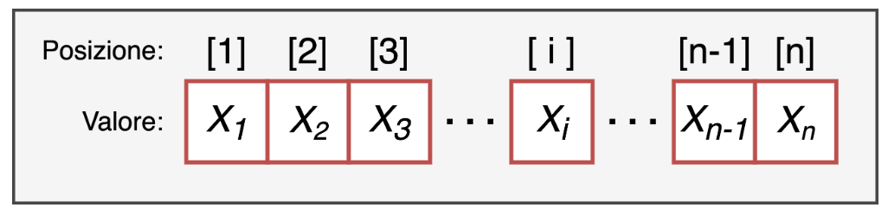
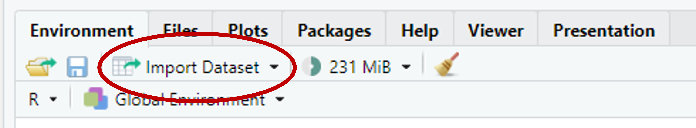
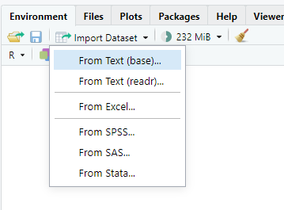
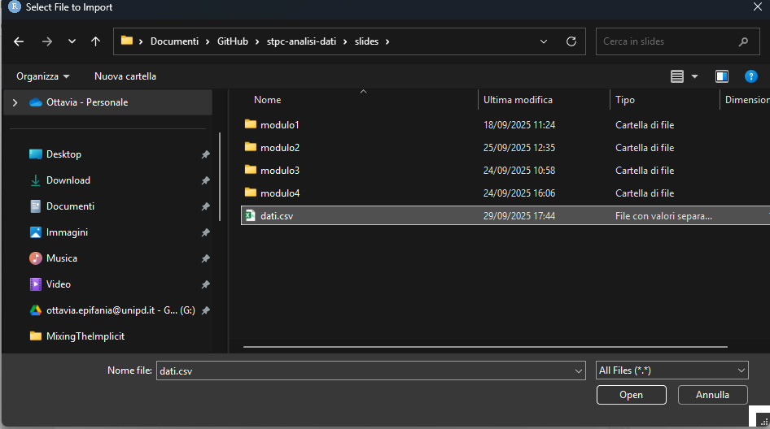
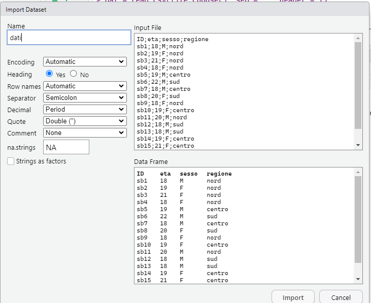

```{r include=FALSE}
myinclude = TRUE
```


# Vettori

###

I vettori sono una struttura dati unidimensionale e sono la più semplice presente in R.

{fig-align="center"}

**Caratteristiche**:

* **la lunghezza**: il numero di elementi da cui è formato il vettore

* **la tipologia**: la tipologia di dati da cui è formato il vettore. Un vettore infatti deve esssere formato da **elementi tutti dello stesso tipo**!

### Caratteristiche degli elementi di un vettore

-   **un valore**: il valore dell'elemento che può essere di qualsiasi tipo ad esempio un numero o una serie di caratteri

-   **un indice di posizione**: un numero intero positivo che identifica la sua posizione all'interno del vettore.

{fig-align="center"}


### Creare un vettore con `c()`

Concatena diversi oggetti insieme per creare un nuovo oggetto unico

\small

```{r}
x = c(1, 2, 3) ; x
X = 1:3 ; X
x == X 
```

## Tipologie di vettore

### 

Tipi di oggetti diversi $\rightarrow$ Tipi di vettori diversi: 

- `num` (`numeric`): Numeri `(-0.56, 3, 4.5)`
- `logi` (`logic`): Logico (`TRUE` vs `FALSE`)
- `chr` (`character`): characters `("a", "b", "c")`
- `factor` (`factor`): factor con diversi livelli

La distinzione più importanti è tra vettori di tipo categoriale (`chr` e `factor`) e vettori di tipo numerico (`int` e `num`): 

- `integer` e `numeric`: Operazioni matematiche E calcolo delle frequenze
- `character` e `factor`: Calcolo delle frequenze

### 


```{r}
months = c(5, 6, 8, 10, 12, 16); months
```


```{r}
weight = runif(6, 3, 18) ; weight
```

### 

I vettori logici si ottengono testando delle condizioni sulla base dei valori di altri vettori: 

```{r}
months > 12
```

Il vettore logico risultante può essere utilizzato

### 

\small

```{r}
v_chr = c(letters[1:3], LETTERS[4:6]); v_chr
```

```{r}
ses = factor(rep(c("low", "medium", "high"), each = 2)); ses
```

Il secondo vettore è un vettore di tipo `factor` e prevede che si possa specificare l'ordine dei livelli 

```{r}
ses = factor(ses, levels = c("low", "medium", "high"))
```


### 

Attenzione a non mischiare gli oggetti!!


`num` + `logi` $\rightarrow$ `num` 

`num` + `factor` $\rightarrow$ `num` 

`num` + `chr` $\rightarrow$ `chr`

`chr` + `logi` $\rightarrow$ `chr`

## Indicizzare i vettori 

### 


```{r eval=TRUE}
nomi = c("Pasquale", "Egidio", "Debora", "Luca", "Andrea")
nomi
```


\begin{table}
\centering
\begin{tabular}{p{2cm}p{2cm}p{2cm}p{2cm}p{2cm}}
\hline
\multicolumn{1}{|c|}{Pasquale} & \multicolumn{1}{|c|}{Egidio}& \multicolumn{1}{|c|}{Debora} & \multicolumn{1}{|c|}{Luca} & \multicolumn{1}{|c|}{Andrea} \\\hline
& & & & \\

\multicolumn{1}{c}{1} & \multicolumn{1}{c}{2}& \multicolumn{1}{c}{3} & \multicolumn{1}{c}{4} & \multicolumn{1}{c}{5}\\
\end{tabular}
\end{table}


\centering 

`nome_vettore[indice]`

### 

\begin{table}
\centering
\begin{tabular}{p{2cm}p{2cm}p{2cm}p{2cm}p{2cm}}
\hline
\multicolumn{1}{|c|}{Pasquale} & \multicolumn{1}{|c|}{Egidio}& \multicolumn{1}{|c|}{Debora} & \multicolumn{1}{|c|}{Luca} & \multicolumn{1}{|c|}{Andrea} \\\hline
& & & & \\

\multicolumn{1}{c}{1} & \multicolumn{1}{c}{2}& \multicolumn{1}{c}{3} & \multicolumn{1}{c}{4} & \multicolumn{1}{c}{5}\\
\end{tabular}
\end{table}

\centering
\pause

`nomi[1]` $\rightarrow$ \pause `r nomi[1]`

`nomi[3]` $\rightarrow$ \pause `r  nomi[3]`

`nomi[seq(2, 5, by = 2)]` $\rightarrow$ \pause `r nomi[seq(2, 5, by = 2)]`

### 

\small
```{r}
weight
```

\footnotesize

```{r eval=TRUE}
weight[2] # secondo elemento di weight
(weight[6] = 15.2) # sostituisce il sesto elemento di weight
weight[seq(1, 6, by = 2)] # elementi 1, 3, 5
weight[2:6] # elementi dal 2 al 6 (incluso)
weight[-2] # rimuove il secondo elemento
```


### 

Si può indicizzare con la logica

\small

```{r}
weight > 7
```


```{r}
weight[weight > 7] # solo i valori > di 7
weight[weight >= 4.5 & weight < 8] # valori compresi tra 4.5 e 8
```


### 

\vspace*{-5mm}

```{r echo = FALSE, fig.align='center', out.width="10%"}
knitr::include_graphics("img/work.png")
```

\small

In un nuovo documento quarto (`esercizi-modulo1.qmd`):

- Assegna i seguenti valori a un oggetto chiamato `my_var` (i valori devono essere **concatenati** tra loro)

> 23, 24, 25, 27, 28, 29, 30

- Calcola la media di `my_var` usando la funzione `mean()`, il minimo (`min()`) e massimo (`max()`)

- Crea un oggetto (`voto`) di tipo character come segue (usare la funzione `rep()`): 
  - "si" ripetuto 12 volte
  - "no" ripetuto 15 volte 


# Matrici 

### 

Le matrici sono una struttura dati **bidimensionale** (caratterizzate da 2 dimensioni **`dim()`** ) dove il numero di righe rappresenta la dimensione 1 e il numero di colonne la dimensione 2.

```{r, echo=TRUE}
my_mat = matrix(data = 1:10, nrow = 2, ncol = 5)
my_mat
```


### 


     `matrix(data, nrow, ncol, byrow = FALSE)`

\small

```{r}
# crea una matrice con 3 righe e 4 colonne 
# (i valori sono sistemati per riga)
A = matrix(1:12, nrow=3, ncol = 4, byrow = TRUE)
# assegna dei nomi alle righe 
rownames(A) = paste("a", 
                    1:nrow(A), sep ="_") 
# assegna dei nomi alle colonne
colnames(A) = paste("b", 
                    1:ncol(A), sep ="_")
A
```

## Caratteristiche 

### 

* Possono contenere una sola tipologia di dati
* Essendo bidimensionali, sono necessari due indici di posizione
(righe e colonne) per identificare un elemento
* Possono essere viste come un insieme di singoli vettori

## Indicizzare le matrici 

### 


```{r echo = FALSE, results='asis'}
#| tbl-cap: "Struttura di una matrice"
library(knitr)
library(kableExtra)
library(tidyverse)

my.mat = rbind("[1,]" = c("$1, 1$", "$1, 2$", "$1, 3$"), 
       "[2,]" = c("$2, 1$", "$2, 2$", "$2, 3$"), 
       "[3,]" = c("$3, 1$", "$3, 2$", "$3, 3$"))
colnames(my.mat) = c("[,1]", "[,2]", "[,3]")
my.mat %>% kable(align = "c")

```


\centering 

`my_matrix[righe, colonne]`


### 

\small
```{r}
A
```

`A[1, ]` $\rightarrow$  `r A[1, ]`

`A[2, ]` $\rightarrow$ `r A[2, ]`

`A[2, 3]` $\rightarrow$ `r A[2, 3]` 

### 


```{r echo = FALSE, fig.align='center', out.width="19%"}
knitr::include_graphics("img/work.png")
```

- Crea una matrice $3 \times 3$ con la tabellina del 3 fino a 24, assegnandola all'oggetto `my_mat`
- Dai un nome alle righe (e.g., `r1, r2, r3`) e alle colonne (e.g., `c1, c2, c3`)
- Indice da `my_mat`:
  - La prima riga
  - La seconda colonna
  - La cella $[1,2]$

# Dataframe

###

Il dataframe è la struttura più “complessa”, utile e potente di R: 

Come le matrici, è composto da due dimensioni (righe $\times$ colonne)

A differenza delle matrici, può contenere dati di tipo diverso

* Ogni elemento (colonna) è un vettore con un nome associato 

* Ogni colonna deve avere lo stesso numero di elementi
di conseguenza ogni riga ha lo stesso numero di elementi (struttura
rettangolare)

### 

    data.frame(. . .)

\small
```{r}
#| output: fragment

sesso = c(rep(c("M","F"), length=length(weight)))
data = data.frame(id = paste0("id", 1:length(weight)), 
                  weight, sesso)
data
```

## Indicizzare i dataframe

### 

    data[r, c], data$nome_variabile

\pause

:::: {.columns}

:::{.column width="50%"}
\small
```{r}
data
```

:::

:::{.column width="50%"}

\small
```{r}

data[2, 1]
data$peso
data$peso[2]
```
:::
::::

### 

La stessa logica con cui dai vettori si estraggono tutte le osservazioni che soddisfano un determinato requisito

\small
```{r}
weight[weight >= 7]
```

\normalsize
Nel caso del dataframe: 


::::{.columns}

:::{.column width=50%}
\footnotesize
```{r}
data[data$weight >=7, ]
```
:::

:::{.column width=50%}
\footnotesize
```{r}
data[data$weight >=7 & data$weight < 9, 
     "id"]
```
:::

::::
## Attributi e caratteristiche

### 

Le funzioni **`names()`** , **`dim()`**, **`nrow()`**, **`ncol()`** sono alcune delle funzioni per ottenere informazioni sulle caratteristiche del dataframe. 

La funzione più utile è **`str()`** poichè ci restituisce una veloce overview della struttura del dataframe: dimensioni, tipi di variabili,...

```{r,echo=TRUE}
str(data) 
```


# Liste 


### 

      list(name1 = obj1, name2 = obj2, name3 = obj3, . . .)
      
\small

Permette di creare liste di oggetti diversi (matrici, vettori, variabli) di diverso tipo (`numeric`, `character`, `integer`)

Molti dei risultati ottenute con le funzioni per le analisi statistiche sono organizzati in liste, proprio perché permettono di contenere oggetti di natura diversa e con dimensionalità diversa

###

\footnotesize

```{r}
#| output: fragment
A <- c(1,8,5,0)
M <- matrix(A, 2, 2)
Nomi3 <- c("giorgio", "ugo", "anna")
LV <- c(TRUE, FALSE, TRUE, TRUE)
OgLista <- list(a = A, Mat = M, nomi = Nomi3, X = LV)
str(OgLista)
```

## Indicizzare le liste

### 

    lista[[i]], lista$nome_oggettpo

`[[i]]`: indice dell'oggetto all'interno della lista a cui si vuole accedere 


\small

```{r}

OgLista[[2]]
```


`$nome_oggetto`

```{r}
#| output: fragment
OgLista$Mat
```

# Importare dati esterni 

## Importa base

### 

    read.csv2("file_path", header = T, sep = ";")

Il default della funzione prevede che la prima riga contenga i nomi delle variabili e che il separatore di colonne sia ";".

Se si possiede un dataset chiamato "dati" nella cartella "data", questo codice lo importerà all'interno dell'ambiente

```{r}
#| eval: false
# Lettura file dati esterni
data <- read.csv2("data/dati.csv")
```


## Importa alternativa 1

### 

```{r}
#| echo: false
#| fig-align: center
#| out-width: 100%

```

###

```{r}
#| echo: false
#| fig-align: center
#| out-width: 100%

```

###

```{r}
#| echo: false
#| fig-align: center
#| out-width: 100%

```

### 

```{r}
#| echo: false
#| fig-align: center
#| out-width: 100%

```

## Importa alternativa 2

###

```{r}
#| echo: true
dati = read.csv("C:/Users/Ottavia/Documents/GitHub/stpc-analisi-dati/slides/dati.csv", 
                sep =";", dec =",", header = TRUE)
head(dati)
```

# Sintesi delle strutture tabellari

### `summary()`

    summary(data)

Riassume il contenuto di strutture di dati 
\pause

\small

```{r}
summary(rock)
```

### `str()`

    str(data)
    
Fornisce informazioni circa la struttura generale di un oggetto: 

\pause

```{r}
str(rock)
```

### `head()` ($\alpha$) and `tail()` ($\omega$)

:::: {.columns}

::: {.column width="50%"}
`head()`

Le prime 6 osservazioni del dataset
\footnotesize
```{r}
head(rock)
```

:::

::: {.column width="50%"}
`tail()`

\footnotesize
le ultime 6 osservazioni del dataset

```{r}
tail(rock)
```

:::

::::


### `apply()`

    apply(data, MARGIN, FUN)

`data`: i dati su cui si vuole lavorare

`MARGIN`: 1 applica la funzione sulle righe (attraverso le colonne), 2 applica la funzione sulle colonne (attraverso le righe)

`FUN`: la funzione che si vuole applicare

###

\footnotesize

```{r}
apply(rock, 1, sum)   # Somma per riga
apply(rock, 2, mean)  # Media per colonna
```
