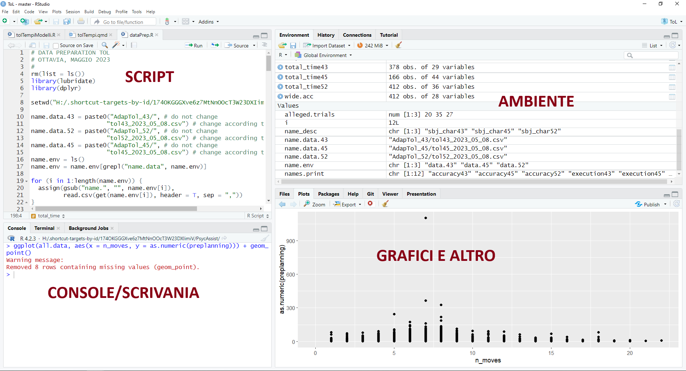
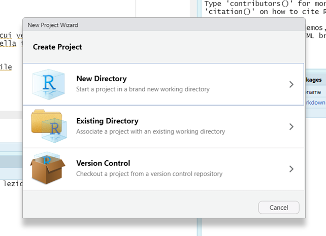
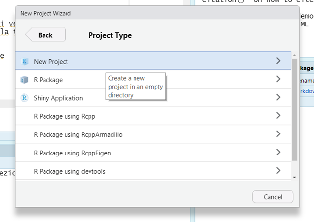
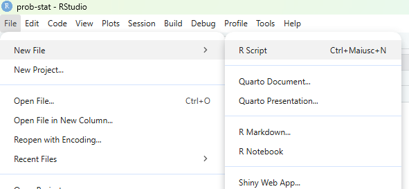
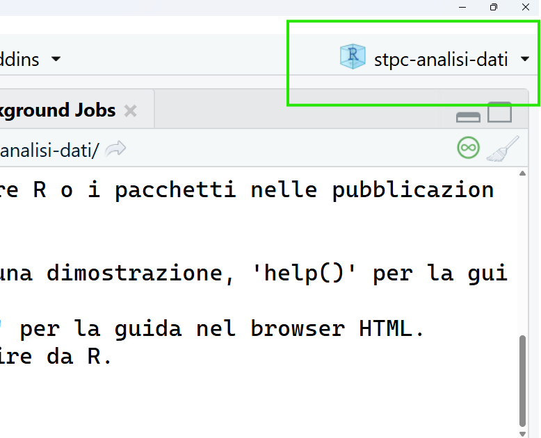
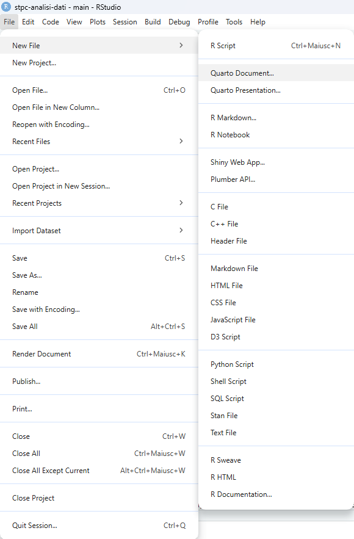
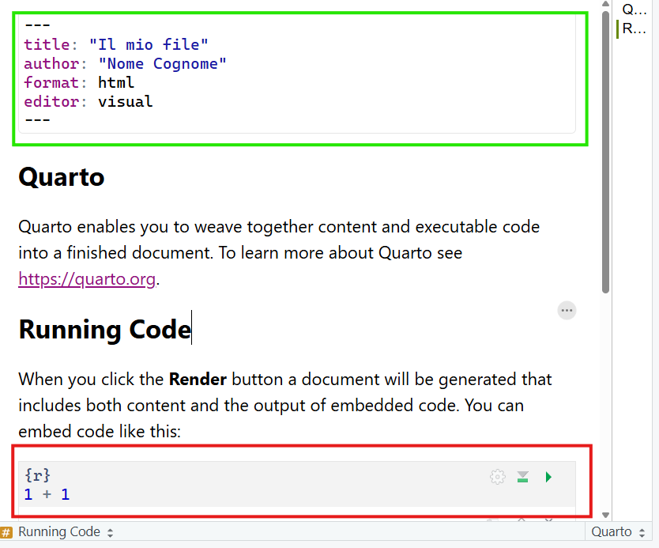
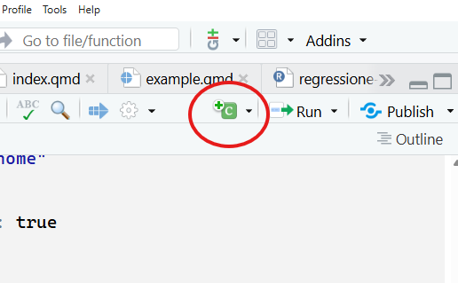
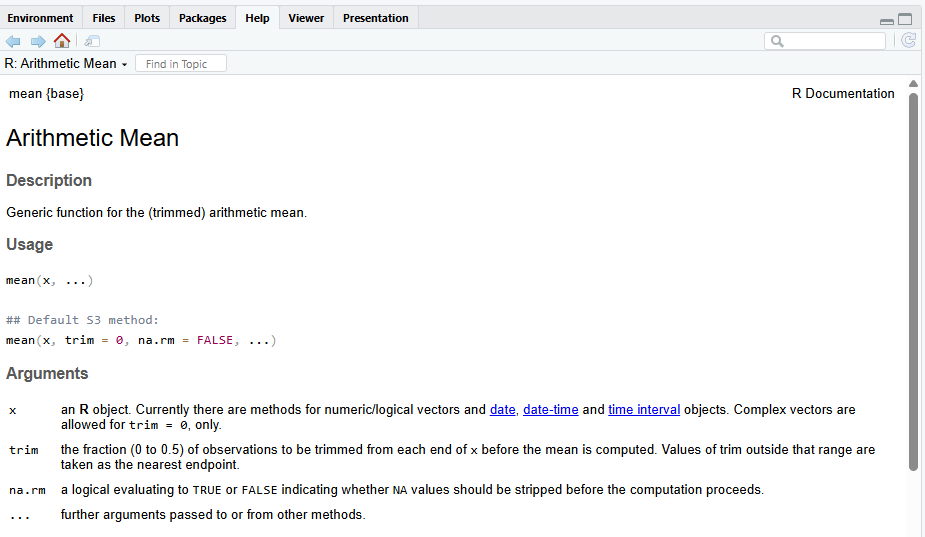

```{r include=FALSE}
myinclude = TRUE
```


# Rstudio

###


```{r, echo = FALSE, out.width="110%", fig.align='center'}

```


### 

**Ambiente/Environment**. Contiene tutti gli oggetti che sono stati creati fino a quel momento nell'ambiente di lavoro

**Script**. File di tipo testuale dove salvare il codice usato per generare gli oggetti presenti nell'ambiente. Si possono combinare codice e commenti (righe che non vengono eseguite e interpretate come codice `#`)

```{r}
# codice per assegnare il numero 25 alla variabile x
x <- 25 
```

**Working directory**. La cartella dentro cui sta lavorando R in quel momento. Diventa di fondamentale importanza perché è dove R si aspetta che ci siano i file (e.g., i dati) con cui volete lavorare

### 
\small

:::{.callout-note}
## Console

I comandi nella console vengono eseguiti con click su Invio 

Il codice non viene salvato e scompare sequenzialmente.

L'output appare immediatamente nella console.

Per fare lo switch alla console $\rightarrow$ `ctrl + 2`

:::


:::{.callout-note}
## Script

Si possono salvare gli script di codice 

Per far "correre" qualsiasi comando nello script
 $\rightarrow$ Ctrl + Invio (o `cmd + Enter`)

L'output appare nella console.

Per fare lo switch allo script $\rightarrow$ `ctr + 1`

:::


# Working directories (`wd`)

## Hard way

### 

```{r}
# per sapere dove sta lavorando R
getwd()
```

La `wd` si può cambiare con il comando `setwd()`: 

```{r}
#| eval: false

setwd("C:/Users/Ottavia/Documents/altro-percorso")
```

## Easy Way: R Project 


### 

Crea automaticamente una working directory in cui potete trovare tutto il materiale necessario per delle analisi

\small

Struttura tipica

```text
my-project/
│
├── index.qmd
├── data/
│   └── mydata.csv
├── img/
│   ├── logo.png
│   ├── plot.jpg
│   └── illustration.svg
├── bibliography/
│   └── references.bib
└── slides/
    ├── intro.qmd
    └── advanced-topics.qmd
```


### {.plain} 

From `File` $\rightarrow$ New Project: 

```{r}
#| label: fig-project
#| echo: false
#| out-width: 100%
#| fig-align: center
#| layout-ncol: 3
#| fig-cap: Creare un progetto R in 3 step
#| fig-subcap: 
#|   - "Step 1"
#|   - "Step 2"
#|   - "Step 3"

library(knitr)


knitr::include_graphics("img/project3.png")
```

### 


```{r}
#| echo: false
#| out-width: 70%
#| fig-align: center
#| fig-cap: "Creare un nuovo script"


```

    
Oppure la seguenza di tasti: `Ctrl + shift + n`

Per salvare uno script: Click sull'icona del salvataggio 

### 

```{r}
#| echo: false
#| fig-align: center
#| fig-cap: Indica il nome del progetto

```


# Reporting con quarto 

### 

quarto è un markup language integarte con RStudio. 

Permette la creazione di documenti (sia pdf sia html) che possono contenre chunk di codice, ovvero delle parti dove viene eseguito il codice R, per ottenere risultati, tabelle e grafici.

In questo corso, useremo quarto per tutti gli esercizi.

Una parte dell'esame prevede l'utilizzo di quarto per lo svolgimento degli esercizi. 

A [questo link](https://arca-dpss.github.io/shine-with-quarto/) trovate maggiori informazioni su quarto e una guida veloce sul suo funzionamento 

### 


```{r}
#| echo: false
#| fig-align: center
#| label: fig-quarto
#| fig-cap: Crea un nuovo file quarto
#| layout-ncol: 2
#| fig-subcap: 
#|   - "Crea il file"
#|   - "Selezione tipo di file/dati"

library(knitr)



```


###

```{r}
#| echo: false
#| fig-align: center
#| fig-cap: Deafult documento di quarto
library(knitr)

```

In verde, lo YAML che controlla l'aspetto generale del documento 

In rosso, un chunk di codice eseguibile 

### 

:::{.callout-caution}
## Modifica importante allo YAML

```{markdown}
---
title: "Il mio file"
author: "Nome Cognome"
format: 
  html: 
   self-contained: true
editor: visual
---
```


:::


### 

Il chunk di codice funziona esattamente come R -- è sequenziale, va seguito l'ordine con cui vengono fatte le operazioni

Ogni volta che viene fatto il rendering del documento (`shift + ctrl + k` o freccina azzurra), viene creato un ambiente temporaneo dove viene eseguito il codice. 

L'ambiente temporaneo è indipendente dall'ambiente che vedere su R! 

Per creare un nuovo chunk: `shift + ctrl + i` oppure: 

```{r}
#| echo: false
#| out-width: 30%

```


# Elementi base 

## Calcolatrice

### 

```{r eval = FALSE} 
3 + 2   # più
3 - 2   # meno
3 * 2   # per
3 / 2   # diviso
sqrt(4) # radice quadrata
log(3)  # logaritmo naturale
exp(3)  # esponenziale
```


Parentesi e simili:

> `()` `[]` `{}` `""` `:` `;` `,`

:::{.callout-warning}
## Attenzione!

Ogni parentesi ha un suo significato speciale! Lo vedremo via via
:::

## Assign 

### 
\small

Tutto quello che viene creato in R viene chiamato *oggetto* tramite l'"assegnazione" con specifici simboli, ovvero `<- ` oppure `=`:

```{r}
x <- 4 ; x 

X = 5 ; X
```

Gli elementi a destra del simbolo (contenuto) vengono assegnati all'elemento a sinsitra (contenitore) del simbolo

:::{.callout-warning}
## Attenzione!

R è case sensitive. `x` e `X` sono due oggetti diversi!
:::

## Nominare gli oggetti 

### 


```{r echo = FALSE, out.width="25%", fig.align='center'}
knitr::include_graphics("img/meme.jpg")
```

\small

Nomi validi sono lettere, numeri, punti, underscore (e.g., `variable_name`)


I nomi NON possono iniziare con numeri, simboli o valori interni di R

:::: {.columns}

::: {.column}
Buoni nomi per le variabili: 

- `mean_rt`

- `sum_age`

- `prop_item`

:::

::: {.column}
Pessimi nomi per variabili: 

- `x`

- `y`

- `ciccio`

:::

::::

### 

\footnotesize

```{r}
#| error: true
.01 = 5
1 = "a"
TRUE = 567
```

### 


```{r echo = FALSE, fig.align='center', out.width="10%"}

```

- Creare una cartella sul vostro Desktop/Scrivania nominata `corso-statistica`

- Aprire `RStudio` e creare un nuovo script 

- Svolgere le sgeuenti operazioni. Il risultato di ogni operazione deve essere assegnato a un oggetto: 
  - $10 + 15$ (nome dell'oggetto: `somma`)
  - $\frac{5}{10} \times 3 -2$ (nome dell'oggetto: `operazione_1`)
  - $(3*2) + \frac{5}{10} \times (45 * 0.5) - 15$ (nome dell'oggetto: `operazione_2`)
  
# Strutture 

##  Pacchetti e Funzioni 

### Funzioni

Sono i comandi che permettono di fare tutto. 

Ne eistono di predefinite all'installazione di R, se ne possono definire di nuove autonomamente, si possono installare dei "pacchetti" dal CRAN (comprehensive R archive network) o da un file locale, a seconda delle operazioni che si vogliono svolgere.

Ad esempio, per installre il pacchetto `ggplot2` (per dei grafici meravigliosi) non si deve far altro che scrivere in console: 

\small
```{r}
#| eval: false
install.packages("ggplot2")
# per rendere il pacchetto operativo 
library(ggplot2) # permette di usare le funzioni al suo interno 
```

### 
    
    mean(x, trim = 0, na.rm = FALSE, ...)

- Nome della funzione: `mean`
- Parentesi che racchiudono gli argomenti della funzione
- argomenti: 
  - obbligatori, senza valori predefiniti senza di cui la funzione non può funzionare
  - facoltativi con valori di default (`trim = 0`, `na.rm = FALSE`)
  
\small 

```{r}
mean(1:5)
mean(1:5, trim = 0.3)
```

###

\small

Alcune funzioni non richiedono argomenti al loro interno: 

```{r}
ls() # cosa c'è nell'ambiente di R 
dir() # cosa c'è nella wd 
```

### 

`?funzione` permette di accedere all'help della funzione: 

```{r}
#| eval: false
?mean
```

```{r}
#| echo: false
#| out-width: 70%
#| fig-align: center

```


### `concatenate`, `c()`

Concatena diversi oggetti insieme per creare un nuovo oggetto unico

\small

```{r}
x = c(1, 2, 3) # crea un vettore concatenando 1,2,3
x
X = 1:3 # crea lo stesso identico vettore
X
x == X
```

## Vettori 

### 

Tipi di oggetti diversi $\rightarrow$ Tipi di vettori diversi: 

- `num` (`numeric`): Numeri `(-0.56, 3, 4.5)`
- `logi` (`logic`): Logico (`TRUE` vs `FALSE`)
- `chr` (`character`): characters `("a", "b", "c")`
- `factor` (`factor`): factor con diversi livelli

La distinzione più importanti è tra vettori di tipo categoriale (`chr` e `factor`) e vettori di tipo numerico (`int` e `num`): 

- `integer` e `numeric`: Operazioni matematiche E calcolo delle frequenze
- `character` e `factor`: Calcolo delle frequenze

### 


```{r}
months = c(5, 6, 8, 10, 12, 16); months
```


```{r}
weight = seq(3, 11, by = 1.5) ; weight
```

### 

I vettori logici si ottengono testando delle condizioni sulla base dei valori di altri vettori: 

```{r}
months
```

Prendere solo i valori $> 12$

```{r}
months > 12
```

### 


```{r}
v_chr = c(letters[1:3], LETTERS[4:6]); v_chr
```

```{r}
ses = factor(rep(c("low", "medium", "high"), each = 2)); ses
```
### 

Attenzione a non mischiare gli oggetti!!


`num` + `logi` $\rightarrow$ `num` 

`num` + `factor` $\rightarrow$ `num` 

`num` + `chr` $\rightarrow$ `chr`

`chr` + `logi` $\rightarrow$ `chr`

## Indicizzare i vettori 

### 


```{r eval=TRUE}
nomi = c("Pasquale", "Egidio", "Debora", "Luca", "Andrea")
nomi
```


\begin{table}
\centering
\begin{tabular}{p{2cm}p{2cm}p{2cm}p{2cm}p{2cm}}
\hline
\multicolumn{1}{|c|}{Pasquale} & \multicolumn{1}{|c|}{Egidio}& \multicolumn{1}{|c|}{Debora} & \multicolumn{1}{|c|}{Luca} & \multicolumn{1}{|c|}{Andrea} \\\hline
& & & & \\

\multicolumn{1}{c}{1} & \multicolumn{1}{c}{2}& \multicolumn{1}{c}{3} & \multicolumn{1}{c}{4} & \multicolumn{1}{c}{5}\\
\end{tabular}
\end{table}


\centering 

`nome_vettore[indice]`

### 

\begin{table}
\centering
\begin{tabular}{p{2cm}p{2cm}p{2cm}p{2cm}p{2cm}}
\hline
\multicolumn{1}{|c|}{Pasquale} & \multicolumn{1}{|c|}{Egidio}& \multicolumn{1}{|c|}{Debora} & \multicolumn{1}{|c|}{Luca} & \multicolumn{1}{|c|}{Andrea} \\\hline
& & & & \\

\multicolumn{1}{c}{1} & \multicolumn{1}{c}{2}& \multicolumn{1}{c}{3} & \multicolumn{1}{c}{4} & \multicolumn{1}{c}{5}\\
\end{tabular}
\end{table}

\centering
\pause

`nomi[1]` $\rightarrow$ \pause `r nomi[1]`

`nomi[3]` $\rightarrow$ \pause `r  nomi[3]`

`nomi[seq(2, 5, by = 2)]` $\rightarrow$ \pause `r nomi[seq(2, 5, by = 2)]`

### 

\small
```{r}
weight
```

\footnotesize

```{r eval=TRUE}
weight[2] # secondo elemento di weight
(weight[6] = 15.2) # sostituisce il sesto elemento di weight
weight[seq(1, 6, by = 2)] # elementi 1, 3, 5
weight[2:6] # elementi dal 2 al 6 (incluso)
weight[-2] # rimuove il secondo elemento
```


### 

Si può indicizzare con la logica

\small

```{r}
weight > 7
```


```{r}
weight[weight > 7] # solo i valori > di 7
weight[weight >= 4.5 & weight < 8] # valori compresi tra 4.5 e 8
```


### 


```{r echo = FALSE, fig.align='center', out.width="19%"}

```


- Assegna i seguenti valori a un oggetto chiamato `my_var` (i valori devono essere **concatenati** tra loro)

> 23, 24, 25, 27, 28, 29, 30

- Calcola la media di `my_var` usando la funzione `mean()`, il minimo (`min()`) e massimo (`max()`)

- Crea un oggetto (`voto`) di tipo character come segue (usare la funzione `rep()`): 
  - "si" ripetuto 12 volte
  - "no" ripetuto 15 volte 


## Matrici 

### 


     `matrix(data, nrow, ncol, byrow = FALSE)`

\small

```{r}
# crea una matrice con 3 righe e 4 colonne 
# (i valori sono sistemati per riga)
A = matrix(1:12, nrow=3, ncol = 4, byrow = TRUE)
# assegna dei nomi alle righe 
rownames(A) = paste("a", 
                    1:nrow(A), sep ="_") 
# assegna dei nomi alle colonne
colnames(A) = paste("b", 
                    1:ncol(A), sep ="_")
A
```

### 


```{r echo = FALSE, results='asis'}
library(knitr)
library(kableExtra)
library(tidyverse)

my.mat = rbind("[1,]" = c("$1, 1$", "$1, 2$", "$1, 3$"), 
       "[2,]" = c("$2, 1$", "$2, 2$", "$2, 3$"), 
       "[3,]" = c("$3, 1$", "$3, 2$", "$3, 3$"))
colnames(my.mat) = c("[,1]", "[,2]", "[,3]")
my.mat %>% kable(align = "c")

```


\centering 

`my_matrix[righe, colonne]`


## Indicizzare le matrici: In pratica

### 

\small
```{r}
A
```

`A[1, ]` $\rightarrow$  `r A[1, ]`

`A[2, ]` $\rightarrow$ `r A[2, ]`

`A[2, 3]` $\rightarrow$ `r A[2, 3]` 

### 


```{r echo = FALSE, fig.align='center', out.width="19%"}

```

- Crea una matrice $3 \times 3$ con la tabellina del 3 fino a 24, assegnandola all'oggetto `my_mat`
- Dai un nome alle righe (e.g., `r1, r2, r3`) e alle colonne (e.g., `c1, c2, c3`)
- Indice da `my_mat`:
  - La prima riga
  - La seconda colonna
  - La cella $[1,2]$

# Funzioni utili 

### 

- `mean()`: calcola la media di un vettore numerico
- `sd()`: calcola la deviazione standard di un vettore numerico
- `table()`: calcola le frequenze per i livelli di una variabile 
- `sort()`: ordina una variabile in base ai valori (dal più piccolo al più grande)
- `sample()`: permuta i valori all'interno di un vettore, permette di creare vettori casuali di valori ecc

\footnotesize

```{r}
my_var = c(23, 24, 27, 28, 29, 30); my_var
voto = c(rep("si", 12), rep("no", 15)); voto
```

### 

```{r}
table(my_var)
table(voto)
```

### 

\small

    sample(x, size, replace = FALSE, prob = NULL)
    
```{r}
#| out.width: "30%"
set.seed(2026) # ci assicura di osservare sempre lo stesso risultato 
voto
sample(voto)
```

### 

Estrarre un campione di ampiezza 10 dal vettore

```{r}
sample(voto, size = 10)
```

###

```{r}
#| echo: false

set.seed(123)
```


\small
Creare un nuovo vettore di lunghezza 10 dove il sì abbia una probabilità del 70% e il no una probabilità del 30%

```{r}
new_voto = sample(c("si", "no"), size = 10, replace = TRUE, 
               prob = c(.70, .30))
new_voto
```

```{r}
table(new_voto)/length(new_voto)
```

## Basi di programmazione: Il ciclo `for`

### 

Serve per iterare un numero predefinito di volte la stessa operazione (loop)

```{r}
#| eval: false
#| 
for (variable in vector) {
   computation
}
```

`variable`: un indice che si muove attraverso `vector`

`vector`: definisce il numero di iterazioni

`computation`: operazioni che vengono svolte all'interno del ciclo `for`

### {.plain}

\footnotesize

```{r}
replicate = 100   # <1>
results = numeric(100) # <2>
set.seed(123) # <3>
for (i in 1:replicate) {  # <4> 
  temp_variable = rexp(200, rate = i) # <5>
  results[i] = mean(temp_variable) 
}
length(results)
```


1. Definisce il numero di iterazioni
2. Inizializza un vettore di lunghezza 100 per salvare i risultati 
3. "Pianta il seme" per rendere i risultati replicabili 
4. La variabile `i` si muove attraverso i valori che vanno da 1 a 100 (`1:replicate`)
5. Qui si volge realmente l'operazione di generare i numeri casuali da una distribuzione esponenziale dove il rate che ne definisce la velocità di accelerazione è definito da `i` mentre alla riga successiva si calcola la media per ogni variabile e la si assegna all'i-esima posizione del vettore `results` 


# Monte Carlo 

### 

Simulare uno scenario determinato da dei parametri ben definiti un numero estremamente elevato di volte

Questo permette di stimare quanto è verosimile un fenomeno dati i parametri iniziali

:::{.callout-note}

## Procedura di Monte Carlo, in sintesi 

1. Definire lo scenario (ad esempio, il lancio di una moneta)
2. Definire il numero di replicazioni che si vogliono implementare (dipende anche dalla potenza del PC)
3. Ripetere lo scenario (1.) per il numero di repliche (2.) e annotare il risultato osservato (Testa vs. Croce)
4. Calcolare varie statistiche descrittive rispetto ai risultati al (3.)
:::

La funzione `sample()` è la nostra migliore amica per le simulazioni Monte Carlo

## Esempio: La moneta è truccata? 

### 

:::{.callout-note}
## 1. Lo scenario 

```{r}
moneta = c("testa", "croce")
```

:::

:::{.callout-note}
## 2. Numero di repliche 

```{r}
repliche = 1000
```

:::


### 

:::{.callout-note}

## 3. Ripetere lo scenario & salvare i risultati

```{r}
mc = sample(moneta, repliche, replace = TRUE)
# lunghezza del vettore 
length(mc) == repliche
str(mc)
```

:::

###

::: {.callout-note}

## 4. Calcolare le statistiche di interesse

```{r}
table(mc) # frequenze
prop.table(table(mc)) # frequenze relative
```

:::

###

::: {.callout-note}
## 4. Calcolare le statistiche di interesse

```{r}
#| out-width: 70%
barplot(prop.table(table(mc)), ylim=c(0,1))
```

:::

### 


```{r}
#| echo: false
#| out-width: 60%
#| fig-cap: "Questa moneta è truccata? Provate a ricostruire il codice!"
set.seed(1903)
newmoneta = sample(moneta, repliche, replace = TRUE, prob = c(.20, .80))
barplot(prop.table(table(newmoneta)), ylim= c(0,1), col = c("salmon", "royalblue"))
```


P.S. :`set.seed(1903)`

### Soluzione 

```{r include=myinclude}
#| eval: false
newmoneta = sample(moneta, repliche, 
                   replace = TRUE, prob = c(.20, .80))
barplot(prop.table(table(newmoneta)), 
        ylim= c(0,1), col = c("salmon", "royalblue"))
```

# Esercizi liberi 

## Esempio 1.5 (pag. 24)

### 

Considerato un mazzo di carte ($n = 52$), qual è la probabilità di estrarre una carta di fiori? 

La soluzione analitica è molto semplice: Ci sono 13 carte fiori, quindi la probabilità di estrarre una carta fiori è di $\frac{13}{52} = 0.25$. 

Trovare lo stesso risultato con una simulazione di Monte Carlo


:::{.callout-tip}

## Codice per creare il mazzo

```{r}
#| eval: false
mazzo = c("fiori", "cuori", "picche", "denari")
mazzo = paste0(mazzo, rep(1:13, each = 4))
```
:::

### Soluzione
\footnotesize

```{r, include=myinclude}
#| eval: false
mazzo = c("fiori", "cuori", "picche", "denari")
mazzo = paste0(mazzo, rep(1:13, each = 4))
set.seed(123)
repliche = 1000
results = numeric(repliche)
for (i in 1:repliche) {
  results[i] = sample(mazzo,1)
}
table(results)
sum(grepl("fiori", results))/repliche
```

## Esempio 1.6 

### 

Considerato un mazzo di carte ($n = 52$), qual è la probabilità di estrarre un asso? 

La soluzione analitica è molto semplice: Ci sono 4 assi (uno per ogni seme), per cui la probabilità di trovare un asso è $\frac{4}{52} = `r 4/52`$. 

Trovare lo stesso risultato con una simulazione di Monte Carlo

:::{.callout-tip}

## Codice per creare il mazzo

```{r}
#| eval: false
mazzo = c("fiori", "cuori", "picche", "denari")
mazzo = paste(mazzo, rep(c("asso", 2:13), each = 4), sep ="_")
```
:::


### Soluzione 
\footnotesize

```{r, include=myinclude}
#| eval: false
mazzo = c("fiori", "cuori", "picche", "denari")
mazzo = paste(mazzo, rep(c("asso", 2:13), each = 4), sep ="_")
set.seed(123)
repliche = 1000
results = numeric(repliche)
for (i in 1:repliche) {
  results[i] = sample(mazzo,1)
}
table(results)
sum(grepl("asso", results))/repliche
```

## Esercizio 1.8 (pag 25)

### 

52 carte, ne vengono estratte due. Calcolare la probabilità che entrambe siano fiori, considerando due scenari: 

* con reimmissione (eventi indipendenti)
* senza reimmissione (eventi dipendenti)

### 

:::{.callout-note}
## Con reimmissione

$A = {\text{Entrambe le carte sono fiori}}$

Casi possibili: $52^2$

Casi favorevoli: $13^2$

$P(A) = \frac{13^2}{52^2} = \frac{1}{16} = 0.0625$

:::

:::{.callout-note}
## Senza reimmissione

$A = {\text{Entrambe le carte sono fiori}}$

Casi possibili: $52^2 - 52$

Casi favorevoli: $13^2 - 13$

$P(A) = \frac{13^2 - 13}{52^2 - 52} = \frac{3}{51} =0.05882353$

:::

MC?

### Soluzione (con reinserimento)

\footnotesize

```{r include=myinclude}
mazzo = rep(c("cuori", "denari", "fiori", "picche"), each = 13)
repliche = 10000
results1 = 10000
for (i in 1:repliche) {
  out = sample(mazzo, size = 2, replace = TRUE)
  results1[i] = all(out == "fiori")
}
sum(results1) # sono casi favorevoli
sum(results1)/repliche
```


### Soluzione (senza reinserimento)

\footnotesize

```{r include=myinclude}
mazzo = rep(c("cuori", "denari", "fiori", "picche"), each = 13)
repliche = 10000
results2 = 10000
for (i in 1:repliche) {
  out = sample(mazzo, size = 2, replace = FALSE)
  results2[i] = all(out == "fiori")
}
sum(results2) # sono casi favorevoli
sum(results2)/repliche
```

## Esercizio 1.9 (pag. 25)

### 

Una moneta viene lanciata 10 volte, calcolare la probabilità di ottenere più croci che teste

Numero dei casi possibili: Si ottengono con le disposizioni con ripetizione considerando gli $n = 2$ elementi ($\{T, C\}$) e le $k = 10$ possibili sequenze di $\{T, C\}$: $D_{2, 10} = 2^{10} = 1024$

$A = \{\text{più croci che teste in 10 lanci}\}$ $\rightarrow$ 6 croci O 7 croci O 8 croci O 9 croci 0 10 croci:

$$\binom{10}{6} + \binom{10}{7} + \binom{10}{8} + \binom{10}{9} + \binom{10}{10} = 386$$

$P(A) = \frac{386}{1024} =  0.3769531$

### Soluzione 

\footnotesize

```{r include=myinclude}
moneta = c("T", "C")
repliche = 10000
results = numeric(repliche)

for (i in 1:repliche) {
  out = sample(moneta, 10, replace = TRUE)
  results[i] = sum(out == "C") >= 6 
}
sum(results)
sum(results)/repliche
```


## Esercizio urna 

### 

Si hanno due urne definite come segue: 

::::{.columns}

:::{.column width=50%}

:::{.callout-note}

## Urna 1

Una pallina verde (V)

Una pallina blu (B)

:::
:::

:::{.column width=50%}
:::{.callout-note}

## Urna 2

Una pallina verde (V)

Una pallina rossa (R)

:::
:::

::::

Calcolare la probabilità che estraenedo una pallina da ogni urna, le due palline siano dello stesso colore

\pause

$$\Omega =  \{ (V,V), (V, R), (B, V), (B, R) \}$$
$|\Omega| = 4$

Unico caso favorevole: $A = \{(V, V)\}$ ($|A|$ = 1)

###

Ne segue che: 

$$P(A) = \frac{|A|}{|\Omega|} = \frac{1}{4} = 0.25$$
MC? (`set.seed(123)`)

### Soluzione 
\footnotesize
```{r include=myinclude}
set.seed(123)
u1 = c("verde", "blu")
u2 = c("verde", "rossa")
repliche = 1000
results = numeric(repliche)
 for (i in 1:repliche) {
   out1 = sample(u1,1)
   out2 = sample(u2, 1)
   results[i] = all(out1 == "verde", out2 == "verde")
 }
table(results)/repliche
```


## Altra urna 

### 

4 palline rosse, 3 palline blu

Vengono fatte due estrazioni *senza reinserimento*

$A = {\text{La prima pallina estratta è rossa}}$

$B = {\text{La seconda pallina estratta è rossa}}$

:::{.callout-tip}

## Codice per generare l'urna

```{r}
urna = c(rep("rossa", 4), rep("blu", 3))
```

:::

### Soluzione 

\footnotesize

```{r include=myinclude}
repliche = 1000
resA = numeric(1000)
resB = numeric(1000)
den = 0 
for (i in 1:repliche) {
  out = sample(urna, size = 2)
  den = den + 1
  resA[i] = out[1] == "rossa"
  resB[i] = out[2] == "rossa"
}
sum(resA) # casi favorevoli ad A (la prima pallina è rossa)
sum(resB) # casi favorevoli a B (la seconda pallina è rossa)
den # numero di repliche

```

