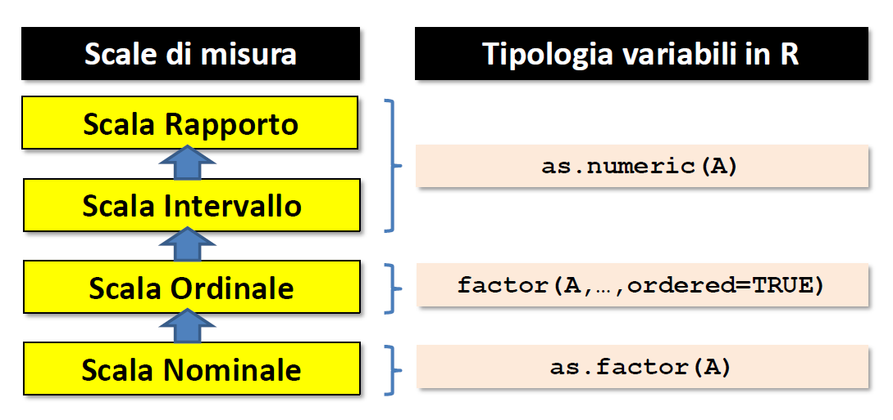

# File esterni di dati

## Working Directories (wd)

### 

\footnotesize

```{r}
getwd() # <1>
```

1. Restituisce la wd in cui ci si trova (default: cartella dove si trova l'installazione di `R`)


\footnotesize
```{r}
#| eval: false

setwd("C/Documenti/I-miei-file") # <2>
```

2. Permette di settare una nuova wd

\small

```{r}
dir()  # <3>
```

3. Vettore che indica tutti i file/sottorcartelle presenti nella wd ottenuta con `getwd()`

### Esercizio 

1. Aprire un nuovo script in Rstudio 
  * File, New File, R script oppure tasti `shift + ctrl + n`
  
2. Determinare in che wd ci si trova (copia & incolla il risultato del comando `getwd()` nello script sottoforma di commento)

3. Creare una nuova cartella sul desktop dal nome `corso-analisi`

4. Usare il comando `setwd()` per spostarsi in quella cartella


## Caricare

### 

    read.csv2("file_path")


Se si possiede un dataset chiamato "Dati" nella cartella "EXP", questo codice lo importerà all'interno dell'ambiente

```{r}
#| eval: false
# Lettura file dati esterni
DATI <- read.csv2("C:\\EXP\\Dati.csv")
```

## Sintesi di strutture tabellari

### `summary()`

    summary(data)

Riassume il contenuto di strutture di dati 
\pause

\small

```{r}
summary(rock)
```

### `str()`

    str(data)
    
Fornisce informazioni circa la struttura generale di un oggetto: 

\pause

```{r}
str(rock)
```

### `head()` ($\alpha$) and `tail()` ($\omega$)

:::: {.columns}

::: {.column width="50%"}
`head()`

Le prime 6 osservazioni del dataset
\footnotesize
```{r}
head(rock)
```

:::

::: {.column width="50%"}
`tail()`

\footnotesize
le ultime 6 osservazioni del dataset

```{r}
tail(rock)
```

:::

::::


### `apply()`

    apply(data, MARGIN, FUN)

`data`: i dati su cui si vuole lavorare

`MARGIN`: 1 applica la funzione sulle righe (attraverso le colonne), 2 applica la funzione sulle colonne (attraverso le righe)

`FUN`: la funzione che si vuole applicare

###

\footnotesize

```{r}
apply(rock, 1, sum)   # Somma per riga
apply(rock, 2, mean)  # Media per colonna
```

# Variabili 

### 

```{r}
#| echo: false
#| out-width: 100%
#| fig-align: center

```


## Categoriali - Nominali 

### `as.factor()`

`as.factor()`: Converte una variabile in una variabile di tipo **categoriale/nominale** con tanti livelli quanti sono i valori unici nel vettore 

:::{.r-stack}
Due livelli
:::

```{r}
Genere <- c("m","f","f","m","f","m") 
Genere
```

\pause

```{r}
as.factor(Genere) 
```


###

:::{.r-stack}
Più livelli
:::


```{r}
diagnosi <- c("schizo", "dep", "narc", "schizo", "dep", "narc")
diagnosi

```

\pause

\small
```{r}
as.factor(diagnosi) 
```


## Categoriali - Ordinali 

### 

    factor(A,levels=c("a1","a2",..., "ak"), 
       ordered=TRUE) 
       
Converte la variabile in una variabile con tanti livelli quanti sono i valori unici e viene forzato un ordine su questi livelli: 

\small
```{r}
Voto <- c("alto","medio","medio","basso","alto") 
Voto
factor(Voto,levels=c("basso","medio","alto"), ordered=TRUE) 
```


# Statistiche descrittive di base

## Tavole di frequenza 

### 

    table(variabile)
    
Calcola le occorrenze (frequenze) per ogni categoria. Funziona sia per le variabili categoriali sia per le variabili numeriche 

```{r}
table(Genere)
```

```{r}
table(diagnosi)
```


### Altre funzioni 

| Funzione | Significato        |
|----------|--------------------|
| `mean()`   | Media              |
| `min()`, `max()`   | Minimo, Massimo              |
| `range()` | Range di valori entro cui varia la variabile|
| `quantile(x, probs)` | Calcola il quantile p=probs della variabile numerica X|
| `sd()`, `var()`   | Deviazione st., Varianza  |
| `sum()`   | Somma  |


# Generazione di variabili casuali e grafici 

## Generazioni di variabili 

### `set.seed()`

Permette di settare un seed comune a tutt

Garantisce la perfetta replicabilità dei risultati

Garantisce che se tutt settiamo questo seed, otteniamo gli stessi grafici

```{r}
set.seed(999)
```

### 


`rnorm(n, mean = 0, sd = 1)` :Genera `n` valori casuali e indipendenti da una variabile casuale normale con media `mean` 0 e deviazione standard `sd` 1 (normale standard)


\pause

`rnunif(n, min = 0, max = 1)` Genera `n` valori casuali e indipendenti da una variabile casuale uniforme, dove i valori sono compresi tra 0 (`min`) e 1 (`max`)

\pause

:::: {.columns}

:::{.column width=50%}
\footnotesize
```{r}
x = rnorm(500, mean = 0, sd = 1)
```

```{r}
#| echo: false
#| out-width: 80%
hist(x)
```

:::

:::{.column width=50%}
\footnotesize
```{r}
y = runif(500, min = -4, max = 4)
```

```{r}
#| echo: false
#| out-width: 80%
hist(y)
```


:::
::::

## Istogrammi 


### 

`hist(x, breaks)` Produce un istogramma a partire da un vettore x di osservazioni quantitative. `breaks` definisce la larghezza delle singole barre, secondo diverse regole 

```{r}
#| echo: false
#| layout-ncol: 2
#| fig-cap: Istogrammi con n diverso 
#| fig-subcap: 
#|   - "n = 500"
#|   - "n = 50"

x = rnorm(500, mean = 0, sd = 1)
hist(x, ylab = "Frequenze assolute", 
     xlim = c(-3,3))
x = rnorm(50, mean = 0, sd = 1)
hist(x,  ylab = "Frequenze assolute", 
     xlim=c(-3,3))
```


<!-- :::: {.columns} -->
<!-- :::{.column width="50%"} -->
<!-- ```{r} -->
<!-- #| echo: false -->
<!-- x = rnorm(500, mean = 0, sd = 1) -->
<!-- hist(x, main = "Istogramma, n = 500", ylab = "Frequenze assolute",  -->
<!--      xlim = c(-3,3)) -->

<!-- ``` -->

<!-- ::: -->

<!-- :::{.column width="50%"} -->
<!-- ```{r} -->
<!-- #| echo: false -->
<!-- x = rnorm(50, mean = 0, sd = 1) -->
<!-- hist(x, main = "Istogramma, n = 50", ylab = "Frequenze assolute",  -->
<!--      xlim=c(-3,3)) -->
<!-- ``` -->

<!-- ::: -->


<!-- :::: -->

### 

```{r}
#| echo: false
#| fig-align: center
# --- Dati di esempio ---
set.seed(123)
x <- rnorm(500, mean = 20, sd = 10)

# Creo istogramma senza plot per avere i dati
h <- hist(x,  plot = FALSE)

# Scelgo il bin da evidenziare (es: bin 9)
bin_index <- 9
bin_height <- h$counts[bin_index]
bin_left <- h$breaks[bin_index]
bin_right <- h$breaks[bin_index + 1]
bin_mid <- (bin_left + bin_right)/2
bin_width <- bin_right - bin_left

# --- Plot base ---
plot(h, main = "Histogram of X", xlab = "", ylab = "Frequenze assolute",
     col = "white", border = "black", cex.main = 1.5, cex.axis = 1.2, cex.lab = 1.3)

# Evidenzio il bin b9
rect(bin_left, 0, bin_right, bin_height,
     col = rgb(0.2, 0.4, 0.8, 0.6), border = "black", lwd = 2)

# --- Etichetta n = 500 in alto a sinistra ---
usr <- par("usr") # per coordinate del grafico
rect(usr[1], usr[4] - 15, usr[1] + 15, usr[4],
     col = "black", border = NA)
text(usr[1] + 7.5, usr[4] - 7.5,
     expression(bolditalic(n == 500)), col = "white", cex = 1.3)

# --- Linea orizzontale per altezza bin ---
abline(h = bin_height, col = "skyblue", lty = 2, lwd = 2)
text(usr[1] + 2, bin_height + 3, "Altezza Bin b9", col = "red",
     font = 2, pos = 4, cex = 1.2)

# --- Freccia per indicare il bin ---
arrows(x0 = bin_mid + bin_width/2, y0 = bin_height + 5,
       x1 = bin_mid + bin_width/4, y1 = bin_height + 1,
       lwd = 2, length = 0.1)

# Rettangolo blu dietro la scritta Bin b9
rect(bin_mid + bin_width/2 + 2, bin_height + 1,
     bin_mid + bin_width/2 + 8, bin_height + 6,
     col = "steelblue", border = NA)
text(bin_mid + bin_width/2 + 5, bin_height + 3.5,
     "Bin b9", col = "white", font = 2, cex = 1.1)

# --- Doppia freccia per larghezza bin ---
arrows(bin_left, -5, bin_right, -5, code = 3,
       angle = 90, length = 0.1, lwd = 2, col = "skyblue")
text(bin_mid, -8, "Larghezza Bin b9", col = "red",
     font = 2, cex = 1.2)
```


### {.plain}

\footnotesize

```{r}
#| echo: false
x = rnorm(1000, mean = 10, sd = 5)
```


```{r}
#| layout-ncol: 2
#| layout-nrow: 2
#| echo: false
#| out-width: "90%"
#| fig-cap: "Metodi per la definizione dei breaks"
#| fig-subcap: 
#|     - "Sturges - Default"
#|     - "FD"
#|     - "Scott"
#|     - "User defined (145)"

hist(x, breaks = "Sturges")
hist(x, breaks = "FD")
hist(x, breaks = "Scott")
hist(x, breaks = 145)
```


### 

\begin{center}
Sturges: 

$\displaystyle \frac{\max(x) - \min(x)}{\log_{2}(n + 1)}$

Scott: 

 $\displaystyle 3.5 \sqrt{\mathrm{var}(x)} \, n^{-1/3}$
 
Freedman-Diaconis 
 
 $\displaystyle 2 \,(Q_3 - Q_1)\, n^{-1/3}$ 
 
User defined: 

 $\displaystyle \dfrac{\max(x) - \min(x)}{\text{breaks}}$ 

\end{center}

## Boxplot

### 

`boxplot(x)` Produce un boxplot a partire da un vettore X di osservazioni quantitative 

```{r}
#| echo: false
#| out-width: 70%
#| fig-align: center
set.seed(123)
x <- c(rnorm(30, mean = 10, sd = 2), 3, 4, 20, 22)

# --- Boxplot ---
boxplot(x,
        ylab = "Valore", cex.main = 1.2)
```

### 

```{r}
#| echo: false
set.seed(123)
x <- c(rnorm(30, mean = 10, sd = 2), 3, 4, 20, 22)

# --- Boxplot ---
boxplot(x, main = "Boxplot",
        ylab = "Valore", cex.main = 1.2)

# --- Statistiche del boxplot ---
stats <- boxplot.stats(x)
vals <- stats$stats  # contiene: min, Q1, mediana, Q3, max dei baffi

minimo <- vals[1]
Q1 <- vals[2]
mediana <- vals[3]
Q3 <- vals[4]
massimo <- vals[5]

# --- Etichette sui punti chiave ---
# L'asse x del boxplot è a 1 (perché è un singolo box)
xpos <- 1.2  # sposto leggermente a destra per non sovrapporre

text(xpos, minimo,  labels = "Baffo", pos = 4, col = "blue")
text(xpos, Q1,      labels = "Q1", pos = 4, col = "blue")
text(xpos, mediana, labels = "Mediana/Q2", pos = 4, col = "blue")
text(xpos, Q3,      labels = "Q3", pos = 4, col = "blue")
text(xpos, massimo, labels = "Baffo", pos = 4, col = "blue")

# --- Eventuali outlier ---
out <- stats$out
if (length(out) > 0) {
  points(rep(1, length(out)), out, pch = 16, col = "red")
  text(rep(xpos, length(out)), out,
       labels = "Outlier ",
       pos = 4, col = "red")
}
text(xpos, min(out),labels = "Minimo", 
     pos = 2, col = "black")
text(xpos, max(out),labels = "Massimo", 
     pos = 2, col = "black")
```

## Boxplot -- Calcolo degli outlier

### 

La lunghezza dei baffi (e di conseguenza la definizione degli outliers) è definita attrverso il metodo Tukey: 

$$[Q_1 - 1.5 \times IQR, \, Q_3 + 1.5 \times IQR]$$

dove $IQR = Q_3 - Q_1$ (Inter-quartile range)

###

Settando l'argomento `range = x` si può cambiare il modo in cui vengono calcolati i baffi: 

```{r}
#| layout-ncol: 2
#| fig-cap: Calcolo degli outlier
#| fig-subcap: 
#|   - "range = 2 - Meno Conservativo"
#|   - "range = 0 - Minimo e Massimo"

boxplot(x, range = 2)
boxplot(x, range = 0)
```


## Istogramma con kernel

### 

\small

*kernel density estimation, KDE*: Metodo non parametrico per *stimare* la funzione di densità di probabilità di una variabile casuale continua a partire da un campione di dati


```{r}
#| echo: false
#| out-width: 70%
#| fig-align: center
x <- rnorm(3000, mean = 10, sd = 2)
hist(x, freq = FALSE)
lines(density(x), col = "blue", lwd = 2) 
```


### 

\small

Funzione che "assegna" una probabilità attorno a ogni singolo dato osservato

`density(X, bw)`: Stima della densitità di una variabile a partire da un vettore `X` di osservazioni quantitative. `bw`: Larghezza della banda con cui viene stimato il kernel attorno a ogni dato: 

* Più è stretto attorno al dato: Si vede bene la struttura del dato, ma si rischia di essere in overfitting (quella stima va bene SOLO per quel dato)

* Più è largo attorno al dato: La curva è ben definita e liscia, ma si rischia di perdere dettagli per questi specifici dati (underfitting)


```{r}
#| echo: false
#| out-width: 50%
#| fig-align: center
set.seed(123)
x <- c(2.1, 2.3, 2.5, 2.7, 2.9)

# 2. Calcolo la stima di densità con due bandwidth diverse
dens_small <- density(x, bw = 0.05)  # bandwidth piccola
dens_large <- density(x, bw = 0.5)   # bandwidth grande

plot(dens_small, 
     col = "royalblue", lwd = 2, main = "",
     xlab = "x", ylab = "Densità")
lines(dens_large, col = "firebrick", lwd = 2)
# 4. Aggiungo i punti osservati
rug(x, lwd = 2, pch = 4)

# 5. Aggiungo una legenda
legend("topright", legend = c("bw = 0.05 (stretto)", "bw = 0.5 (largo)"),
       col = c("royalblue", "firebrick"), lwd = 2, bty = "n")
```


## Utilizzare i kernel

### 

\small


La funzione calcola la densità, per vedere la densità va usata insieme alla funzione `plot()`


```{r}
#| out-width: 70%
#| fig-align: center
x = rnorm(200)
plot(density(x))
```


### 
\small

va imposto all'istogramma che costruisca i bin con la densità e non con la frequenza: 

```{r}
#| out-width: 70%
#| fig-align: center

hist(x, freq = FALSE)
lines(density(x), lwd = 2, col ="blue")
```

