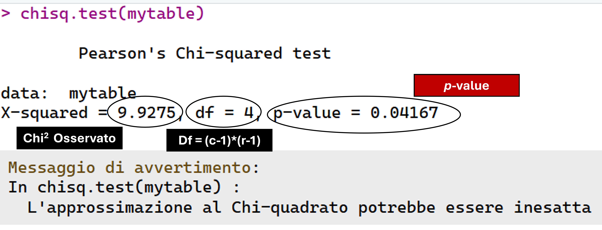
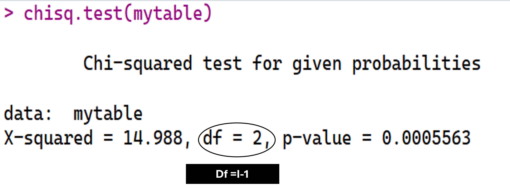

# Test Chi-quadrato 

## Associazione tra due variabili

### 


::: {.callout-tip}
## Scopo 

Quantificare il grado di associazione tra due variabili nominali A con $I$ categorie e B con $J$ categorie
:::

$$\chi^2 = 	\sum_{i} \sum_{j} \displaystyle \frac{(n_{ij} - n_{ij}^*)^2}{n_{ij}^*}$$

:::: {.columns}
:::{.column width=50%}
$$n_{ij}^* = \dfrac{n_{i.} \times n{.j}}{N}$$
:::


:::{.column width=50%}
$$N = \sum_{i=1}^I \sum_{j=1}^J n_{ij}$$
:::

::::

### 

::: {.callout-note}
## Sistema di ipotesi

$H_0$: $\chi^2 = 0$ Independent model $\rightarrow$ le frequenze osservate non si discostano dal modello teorico (frequenze teoriche)

$H_A$:  $\chi^2 > 0$ Association model $\rightarrow$ Le frequenze teoriche si discostano dal modello teorico 

:::

## In R 

### 

| **Simbolo R**                                       | **Significato**                                                                                                                                         |
|-----------------------------------------------------|---------------------------------------------------------------------------------------------------------------------------------------------------------|
| `chisq.test(mytab)` | Calcola il test statistico del chi quadro alla tabella di frequenze chiamata `mytab`|

```{r}
#| results: hide
#| warning: false
mytable <- matrix(c(21,7,9,33,7,28,7,8,10),3,3)
rownames(mytable) <- c("a1","a2","a3")
colnames(mytable) <- c("b1","b2","b3")
chisq.test(mytable)
```

## Esempi 

### 


```{r}
#| warning: true
chisq.test(mytable)
```


### 

```{r}
#| echo: false
#| fig-align: center
#| out-width: 100%

```

### 

$$p\text{-value} = 1- \int_{-\infty}^{\chi_0} f_x(x|\theta)dx$$

```{r}
#| echo: false
#| out-width: 60%
#| fig-align: center
x = seq(0, 40, length.out = 100)

plot(x, dchisq(x, df = 4), type = "l", lwd = 2, 
     xlab= "Densità", ylab = "X")
polygon(c(9.9275, x[x>=9.9275]), 
        c(0,dchisq(x, df = 4)[x>=9.9275]), 
        col ="grey")
```

```{r}
1-pchisq(9.9275, 4)
```

## Equidistribuzione nelle categorie

### 

::: {.callout-tip}
## Scopo 

Valutare se le proporzioni nelle $I$ categorie di una variabile categoriale $A$ siano o meno conformi a un modello teorico (solitamente di omogeneità)
:::

$$\chi^2 = 	\sum_{i} \displaystyle \frac{(n_{i} - n_{i}^*)^2}{n_{i}^*}$$

:::: {.columns}
:::{.column width=50%}
Frequenze attese sotto il modello teorico di omogeneità

$$n_{i}^* = \dfrac{1}{I}N$$
:::


:::{.column width=50%}

Frequenze osservate per le $I$ categorie

$$N = \sum_{i=1}^I n_{i}$$
:::

::::

### 

::: {.callout-note}
## Sistema di ipotesi

$H_0$: $\chi^2 = 0$ Independent model $\rightarrow$ le frequenze osservate non si discostano dal modello teorico 

$H_A$:  $\chi^2 > 0$ Association model $\rightarrow$ Le frequenze teoriche si discostano dal modello teorico 

:::

## In R 

### 

| **Simbolo R**                                       | **Significato**                                                                                                                                         |
|-----------------------------------------------------|---------------------------------------------------------------------------------------------------------------------------------------------------------|
| `chisq.test(mytab)` | Calcola il test statistico del chi quadro alla tabella di frequenze chiamata `mytab`|

```{r}
#| results: hide
#| warning: false
mytable <- matrix(c(22,45,18),1,3)
colnames(mytable) <- c("a1","a2","a3")
chisq.test(mytable)
```

## Esempi 

### 


```{r}
#| warning: true
chisq.test(mytable)
```


### 

```{r}
#| echo: false
#| fig-align: center
#| out-width: 100%

```


# Altri test per variabili categoriali 

## Test delle proporzioni 


### {.plain}

\small

| **Funzione R** |  **Significato** |
|----------------|--------------------------|
| `prop.test(x, n, p)` | Calcola se la proporzione $x/n$ (dove $x \le n$) sia significativamente differente dal valore di probabilità $p$. Il valore $x$ è il numero di esiti dicotomici positivi su $n$ distinte prove  ($x/n \neq \pi$ ) |
| `prop.test(x, n, p, alternative = "less")` | *Test inferenziale a una coda sinistra* $x/n < \pi$  |
| `prop.test(x, n, p, alternative = "greater")` | *Test inferenziale a una coda destra* | $x/n > \pi$  |
| `prop.test(c(x1,x2), c(n1,n2))` | *Test inferenziale a due code per due proporzioni* $\pi_1 \neq \pi_2$ |
| `prop.test(c(x1,x2), c(n1,n2), alternative = "less")` | *Test inferenziale a una coda (sinistra) per due proporzioni* $\pi_1 < \pi_2$ |
| `prop.test(c(x1,x2), c(n1,n2), alternative = "greater")` | *Test inferenziale a una coda (destra) per due proporzioni*  $\pi_1 > \pi_2$ |

## Esempi: 1 Campione

### 

\small

Campione di bambini che supera (1) o non supera (0) un punteggio minimo alle matrici di Raven. Nella popolazione a cui appartengono, la maggioranza degli individui supera la soglia minima alle matrici di Raven?

\footnotesize

```{r}
#| eval: true
#| results: hide
# Test delle proporzioni
pass_scores = c(1,0,0,1,1,0,0,0,0,1,0,1,0,1,0,0) # 
table(pass_scores) # Frequenze insuccessi/successi
x = sum(pass_scores) # x, numero dei successi
n = length(pass_scores) # n, numero totale di prove indipendenti
prop.test(x, n = n, p = .50, alternative = "greater") # Test
```


###

\footnotesize

```{r}
table(pass_scores) 
prop.test(x, n = n, p = .50, alternative = "greater") # Test
```

## Esempi: 2 campioni

### 

:::: {.columns}

:::{.column width=50%}

$x_1 = 6$, $n_1 = 16$

:::

:::{.column width=50%}

$x_2 = 21$, $n_2 = 30$

:::

::::


Le proporzioni di successi nei due gruppi sono diverse? 

```{r}
#| results: hide
x_2 = 21
n_2 = 30
prop.test(c(x,x_2), c(n, n_2), alternative = "two.sided")
```

###

\small

```{r}
x_2 = 21
n_2 = 30
prop.test(c(x,x_2), c(n, n_2), alternative = "two.sided")
```
