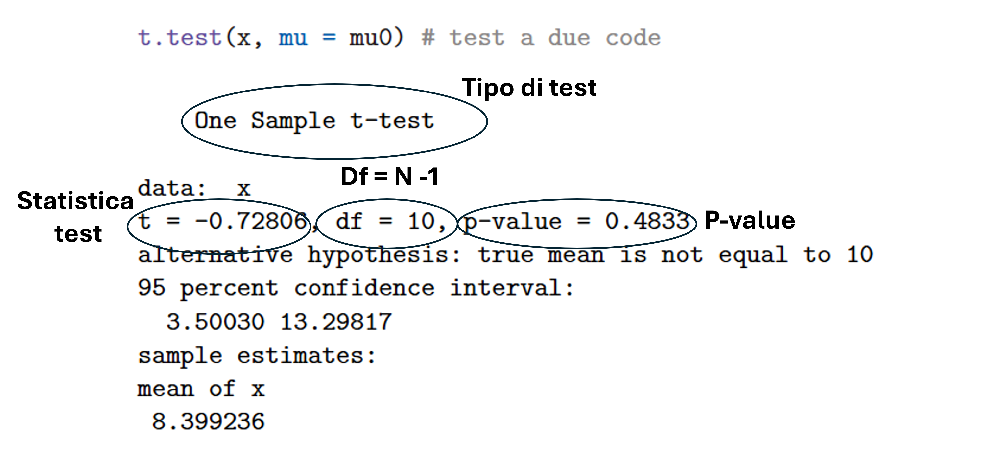
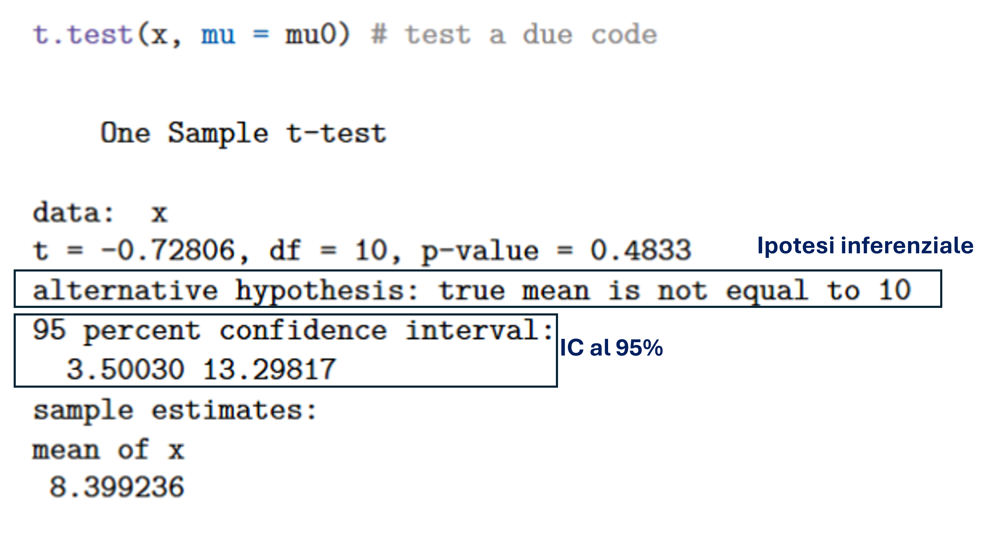

# Un campione 

### 

::: {.callout-note appearance="default"}
## Scopo

permette di valutare se la media $\mu$ della popolazione di un dato campione *x* sia significativamente differente (risp. maggiore/minore) rispetto ad una specifica soglia teorica $\mu_0$.
:::

Sia $\mathbf{x} = (x_1, x_2, \dots, x_N)$ un campione empirico di $N$ osservazioni quantitative indipendenti tali che $x_i \sim \mathcal{N}(\mu, \sigma^2)$, dove $\mu$ e $\sigma^2$ sono parametri ignoti della popolazione di $\mathbf{x}$.

Inoltre sia $\mu_0 \in \mathbb{R}$ una soglia teorica definita dall’analizzatore.

:::: {.columns}

::: {.column width=60%}
$$t = \frac{\bar{x} - \mu_0}{\sqrt{\mathrm{var}(x)/N}}$$
:::

::: {.column width=40%}
$\bar{x}$: Media campionaria di $\mathbf{x}$

$\mathrm{var}(x)$: Varianza campionaria $\mathbf{x}$
:::

::::

###


:::{.callout-note}
## Test a due code (two-sided)

$H_0 : \mu = \mu_0 \qquad H_A : \mu \ne \mu_0$

:::

:::{.callout-note}
## Una coda-destra (one-sided right)

$H_0 : \mu \leq \mu_0 \qquad H_A : \mu > \mu_0$

:::


:::{.callout-note}
## Una coda sinistra (one-sided left)

$H_0: \mu \ge \mu_0 \qquad H_A: \mu < \mu_0$  

:::

## In R 

### 

| **Simbolo R**                                       | **Significato**                                                                                                                                         |
|-----------------------------------------------------|---------------------------------------------------------------------------------------------------------------------------------------------------------|
| `t.test(x, mu = mu0)`                              | T-test ad un campione (`x`) rispetto alla soglia teorica `mu = mu0`. Calcola il test statistico inferenziale a due code.                               |
| `t.test(x, mu = mu0, alternative = "greater")`      | T-test ad un campione (`x`) rispetto alla soglia teorica `mu = mu0`. Calcola il test statistico inferenziale ad una coda (destra).                     |
| `t.test(x, mu = mu0, alternative = "less")`         | T-test ad un campione (`x`) rispetto alla soglia teorica `mu = mu0`. Calcola il test statistico inferenziale ad una coda (sinistra).                   |

## Esempi 

###

\small 

```{r}
#| results: hide
set.seed(999)
x = rnorm(11, mean = 12, sd = 7.5)
mu0 = 10
t.test(x, mu = mu0) # test a due code
t.test(x, mu = mu0, 
       alternative = "greater") # test a una coda destra
t.test(x, mu = mu0, 
       alternative = "less") # test a una coda sinistra
t.test(x) # test a due code assumedno mu0 = 0

```

### 

```{r}
t.test(x, mu = mu0) # test a due code
```

```{r}
#| echo: false
myt = t.test(x, mu = mu0) # test a due code
```


### 

```{r}
#| echo: false
#| out-width: 90%
#| fig-align: center

```


### 

```{r}
#| echo: false
#| out-width: 90%
#| fig-align: center

```


### 

$$\begin{aligned}
p\text{-value} &= \int_{-\infty}^{-|t_o|} f_T(t \mid \theta) \, dt 
               + \int_{|t_o|}^{\infty} f_T(t \mid \theta) \, dt \\
               &= 2 \int_{|t_o|}^{\infty} f_T(t \mid \theta) \, dt
\end{aligned}$$

:::: {.columns}

:::{.column width=50%}

```{r}
#| echo: false
#| out-width: 60%
#| fig-align: center
mx = seq(-3,3, length.out=100)
plot(mx, dt(mx, df = 10), type = "l", ylab = "Density", 
     main = "Distribuzione t di student con df = 10", cex = 3)
polygon(c(-3, 
          mx[mx < myt$statistic],
          myt$statistic), 
        c(0, dt(mx[mx < myt$statistic], 10), 0), 
        col = rgb(1, 0, 0, 0.25))
polygon(c(abs(myt$statistic), 
          mx[mx > abs(myt$statistic)],
          3), 
        c(0, dt(mx[mx > abs(myt$statistic)], 10), 0), 
        col = rgb(1, 0, 0, 0.25))
```

:::

:::{.column width=50%}
$t_0$: Statistica test osservata `r round(myt$statistic,4)`

$f_T(t|\theta)$: Distribuzione $t$ di Student con parametro $\theta$ (ovvero i gdl)

\footnotesize

```{r}
# calcolo p-value
2*(1-pt(abs(-0.72806),10))
```


:::

::::

### 

```{r}
t.test(x, mu = mu0, 
       alternative = "greater") # test a una coda destra
```

###

$$p\text{-value} = \int_{t_o}^{\infty} f_T(t \mid \theta) \, dt$$

:::: {.columns}

:::{.column width=50%}

```{r}
#| echo: false
#| out-width: 60%
#| fig-align: center
mx = seq(-3,3, length.out=100)
plot(mx, dt(mx, df = 10), type = "l", ylab = "Density", 
     main = "Distribuzione t di student con df = 10", cex = 3)
myt = t.test(x, mu = mu0, 
       alternative = "greater") # test a una coda destra
polygon(c((myt$statistic), 
          mx[mx > (myt$statistic)]), 
        c(0, dt(mx[mx > (myt$statistic)], 10)), 
        col = rgb(1, 0, 0, 0.25))
```


:::

:::{.column width=50%}
$t_0$: Statistica test osservata `r round(myt$statistic,4)`

$f_T(t|\theta)$: Distribuzione $t$ di Student con parametro $\theta$ (ovvero i gdl)

\footnotesize

```{r}
# calcolo p-value
1-pt(-0.72806, 10)
```


:::

::::

### 


```{r}
t.test(x, mu = mu0, 
       alternative = "less") # test a una coda sinistra
```


###

$$p\text{-value} = \int_{-\infty}^{t_o} f_T(t \mid \theta) \, dt$$

:::: {.columns}

:::{.column width=50%}

```{r}
#| echo: false
#| out-width: 60%
#| fig-align: center
mx = seq(-3,3, length.out=100)
plot(mx, dt(mx, df = 10), type = "l", ylab = "Density", 
     main = "Distribuzione t di student con df = 10", cex = 3)
myt = t.test(x, mu = mu0, 
       alternative = "less") # test a una coda sinistra
polygon(c(-3, 
          mx[mx < myt$statistic],
          myt$statistic), 
        c(0, dt(mx[mx < myt$statistic], 10), 0), 
        col = rgb(1, 0, 0, 0.25))
```


:::

:::{.column width=50%}
$t_0$: Statistica test osservata `r round(myt$statistic,4)`

$f_T(t|\theta)$: Distribuzione $t$ di Student con parametro $\theta$ (ovvero i gdl)

\footnotesize

```{r}
# calcolo p-value
pt(-0.72806, 10)
```


:::

::::


# Due campioni indipendenti

### 
::: {.callout-note appearance="default"}
## Scopo

Permette di valutare se la media $\mu_X$ della popolazione di un campione di dati $x$ sia significativamente differente (risp. maggiore/minore) rispetto alla media $\mu_Y$ della popolazione di un campione di dati $y$.
:::

\small

Sia $\mathbf{x} = (x_1, x_2, \ldots, x_N)$ un campione empirico di $N$ osservazioni quantitative indipendenti tali che $x_i \sim N(\mu_X, \sigma^2)$ e sia $\mathbf{y} = (y_1, y_2, \ldots, y_M)$ un campione empirico di $M$ osservazioni quantitative indipendenti tali che $y_j \sim N(\mu_Y, \sigma^2)$, dove $\sigma^2$ è la varianza comune ad entrambe le popolazioni.


:::: {.columns}

::: {.column width=60%}
$$t = \frac{(\overline{x} - \overline{y}) - (\mu_x - \mu_y)}{s \sqrt{\frac{1}{N} + \frac{1}{M}}}$$
:::

::: {.column width=40%}
\small
$s = \sqrt{\frac{(N-1)\mathrm{var}(\mathbf{x}) + (M-1)\mathrm{var}(\mathbf{y})}{N + M - 2}}$
:::

::::

### 


:::{.callout-note}
## Test a due code (two-sided)

$H_0 : \mu_X = \mu_Y \qquad H_A : \mu_X \ne \mu_Y$

\footnotesize

$H_0 : \mu_X -\mu_Y = 0 \qquad H_A : \mu_X - \mu_Y \ne 0$
:::

:::{.callout-note}
## Una coda-destra (one-sided right)

$H_0 : \mu_X \leq \mu_Y \qquad H_A : \mu_X > \mu_Y$

\footnotesize

$H_0 : \mu_X - \mu_Y \leq 0 \qquad H_A : \mu_X -\mu_Y > 0$
:::


:::{.callout-note}
## Una coda sinistra (one-sided left)

$H_0: \mu_X \ge \mu_Y \qquad H_A: \mu_X < \mu_Y$  

\footnotesize

$H_0: \mu_X - \mu_Y \ge 0 \qquad H_A: \mu_X - \mu_Y < 0$  
:::

## In R 

### 
| **Simbolo R** | **Significato** |
|:--------------|:----------------|
| `t.test(x, y, var.equal = TRUE)` | T-test per 2 campioni indipendenti (`x`, `y`). Calcola il test statistico inferenziale **a due code**. |
| `t.test(x, y, var.equal = TRUE, alternative = "greater")` | T-test per 2 campioni indipendenti (`x`, `y`). Calcola il test statistico inferenziale **ad una coda (destra)**. |
| `t.test(x, y, var.equal = TRUE, alternative = "less")` | T-test per 2 campioni indipendenti (`x`, `y`). Calcola il test statistico inferenziale **ad una coda (sinistra)**. |


## Esempi

###

```{r}
#| results: hide

x <- c(12.2,23.2,14,20.3,9.2,3.7,8,16.8,3.7,1.9,20.5)
y <- c(8.5,3.2,4,10.5,7.7,3.1,2,3.9)
t.test(x,y,var.equal=TRUE)
t.test(x,y,var.equal=TRUE,alternative="greater")
t.test(x,y,var.equal=TRUE,alternative="less")
t.test(x,y)
```


### Test a due code `var.equal=TRUE`

\small
```{r}
t.test(x,y,var.equal=TRUE)
```

### `var.equal=FALSE`

\small

```{r}
t.test(x,y)
```

# Due campioni appaiati 

###

::: {.callout-note appearance="default"}
## Scopo

Permette di valutare se le medie $\mu_x$ e $\mu_y$ delle popolazioni di due campioni di dati appaiati $(x,y)$ siano significativamente differenti (risp. maggiore/minore).
:::

Sia $\mathbf{(x, y)} = \big( (x_1, y_1), (x_2, y_2), \ldots, (x_N, y_N) \big)$ un campione bivariato di $N$ osservazioni $(x_i, y_i)$ indipendenti. 
Inoltre sia $d_i \sim N(d \mid \mu_D, \sigma^2)$ l’osservazione differenziale $d_i = x_i - y_i$ derivata da $\mathbf{(x, y)}$. 
I parametri $\mu_D$ e $\sigma^2$ sono i termini ignoti della variabile differenziale $D$.

$$t = \dfrac{\overline{d}}{\sqrt{\operatorname{var}(\mathbf{d})/N}}$$

### 


:::{.callout-tip}
## Test a due code (two-sided)

$H_0 : \mu_D = 0 \qquad H_A : \mu_D \ne 0$

:::

:::{.callout-note}
## Una coda-destra (one-sided right)

$H_0 : \mu_D \leq 0 \qquad H_A : \mu_D > 0$

:::


:::{.callout-note}
## Una coda sinistra (one-sided left)

$H_0: \mu_D \ge 0 \qquad H_A: \mu_D < 0$  

:::

## In R 

###

| **Simbolo R** | **Significato** |
|:--------------|:----------------|
| `t.test(x, y, paired = TRUE)` | T-test per 2 campioni dipendenti (`x`, `y`). Calcola il test statistico inferenziale **a due code**. |
| `t.test(x, y, paired = "greater")` | T-test per 2 campioni dipendenti (`x`, `y`). Calcola il test statistico inferenziale **ad una coda (destra)**. |
| `t.test(x, y, paired = "less")` | T-test per 2 campioni dipendenti (`x`, `y`). Calcola il test statistico inferenziale **ad una coda (sinistra)**. |

## Esempi 

### 

```{r}
#| results: hide
x = c(5.2,3.5,3.4,7.1,6.2,3.0,1,4) 
y = c(8.5,3.2,4,10.5,7.7,3.1,2,3.9)

t.test(x,y,paired=TRUE) 
t.test(x,y,paired=TRUE,alternative="less") 
t.test(x,y,paired=TRUE,alternative="greater")
```


### 

```{r}
t.test(x,y,paired=TRUE,alternative="less") 
```

