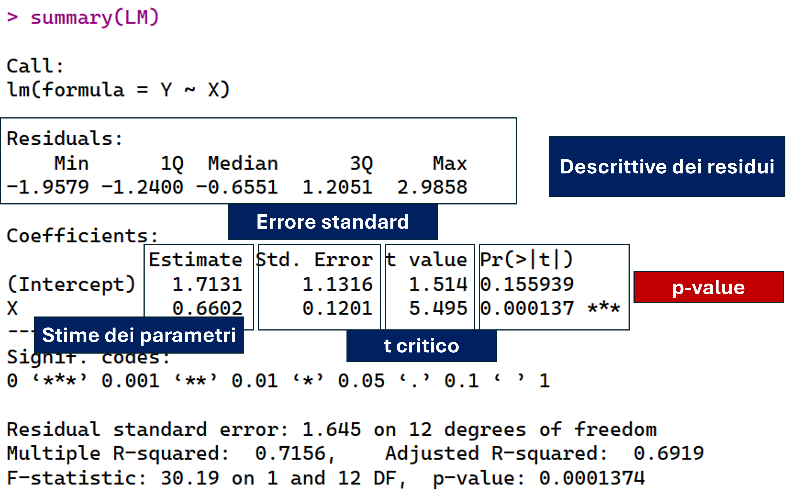
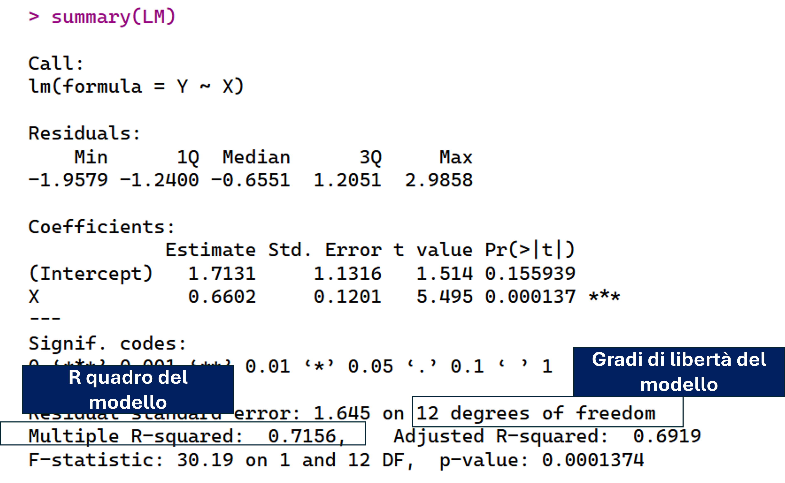

# Modello di regressione lineare semplice 

### 
::: {.callout-note appearance="default"}
## Scopo

Stimare la dipendenza lineare tra una variabile indipendente ($X$) e una variabile dipendente ($Y$)

:::

Siano $\mathbf{x} = (x_1, x_2, \dots, x_N)$ e $\mathbf{y} = (y_1, y_2, \dots, y_N)$ i due campioni empirici associati, rispettivamente, alla variabile indipendente $X$ e alla variabile dipendente $Y$


:::: {.columns}

::: {.column width=60%}
$y_i = \beta_0 + \beta x_i + \varepsilon_i \quad$ $\varepsilon_i \sim \mathcal{N}(0, \sigma^2)$
:::

::: {.column width=40%}
$$(i = 1, \ldots, n)$$
:::

::::

Dove $\beta_0$, $\beta$ e $\varepsilon$ sono, rispettivamente, l'intercetta, il coefficiente angolare e la componente d'errore del modello di regressione lineare

### 

:::{.callout-note}
## Sistema di ipotesi sull'intercetta

$H_0 : \beta_0 = 0$: L'intercetta interseca l'origine $(0,0)$ 

$H_A^1 : \beta_0 \ne 0$: L'intercetta NON interseca l'origine $(0,0)$ 
:::

::: {.callout-note}
## Sistema di ipotesi sul coefficiente angolare

$H_0 : \beta = 0$: Modello di indipendenza lineare

$H_A^1 : \beta \ne 0$: Modello di associazione lineare
:::

## In R 

### 

| **Simbolo R**                                       | **Significato**                                                                                                                                         |
|-----------------------------------------------------|---------------------------------------------------------------------------------------------------------------------------------------------------------|
| `lm(y ~ x)`                              | Fitta un modello lineare dove si spiega la `y` in funzione della `x`                       |
| `summary(lm(y ~ x))`                              | Restituisce l'output inferenziale del modello lineare                    |

## Esempi 

###

\small 

```{r}
#| results: hide
#| eval: false
X <- c(9,8,12,9,10,14,5,4,13,7,5,3.4,15.3,6.8)
Y <- c(9,6,8,9,7,10,8,4,11,5,4,2,12.6,8.6)
LM <- lm(Y~X)
plot(X,Y, pch = 8)
abline(LM, lwd = 2, col = "darkorange")
summary(LM)

```


### 

```{r}
#| echo: false
X <- c(9,8,12,9,10,14,5,4,13,7,5,3.4,15.3,6.8)
Y <- c(9,6,8,9,7,10,8,4,11,5,4,2,12.6,8.6)
LM <- lm(Y~X)
plot(X,Y, pch = 8)
abline(LM, lwd = 2, col = "darkorange")
```


### {.plain}

\small

```{r}
summary(LM)
```


### 

```{r}
#| echo: false

```


### 

```{r}
#| echo: false

```


# Stima dei parametri 

### 

\small

$$SQE = \displaystyle \sum_{i=1}^{N} (y_i - y_i^*)^2 \quad y_i^* = \beta_0 + \beta x_i$$

$$\displaystyle \sum_{i=1}^{N} (y_i - (\beta_0 + \beta x_i))^2 = \sum_{i=1}^{N}e_i^2 \quad e_i = y_i - y_i^*$$

Per il principio dei minimi quadrati: 

$$\hat{\beta} = \dfrac{Cov(X,Y)}{Var(X)} = \dfrac{\sum_{i=1}^{n}(x_i - \bar{x})(y_i - \bar{y})}{\sum_{i=1}^{n}(x_i - \bar{x})^2}$$

e:

$$\hat{\beta_0} = \bar{Y} - \hat{\beta} \bar{X}$$

# Inferenza statistica sui parametri 

## Step 1

### 

Si stima la varianza della componente di errore $\varepsilon_i$ usando la varianza campionaria corretta per i residui $e_i^2$ del modello di regressione

$$
\begin{aligned}
\hat{\sigma}^2 
&= \frac{\sum_{i=1}^{n} (y_i - y_i^{*})^2}{n - 2} \\
&= \frac{\sum_{i=1}^{n} e_i^2}{n - 2} \\
&= \frac{SQE}{n - 2}
\end{aligned}
$$

## Step 2

### 

Si stima la varianza del parametro dell’intercetta $\beta_0$ come

$$
\begin{aligned}
\hat{\sigma}^2_{\beta_0} 
&= \hat{\sigma}^2 \left( \frac{1}{n} + 
\frac{\bar{x}^2}{\sum_{i=1}^{n} (x_i - \bar{x})^2} \right)
\end{aligned}
$$

Si stima la varianza del parametro del coefficiente angolare $\beta$ come

$$
\begin{aligned}
\hat{\sigma}^2_{\beta} 
&= \frac{\hat{\sigma}^2}{\sum_{i=1}^{n} (x_i - \bar{x})^2}
\end{aligned}
$$

## Step 3 & 4 

### 

:::: {.columns}

:::{.column width=50%}
\small

Stima della varianza del parametro dell’intercetta $\beta_0$ 


$$
\begin{aligned}
\hat{\sigma}^2_{\beta_0} 
&= \hat{\sigma}^2 \left( \frac{1}{n} 
+ \frac{\bar{x}^2}{\sum_{i=1}^{n} (x_i - \bar{x})^2} \right)
\end{aligned}
$$
:::

:::{.column width=50%}
Stima della varianza del parametro del coefficiente angolare $\beta$:


$$
\begin{aligned}
\hat{\sigma}^2_{\beta} 
&= \frac{\hat{\sigma}^2}{\sum_{i=1}^{n} (x_i - \bar{x})^2}
\end{aligned}
$$
:::

::::


**Step 4**

Le stime degli errori standard dei parametri sono:

$$
\operatorname{SE}(\hat{\beta}_0) = \sqrt{\hat{\sigma}^2_{\beta_0}}
\qquad\qquad
\operatorname{SE}(\hat{\beta}) = \sqrt{\hat{\sigma}^2_{\beta}}
$$

## Step 5 

### 

:::: {.columns}

:::{.column width=50%}
Valore $t$ osservato calcolato per il parametro di intercetta $\beta_0$:

$$ t^{o}_{\beta_0} = \frac{\hat{\beta}_0}{\widehat{SE}(\beta_0)} $$
$H_0$: $\beta_0 = 0$
:::

:::{.column width=50%}
Valore $t$ osservato calcolato per il parametro di coefficiente angolare $\beta$: 

$$ t^{o}_{\beta} = \frac{\hat{\beta}}{\widehat{SE}(\beta)} $$
$H_0$: $\beta = 0$
:::

::::

Sotto le rispettive ipotesi nulle, i $t$ osservati seguono una distribuzione $f_T$ di Student con $\theta = n - 2$ gradi di libertà.

Gli associati $p$-value saranno dunque:

:::: {.columns}

:::{.column width=50%}
$\beta_0$:  

$$ p\text{-value} = 2 \int_{|t^{o}_{\beta_0}|}^{\infty} f_T(t \mid n-2)\, dt $$
:::

:::{.column width=50%}
 $\beta$:  
 
$$ p\text{-value} = 2 \int_{|t^{o}_{\beta}|}^{\infty} f_T(t \mid n-2)\, dt $$
:::

::::

### Definizione statistica $t$ osservato sotto ipotesi nulla $H_0$

$\beta_0 = 0$ e $\beta = 0$ 

$$
t^{o}_{\beta_0}
= \frac{\hat{\beta}_0 - \beta_0}{\widehat{SE}(\beta_0)}
= \frac{\hat{\beta}_0 - 0}{\widehat{SE}(\beta_0)}
= \frac{\hat{\beta}_0}{\widehat{SE}(\beta_0)},
\quad \text{con } H_0 : \beta_0 = 0
$$

$$
t^{o}_{\beta}
= \frac{\hat{\beta} - \beta}{\widehat{SE}(\beta)}
= \frac{\hat{\beta} - 0}{\widehat{SE}(\beta)}
= \frac{\hat{\beta}}{\widehat{SE}(\beta)},
\quad \text{con } H_0 : \beta = 0
$$


### Definizione statistica t osservato sotto ipotesi nulla $H_0$

$\beta_0 = a$ e $\beta = b$

$$
t^{o}_{\beta_0}
= \frac{\hat{\beta}_0 - \beta_0}{\widehat{SE}(\beta_0)}
= \frac{\hat{\beta}_0 - a}{\widehat{SE}(\beta_0)},
\quad \text{con } H_0 : \beta_0 = a \text{ dove } a \in \mathbb{R}
$$

$$
t^{o}_{\beta}
= \frac{\hat{\beta} - \beta}{\widehat{SE}(\beta)}
= \frac{\hat{\beta} - b}{\widehat{SE}(\beta)},
\quad \text{con } H_0 : \beta = b \text{ dove } b \in \mathbb{R}
$$


## Intervalli di confidenza 

### 

$$
\text{IC95\%}(\beta_0)
= [\, \hat{\beta}_0 - \delta_{\beta_0},\; \hat{\beta}_0 + \delta_{\beta_0} \,]
$$

$$
\text{IC95\%}(\beta)
= [\, \hat{\beta} - \delta_{\beta},\; \hat{\beta} + \delta_{\beta} \,]
$$

dove

$$
\delta_{\beta_0}
= \widehat{SE}(\beta_0) \times q_T(0.975 \mid n-2),
\qquad
\delta_{\beta}
= \widehat{SE}(\beta) \times q_T(0.975 \mid n-2)
$$

dove $q_T(0.975 \mid n-2)$ è il quantile 0.975 della distribuzione $t$ di Student con $n-2$ gradi di libertà.

## In R 

### 

```{r}
coefs = data.frame(summary(LM)$coefficients)
qt95 = qt(.975, 12)
deltaB0 = coefs$Std..Error[1]*qt95
deltaB1 = coefs$Std..Error[2]*qt95
CIB0 = c(coefs$Estimate[1]-deltaB0, 
         coefs$Estimate[1]+deltaB0)
CIB1 = c(coefs$Estimate[2]-deltaB1, 
         coefs$Estimate[2]+deltaB1)
CIB0
CIB1
```

# I residui 

## Errori distribuiti normalmente

### SI! {.plain}

```{r}
#| echo: false
#| fig-align: center
z_res = scale(LM$residuals)[,1]
qqnorm(z_res, cex.axis = 2, cex.lab = 2.5, cex = 2, pch = 17)
qqline(z_res, lwd = 2, col ="firebrick")

```


### NO! {.plain}

```{r}
#| echo: false
#| fig-align: center
set.seed(123)
myg = rgamma(15, 1, 2)
qqnorm(myg, cex.axis = 2, cex.lab = 2.5, cex = 2, pch = 17)
qqline(z_res, lwd = 2, col ="firebrick")
```


## Indipendenza errore-predittore

### SI! {.plain}

```{r}
#| echo: false
#| fig-align: center

plot(X, residuals(LM), cex.axis = 2, cex.lab = 2.5, cex = 2, pch = 17, ylab = "Residui")
abline(h = 0, lwd = 2, col = "gray67", lty = 2)
```


### NO! {.plain}

```{r}
#| echo: false
#| fig-align: center

myy = scale(X*rnorm(length(X), mean = 4, 2))[,1]

plot(X, myy, 
     cex.axis = 2, cex.lab = 2.5, cex = 2, pch = 17, ylab = "Residui")
abline(h = 0, lwd = 2, col = "gray67", lty = 2)
```


